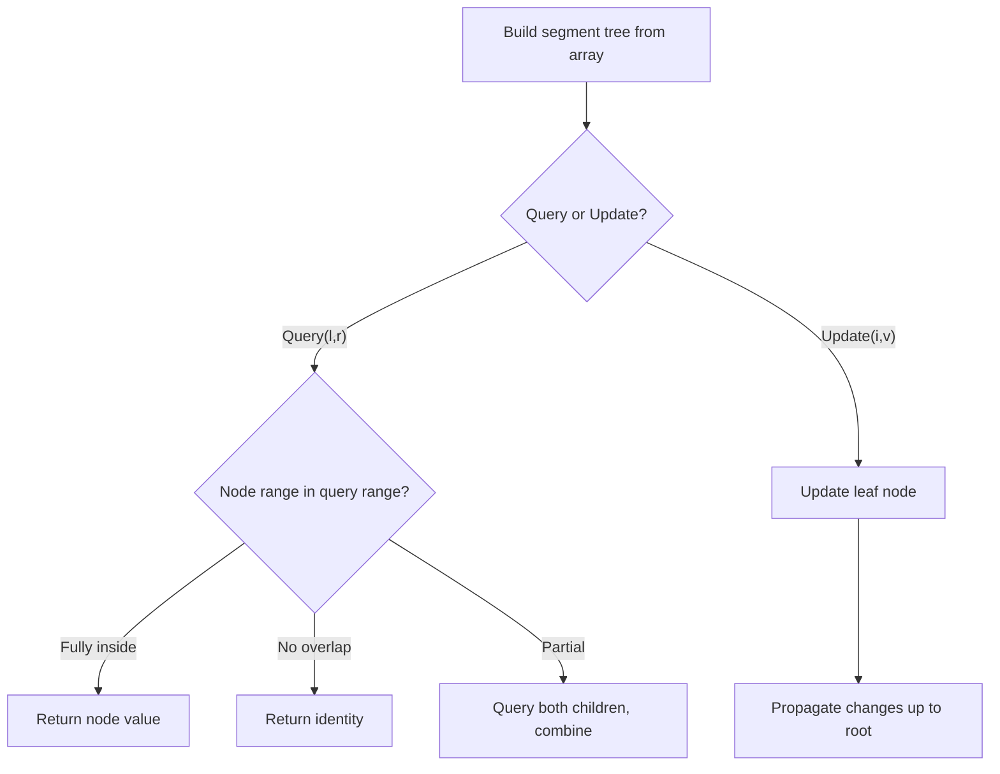

# Problem 406: Queue Reconstruction by Height

**Difficulty:** Medium  
**Tags:** Array, Binary Indexed Tree, Segment Tree, Sorting  
**Pattern:** Segment Tree  
**Link:** [leetcode.com/problems/queue-reconstruction-by-height](https://leetcode.com/problems/queue-reconstruction-by-height/)

## Description

You are given an array of people, `people`, which are the attributes of some people in a queue (not necessarily in order). Each `people[i] = [hi, ki]` represents the `i^th` person of height `hi` with **exactly** `ki` other people in front who have a height greater than or equal to `hi`.

Reconstruct and return *the queue that is represented by the input array *`people`. The returned queue should be formatted as an array `queue`, where `queue[j] = [hj, kj]` is the attributes of the `j^th` person in the queue (`queue[0]` is the person at the front of the queue).

 

Example 1:

```

**Input:** people = [[7,0],[4,4],[7,1],[5,0],[6,1],[5,2]]
**Output:** [[5,0],[7,0],[5,2],[6,1],[4,4],[7,1]]
**Explanation:**
Person 0 has height 5 with no other people taller or the same height in front.
Person 1 has height 7 with no other people taller or the same height in front.
Person 2 has height 5 with two persons taller or the same height in front, which is person 0 and 1.
Person 3 has height 6 with one person taller or the same height in front, which is person 1.
Person 4 has height 4 with four people taller or the same height in front, which are people 0, 1, 2, and 3.
Person 5 has height 7 with one person taller or the same height in front, which is person 1.
Hence [[5,0],[7,0],[5,2],[6,1],[4,4],[7,1]] is the reconstructed queue.

```

Example 2:

```

**Input:** people = [[6,0],[5,0],[4,0],[3,2],[2,2],[1,4]]
**Output:** [[4,0],[5,0],[2,2],[3,2],[1,4],[6,0]]

```

 

**Constraints:**

	- `1 <= people.length <= 2000`
	- `0 <= hi <= 10^6`
	- `0 <= ki < people.length`
	- It is guaranteed that the queue can be reconstructed.

## Approach: Segment Tree

Build a segment tree for range queries (sum, min, max) with point or range updates. Each node covers a range; queries are answered by combining relevant segments.

## Pseudocode

```
1. Build segment tree from array (O(n))
2. Query(l, r):
   - If node range within [l,r]: return node value
   - If no overlap: return identity
   - Else: combine query(left_child) and query(right_child)
3. Update(i, val): update leaf and propagate up
```

## Algorithm Flow



## Complexity Analysis

- **Time:** O(n log n) build, O(log n) query/update
- **Space:** O(n)

## Solution (Python3)

```python
class Solution:
    def reconstructQueue(self, people: List[List[int]]) -> List[List[int]]:
        # Segment tree for range queries - O(n log n) build, O(log n) query
        n = len(people)
        tree = [0] * (4 * n)
        
        def build(node, start, end):
            if start == end:
                tree[node] = people[start]
                return
            mid = (start + end) // 2
            build(2*node, start, mid)
            build(2*node+1, mid+1, end)
            tree[node] = tree[2*node] + tree[2*node+1]
        
        def query(node, start, end, l, r):
            if r < start or end < l:
                return 0
            if l <= start and end <= r:
                return tree[node]
            mid = (start + end) // 2
            return query(2*node, start, mid, l, r) + query(2*node+1, mid+1, end, l, r)
        
        build(1, 0, n-1)
        return []
```

## Solution (C++)

```cpp
#include <functional>
#include <string>
#include <vector>
using namespace std;

class Solution {
public:
    vector<vector<int>> reconstructQueue(vector<vector<int>>& people) {
        // Segment tree for range queries
        int n = people.size();
        vector<int> tree(4 * n, 0);
        function<void(int, int, int)> build = [&](int node, int s, int e) {
            if (s == e) { tree[node] = people[s]; return; }
            int mid = (s + e) / 2;
            build(2*node, s, mid);
            build(2*node+1, mid+1, e);
            tree[node] = tree[2*node] + tree[2*node+1];
        };
        function<int(int, int, int, int, int)> query = [&](int node, int s, int e, int l, int r) -> int {
            if (r < s || e < l) return 0;
            if (l <= s && e <= r) return tree[node];
            int mid = (s + e) / 2;
            return query(2*node, s, mid, l, r) + query(2*node+1, mid+1, e, l, r);
        };
        build(1, 0, n-1);
        return {};
    }
};
```
