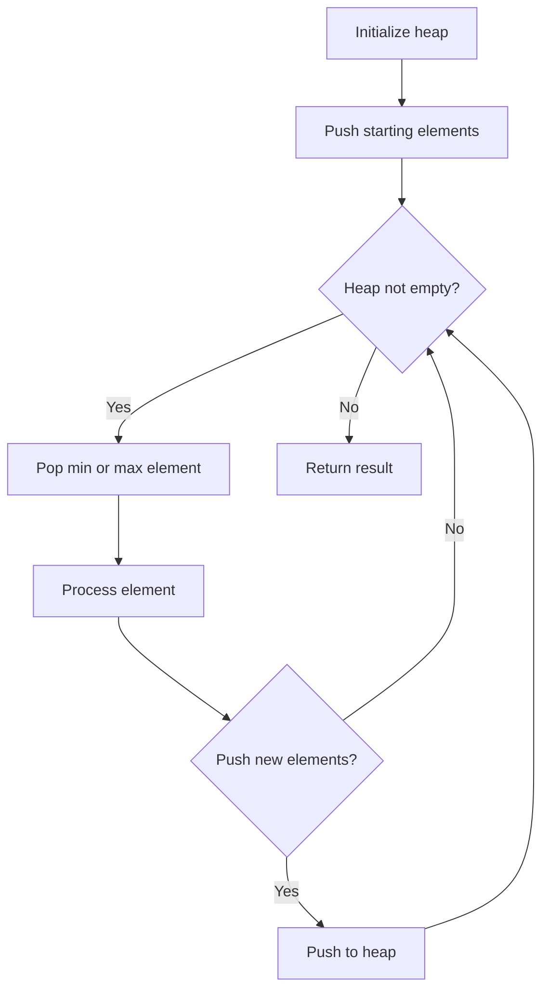
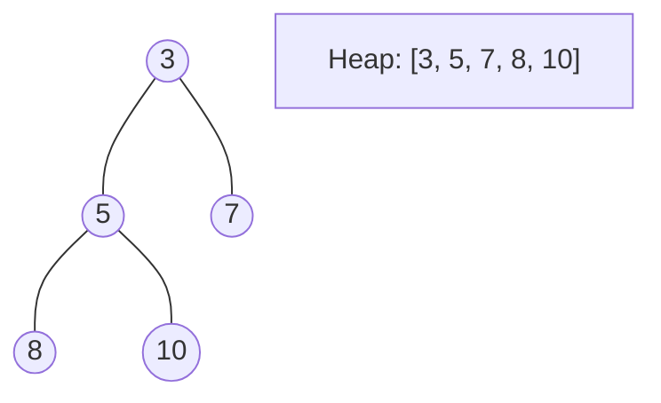
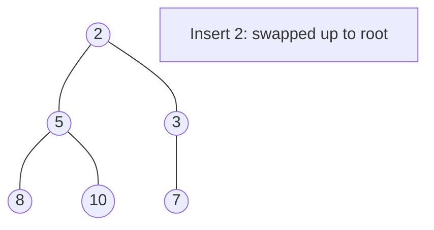
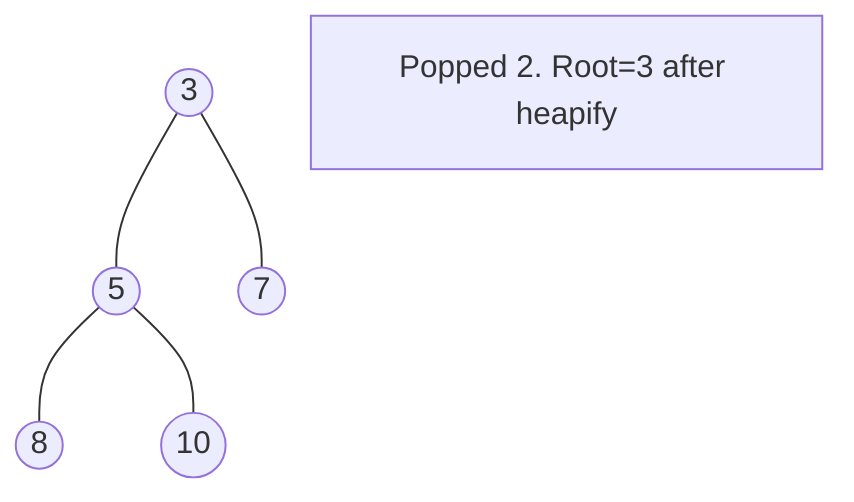

# Problem 407: Trapping Rain Water II

**Difficulty:** Hard  
**Tags:** Array, Breadth-First Search, Heap (Priority Queue), Matrix  
**Pattern:** Heap / Priority Queue  
**Link:** [leetcode.com/problems/trapping-rain-water-ii](https://leetcode.com/problems/trapping-rain-water-ii/)

## Description

Given an `m x n` integer matrix `heightMap` representing the height of each unit cell in a 2D elevation map, return *the volume of water it can trap after raining*.

 

Example 1:

```

**Input:** heightMap = [[1,4,3,1,3,2],[3,2,1,3,2,4],[2,3,3,2,3,1]]
**Output:** 4
**Explanation:** After the rain, water is trapped between the blocks.
We have two small ponds 1 and 3 units trapped.
The total volume of water trapped is 4.

```

Example 2:

```

**Input:** heightMap = [[3,3,3,3,3],[3,2,2,2,3],[3,2,1,2,3],[3,2,2,2,3],[3,3,3,3,3]]
**Output:** 10

```

 

**Constraints:**

	- `m == heightMap.length`
	- `n == heightMap[i].length`
	- `1 <= m, n <= 200`
	- `0 <= heightMap[i][j] <= 2 * 10^4`

## Approach: Heap / Priority Queue

Use a min-heap or max-heap to efficiently access the smallest/largest element. Push elements and pop the top to process in priority order.

## Pseudocode

```
1. Initialize heap (min or max)
2. Push initial elements onto heap
3. While heap not empty and condition:
   a. Pop top element (min or max)
   b. Process element
   c. Push new elements if needed
4. Return result
```

## Algorithm Flow



## Visual State Transitions

**Heap Operations (Min-Heap):**

**Frame 1: Initial heap**


**Frame 2: Insert 2 - bubble up**


**Frame 3: Pop minimum (2) - heapify down**



## Complexity Analysis

- **Time:** O(n log n)
- **Space:** O(n)

## Solution (Python3)

```python
class Solution:
    def trapRainWater(self, heightMap: List[List[int]]) -> int:
        # Heap/Priority Queue - O(n log k) time
        import heapq
        if not heightMap:
            return 0
        # Min heap (negate for max heap)
        heap = []
        for val in heightMap:
            heapq.heappush(heap, val)
            if len(heap) > (heightMap if isinstance(heightMap, int) else len(heightMap)):
                heapq.heappop(heap)
        return heap[0] if heap else 0
```

## Solution (C++)

```cpp
#include <queue>
#include <string>
#include <vector>
using namespace std;

class Solution {
public:
    int trapRainWater(vector<vector<int>>& heightMap) {
        // Heap/Priority Queue - O(n log k) time
        priority_queue<int, vector<int>, greater<int>> pq;
        for (int val : heightMap) {
            pq.push(val);
            if ((int)pq.size() > heightMap)
                pq.pop();
        }
        return pq.empty() ? 0 : pq.top();
    }
};
```
