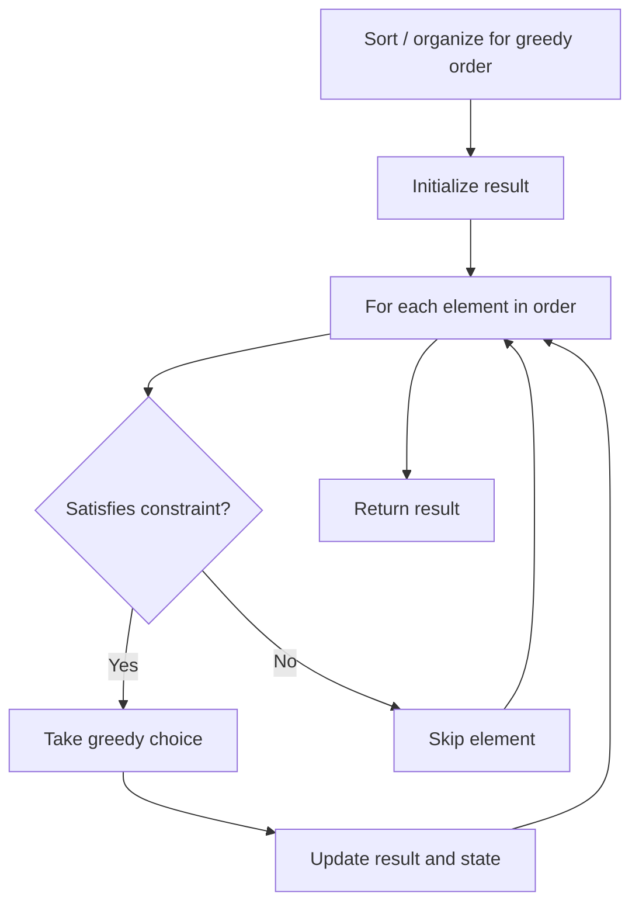

# Problem 409: Longest Palindrome

**Difficulty:** Easy  
**Tags:** Hash Table, String, Greedy  
**Pattern:** Greedy  
**Link:** [leetcode.com/problems/longest-palindrome](https://leetcode.com/problems/longest-palindrome/)

## Description

Given a string `s` which consists of lowercase or uppercase letters, return the length of the **longest palindrome** that can be built with those letters.

Letters are **case sensitive**, for example, `"Aa"` is not considered a palindrome.

 

Example 1:

```

**Input:** s = "abccccdd"
**Output:** 7
**Explanation:** One longest palindrome that can be built is "dccaccd", whose length is 7.

```

Example 2:

```

**Input:** s = "a"
**Output:** 1
**Explanation:** The longest palindrome that can be built is "a", whose length is 1.

```

 

**Constraints:**

	- `1 <= s.length <= 2000`
	- `s` consists of lowercase **and/or** uppercase English letters only.

## Approach: Greedy

Make the locally optimal choice at each step, trusting it leads to a global optimum. Greedy works when the problem has the greedy-choice property and optimal substructure.

## Pseudocode

```
1. Sort or organize data for greedy ordering
2. Initialize result
3. For each element in greedy order:
   a. If element satisfies constraint:
      - Take the greedy choice
      - Update result and state
4. Return result
```

## Algorithm Flow



## Complexity Analysis

- **Time:** O(n log n)
- **Space:** O(1)

## Solution (Python3)

```python
class Solution:
    def longestPalindrome(self, s: str) -> int:
        # Greedy approach - O(n) time
        result = 0
        curr_max = 0
        for i in range(len(s)):
            if isinstance(s[i], int):
                curr_max = max(curr_max, s[i])
                result = max(result, curr_max)
            else:
                result += 1
        return result
```

## Solution (C++)

```cpp
#include <algorithm>
#include <string>
#include <vector>
using namespace std;

class Solution {
public:
    int longestPalindrome(string& s) {
        // Greedy approach - O(n) time
        int result = 0, curr_max = 0;
        for (int i = 0; i < (int)s.size(); i++) {
            curr_max = max(curr_max, s[i]);
            result = max(result, curr_max);
        }
        return result;
    }
};
```
