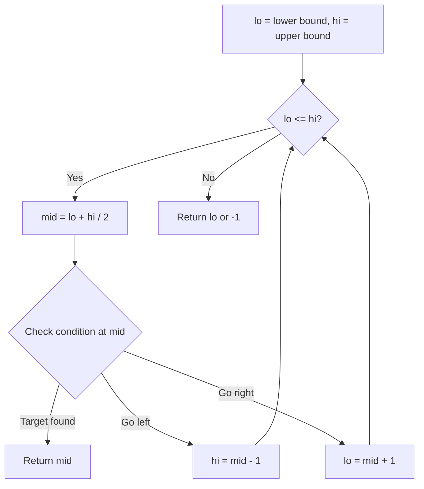
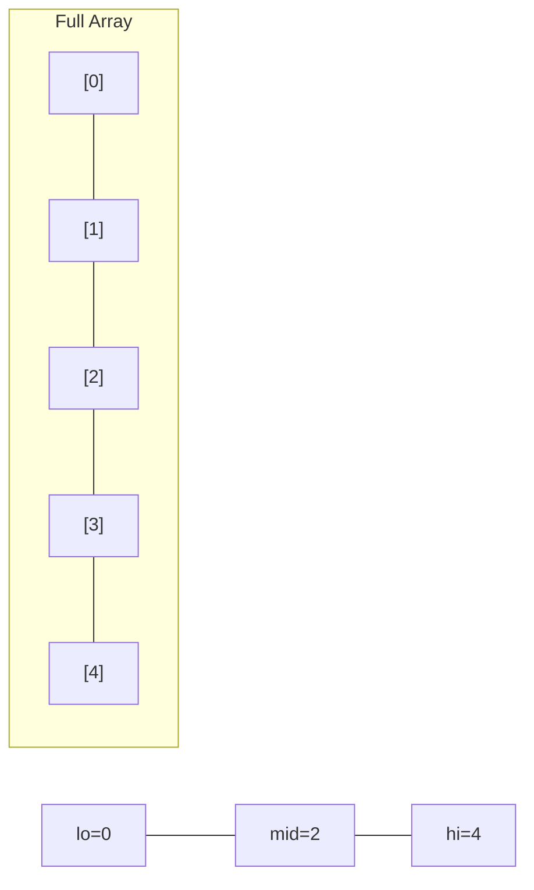
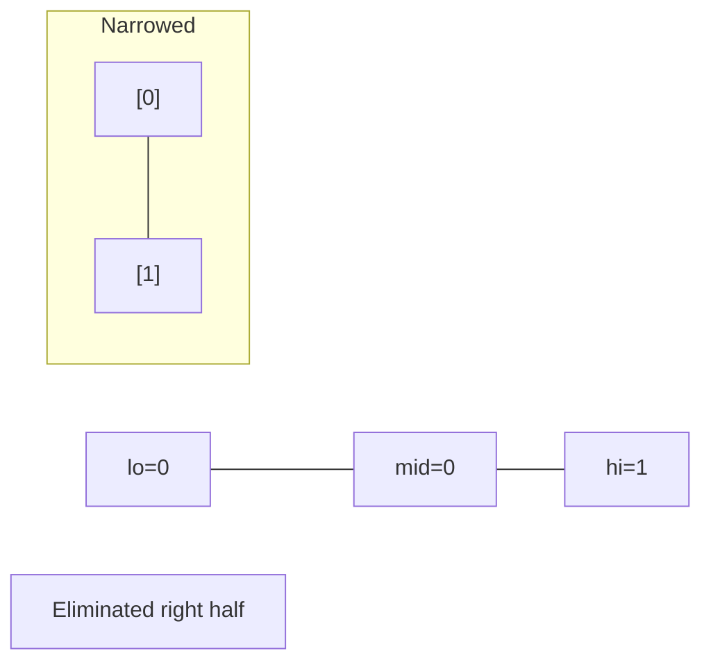
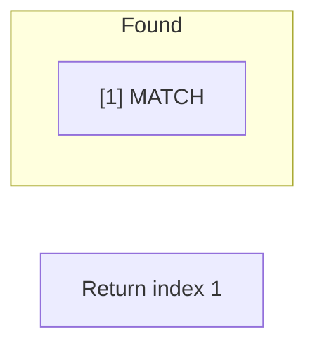

# Problem 410: Split Array Largest Sum

**Difficulty:** Hard  
**Tags:** Array, Binary Search, Dynamic Programming, Greedy, Prefix Sum  
**Pattern:** Binary Search  
**Link:** [leetcode.com/problems/split-array-largest-sum](https://leetcode.com/problems/split-array-largest-sum/)

## Description

Given an integer array `nums` and an integer `k`, split `nums` into `k` non-empty subarrays such that the largest sum of any subarray is **minimized**.

Return *the minimized largest sum of the split*.

A **subarray** is a contiguous part of the array.

 

Example 1:

```

**Input:** nums = [7,2,5,10,8], k = 2
**Output:** 18
**Explanation:** There are four ways to split nums into two subarrays.
The best way is to split it into [7,2,5] and [10,8], where the largest sum among the two subarrays is only 18.

```

Example 2:

```

**Input:** nums = [1,2,3,4,5], k = 2
**Output:** 9
**Explanation:** There are four ways to split nums into two subarrays.
The best way is to split it into [1,2,3] and [4,5], where the largest sum among the two subarrays is only 9.

```

 

**Constraints:**

	- `1 <= nums.length <= 1000`
	- `0 <= nums[i] <= 10^6`
	- `1 <= k <= min(50, nums.length)`

## Approach: Binary Search

Use binary search to halve the search space each iteration. Define the search range [lo, hi], compute mid, and decide which half to keep based on the problem's monotonic condition.

## Pseudocode

```
1. lo = lower_bound, hi = upper_bound
2. While lo <= hi (or lo < hi):
   a. mid = (lo + hi) // 2
   b. If condition(mid) is satisfied: record answer, search left half
   c. Else: search right half
3. Return answer
```

## Algorithm Flow



## Visual State Transitions

**Binary Search Step-by-Step:**

**Frame 1: Initial search space**


**Frame 2: Compare mid, narrow search**


**Frame 3: Found target**



## Complexity Analysis

- **Time:** O(log n)
- **Space:** O(1)

## Solution (Python3)

```python
class Solution:
    def splitArray(self, nums: List[int], k: int) -> int:
        # Binary search - O(log n) time, O(1) space
        lo, hi = 0, len(nums) - 1
        while lo <= hi:
            mid = lo + (hi - lo) // 2
            if nums[mid] == k:
                return mid
            elif nums[mid] < k:
                lo = mid + 1
            else:
                hi = mid - 1
        return 0
```

## Solution (C++)

```cpp
#include <string>
#include <vector>
using namespace std;

class Solution {
public:
    int splitArray(vector<int>& nums, int k) {
        // Binary search - O(log n) time, O(1) space
        int lo = 0, hi = nums.size() - 1;
        while (lo <= hi) {
            int mid = lo + (hi - lo) / 2;
            if (nums[mid] == k) {
                return mid;
            } else if (nums[mid] < k) {
                lo = mid + 1;
            } else {
                hi = mid - 1;
            }
        }
        return 0;
    }
};
```
