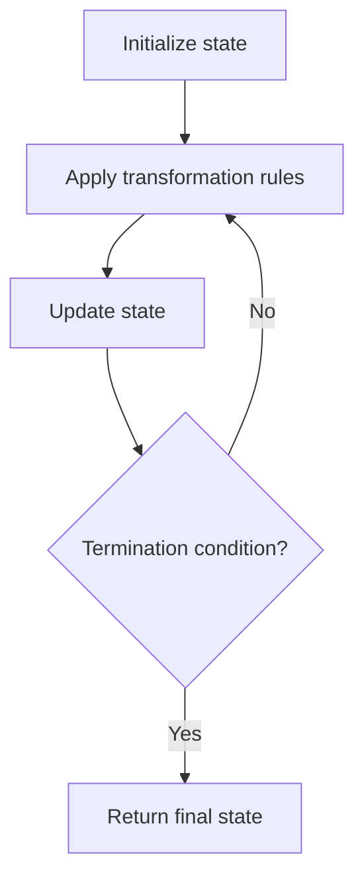

# Problem 412: Fizz Buzz

**Difficulty:** Easy  
**Tags:** Math, String, Simulation  
**Pattern:** Simulation  
**Link:** [leetcode.com/problems/fizz-buzz](https://leetcode.com/problems/fizz-buzz/)

## Description

Given an integer `n`, return *a string array *`answer`* (**1-indexed**) where*:

	- `answer[i] == "FizzBuzz"` if `i` is divisible by `3` and `5`.
	- `answer[i] == "Fizz"` if `i` is divisible by `3`.
	- `answer[i] == "Buzz"` if `i` is divisible by `5`.
	- `answer[i] == i` (as a string) if none of the above conditions are true.

 

Example 1:

```
**Input:** n = 3
**Output:** ["1","2","Fizz"]

```
Example 2:

```
**Input:** n = 5
**Output:** ["1","2","Fizz","4","Buzz"]

```
Example 3:

```
**Input:** n = 15
**Output:** ["1","2","Fizz","4","Buzz","Fizz","7","8","Fizz","Buzz","11","Fizz","13","14","FizzBuzz"]

```

 

**Constraints:**

	- `1 <= n <= 10^4`

## Approach: Simulation

Simulate the process described in the problem step by step. Follow the rules exactly, tracking state at each step.

## Pseudocode

```
1. Initialize state (grid, pointers, counters)
2. For each step / iteration:
   a. Apply the transformation rules
   b. Update state
   c. Check termination condition
3. Return final state or result
```

## Algorithm Flow



## Complexity Analysis

- **Time:** O(n) or O(n * k)
- **Space:** O(n)

## Solution (Python3)

```python
class Solution:
    def fizzBuzz(self, n: int) -> List[str]:
        # Simulation approach - follow the rules step by step
        result = []
        for i in range(len(n) if isinstance(n, list) else n):
            # Simulate each step
            pass
        return result
```

## Solution (C++)

```cpp
#include <string>
#include <vector>
using namespace std;

class Solution {
public:
    vector<string> fizzBuzz(int n) {
        // Simulation approach
        int n = n.size();
        for (int i = 0; i < n; i++) {
            // Simulate each step
        }
        return {};
    }
};
```
