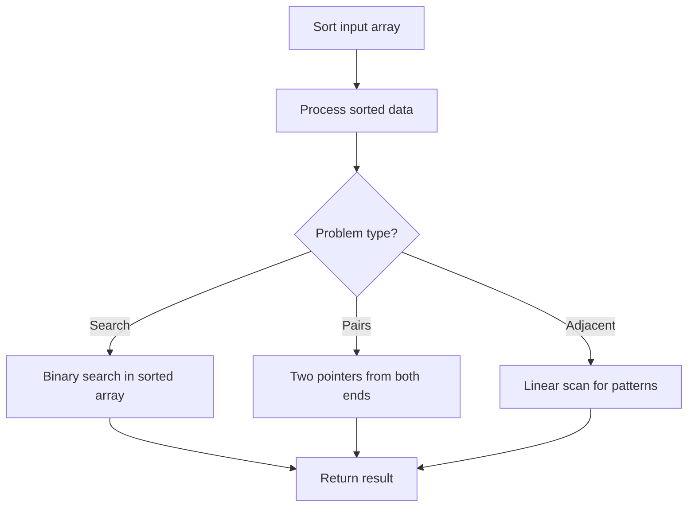

# Problem 414: Third Maximum Number

**Difficulty:** Easy  
**Tags:** Array, Sorting  
**Pattern:** Sorting  
**Link:** [leetcode.com/problems/third-maximum-number](https://leetcode.com/problems/third-maximum-number/)

## Description

Given an integer array `nums`, return *the **third distinct maximum** number in this array. If the third maximum does not exist, return the **maximum** number*.

 

Example 1:

```

**Input:** nums = [3,2,1]
**Output:** 1
**Explanation:**
The first distinct maximum is 3.
The second distinct maximum is 2.
The third distinct maximum is 1.

```

Example 2:

```

**Input:** nums = [1,2]
**Output:** 2
**Explanation:**
The first distinct maximum is 2.
The second distinct maximum is 1.
The third distinct maximum does not exist, so the maximum (2) is returned instead.

```

Example 3:

```

**Input:** nums = [2,2,3,1]
**Output:** 1
**Explanation:**
The first distinct maximum is 3.
The second distinct maximum is 2 (both 2's are counted together since they have the same value).
The third distinct maximum is 1.

```

 

**Constraints:**

	- `1 <= nums.length <= 10^4`
	- `-2^31 <= nums[i] <= 2^31 - 1`

 

**Follow up:** Can you find an `O(n)` solution?

## Approach: Sorting

Sort the data to enable efficient processing. After sorting, use techniques like binary search, two pointers, or linear scan to solve the problem.

## Pseudocode

```
1. Sort the input array
2. Process sorted data:
   - Use binary search for lookups
   - Use two pointers for pair finding
   - Scan for adjacent patterns
3. Return result
```

## Algorithm Flow



## Complexity Analysis

- **Time:** O(n log n)
- **Space:** O(n)

## Solution (Python3)

```python
class Solution:
    def thirdMax(self, nums: List[int]) -> int:
        # Sort-based approach - O(n log n) time
        nums.sort(key=lambda x: x[0] if isinstance(x, (list, tuple)) else x)
        result = [nums[0]]
        for i in range(1, len(nums)):
            curr = nums[i]
            if isinstance(curr, (list, tuple)) and isinstance(result[-1], (list, tuple)):
                if curr[0] <= result[-1][1]:
                    result[-1] = [result[-1][0], max(result[-1][1], curr[1])]
                else:
                    result.append(curr)
            else:
                result.append(curr)
        return result
```

## Solution (C++)

```cpp
#include <algorithm>
#include <string>
#include <vector>
using namespace std;

class Solution {
public:
    int thirdMax(vector<int>& nums) {
        // Sort-based approach - O(n log n) time
        sort(nums.begin(), nums.end());
        vector<vector<int>> result;
        result.push_back(nums[0]);
        for (int i = 1; i < (int)nums.size(); i++) {
            if (nums[i][0] <= result.back()[1]) {
                result.back()[1] = max(result.back()[1], nums[i][1]);
            } else {
                result.push_back(nums[i]);
            }
        }
        return result;
    }
};
```
