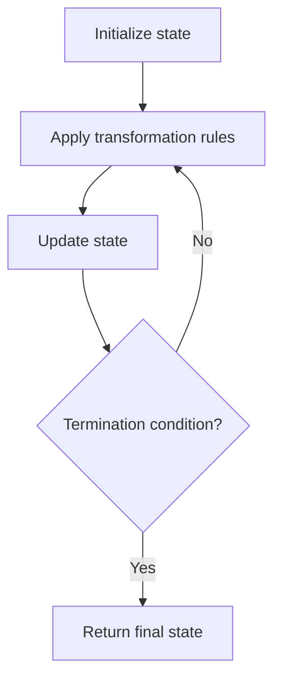

# Problem 415: Add Strings

**Difficulty:** Easy  
**Tags:** Math, String, Simulation  
**Pattern:** Simulation  
**Link:** [leetcode.com/problems/add-strings](https://leetcode.com/problems/add-strings/)

## Description

Given two non-negative integers, `num1` and `num2` represented as string, return *the sum of* `num1` *and* `num2` *as a string*.

You must solve the problem without using any built-in library for handling large integers (such as `BigInteger`). You must also not convert the inputs to integers directly.

 

Example 1:

```

**Input:** num1 = "11", num2 = "123"
**Output:** "134"

```

Example 2:

```

**Input:** num1 = "456", num2 = "77"
**Output:** "533"

```

Example 3:

```

**Input:** num1 = "0", num2 = "0"
**Output:** "0"

```

 

**Constraints:**

	- `1 <= num1.length, num2.length <= 10^4`
	- `num1` and `num2` consist of only digits.
	- `num1` and `num2` don't have any leading zeros except for the zero itself.

## Approach: Simulation

Simulate the process described in the problem step by step. Follow the rules exactly, tracking state at each step.

## Pseudocode

```
1. Initialize state (grid, pointers, counters)
2. For each step / iteration:
   a. Apply the transformation rules
   b. Update state
   c. Check termination condition
3. Return final state or result
```

## Algorithm Flow



## Complexity Analysis

- **Time:** O(n) or O(n * k)
- **Space:** O(n)

## Solution (Python3)

```python
class Solution:
    def addStrings(self, num1: str, num2: str) -> str:
        # Simulation approach - follow the rules step by step
        result = ""
        for i in range(len(num1) if isinstance(num1, list) else num1):
            # Simulate each step
            pass
        return result
```

## Solution (C++)

```cpp
#include <string>
#include <vector>
using namespace std;

class Solution {
public:
    string addStrings(string& num1, string& num2) {
        // Simulation approach
        int n = num1.size();
        for (int i = 0; i < n; i++) {
            // Simulate each step
        }
        return "";
    }
};
```
