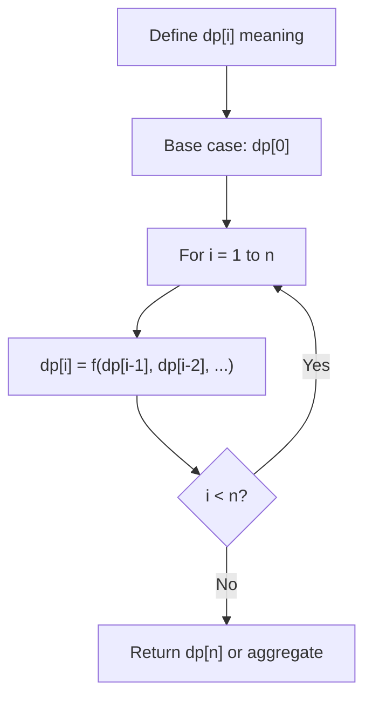
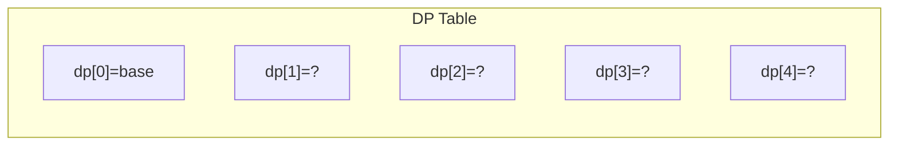
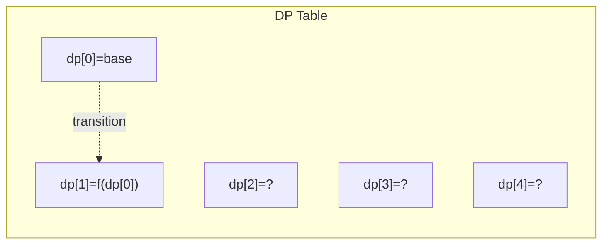
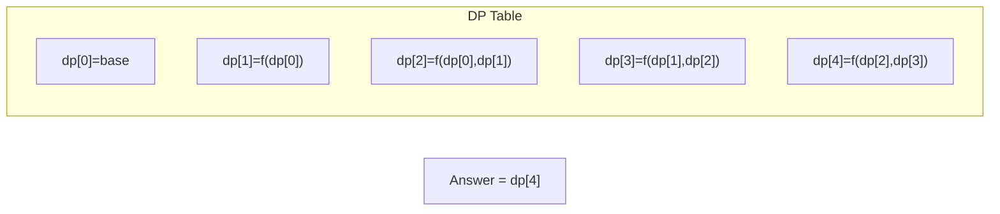

# Problem 416: Partition Equal Subset Sum

**Difficulty:** Medium  
**Tags:** Array, Dynamic Programming  
**Pattern:** Dynamic Programming (0/1 Knapsack)  
**Link:** [leetcode.com/problems/partition-equal-subset-sum](https://leetcode.com/problems/partition-equal-subset-sum/)

## Description

Given an integer array `nums`, return `true` *if you can partition the array into two subsets such that the sum of the elements in both subsets is equal or *`false`* otherwise*.

 

Example 1:

```

**Input:** nums = [1,5,11,5]
**Output:** true
**Explanation:** The array can be partitioned as [1, 5, 5] and [11].

```

Example 2:

```

**Input:** nums = [1,2,3,5]
**Output:** false
**Explanation:** The array cannot be partitioned into equal sum subsets.

```

 

**Constraints:**

	- `1 <= nums.length <= 200`
	- `1 <= nums[i] <= 100`

## Approach: Dynamic Programming (0/1 Knapsack)

Reduce to subset sum: can we find subset summing to total/2? Use 1D DP.

## Pseudocode

```
1. If total is odd: False
2. target = total/2
3. dp[0] = True
4. For each num: update dp backwards
5. Return dp[target]
```

## Algorithm Flow



## Visual State Transitions

**1D Dynamic Programming Table Build:**

**Frame 1: Initialize base cases**


**Frame 2: Fill dp[1] from dp[0]**


**Frame 3: Fill remaining cells**



## Complexity Analysis

- **Time:** O(n * sum/2)
- **Space:** O(sum/2)

## Solution (Python3)

```python
class Solution:
    def canPartition(self, nums: list[int]) -> bool:
        total = sum(nums)
        if total % 2:
            return False
        target = total // 2
        dp = [False] * (target + 1)
        dp[0] = True
        for num in nums:
            for j in range(target, num - 1, -1):
                dp[j] = dp[j] or dp[j - num]
        return dp[target]
```

## Solution (C++)

```cpp
#include <string>
#include <vector>
using namespace std;

class Solution {
public:
    bool canPartition(vector<int>& nums) {
        // Dynamic programming (1D) - O(n) time, O(n) space
        int n = nums;
        if (n <= 0) return 0;
        vector<int> dp(n + 1, 0);
        dp[0] = 1;
        for (int i = 1; i <= n; i++) {
            dp[i] = dp[i-1];
            if (i >= 2) dp[i] += dp[i-2];
        }
        return dp[n];
    }
};
```
