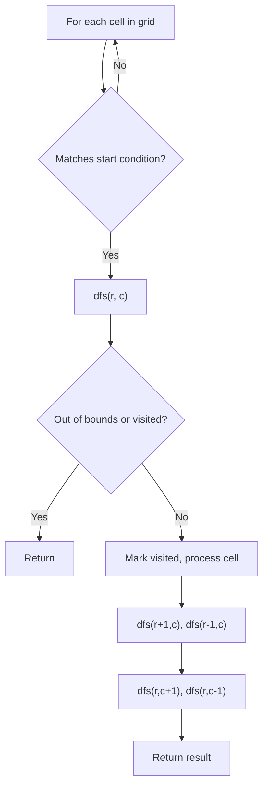
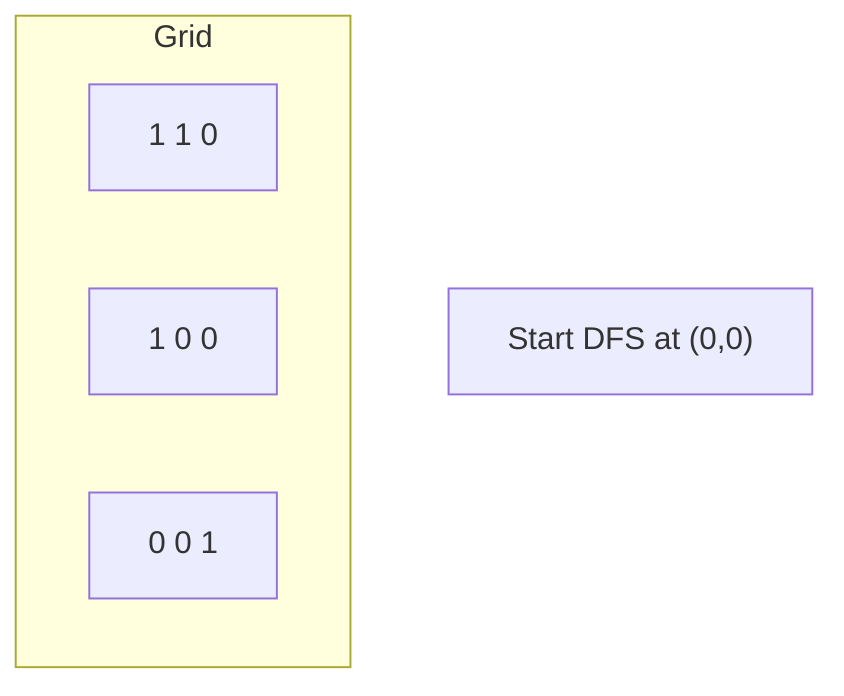
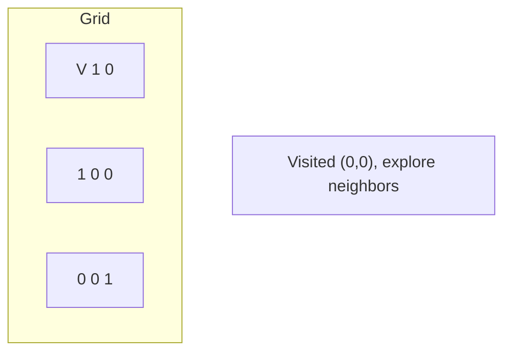
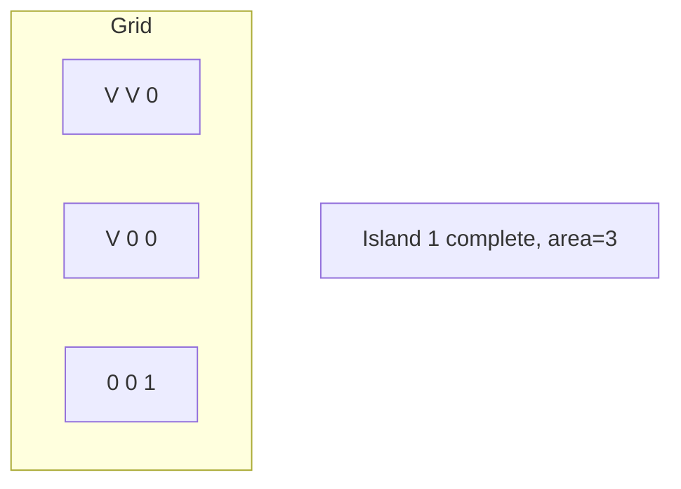
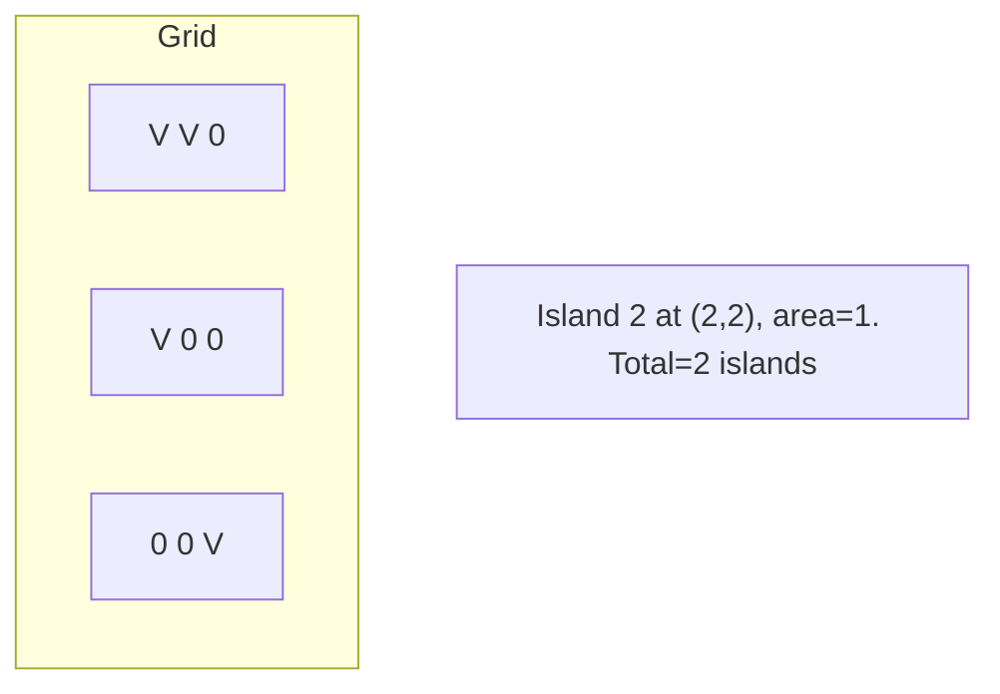

# Problem 417: Pacific Atlantic Water Flow

**Difficulty:** Medium  
**Tags:** Array, Depth-First Search, Breadth-First Search, Matrix  
**Pattern:** DFS on Matrix / Grid  
**Link:** [leetcode.com/problems/pacific-atlantic-water-flow](https://leetcode.com/problems/pacific-atlantic-water-flow/)

## Description

There is an `m x n` rectangular island that borders both the **Pacific Ocean** and **Atlantic Ocean**. The **Pacific Ocean** touches the island's left and top edges, and the **Atlantic Ocean** touches the island's right and bottom edges.

The island is partitioned into a grid of square cells. You are given an `m x n` integer matrix `heights` where `heights[r][c]` represents the **height above sea level** of the cell at coordinate `(r, c)`.

The island receives a lot of rain, and the rain water can flow to neighboring cells directly north, south, east, and west if the neighboring cell's height is **less than or equal to** the current cell's height. Water can flow from any cell adjacent to an ocean into the ocean.

Return *a **2D list** of grid coordinates *`result`* where *`result[i] = [ri, ci]`* denotes that rain water can flow from cell *`(ri, ci)`* to **both** the Pacific and Atlantic oceans*.

 

Example 1:

```

**Input:** heights = [[1,2,2,3,5],[3,2,3,4,4],[2,4,5,3,1],[6,7,1,4,5],[5,1,1,2,4]]
**Output:** [[0,4],[1,3],[1,4],[2,2],[3,0],[3,1],[4,0]]
**Explanation:** The following cells can flow to the Pacific and Atlantic oceans, as shown below:
[0,4]: [0,4] -> Pacific Ocean 
       [0,4] -> Atlantic Ocean
[1,3]: [1,3] -> [0,3] -> Pacific Ocean 
       [1,3] -> [1,4] -> Atlantic Ocean
[1,4]: [1,4] -> [1,3] -> [0,3] -> Pacific Ocean 
       [1,4] -> Atlantic Ocean
[2,2]: [2,2] -> [1,2] -> [0,2] -> Pacific Ocean 
       [2,2] -> [2,3] -> [2,4] -> Atlantic Ocean
[3,0]: [3,0] -> Pacific Ocean 
       [3,0] -> [4,0] -> Atlantic Ocean
[3,1]: [3,1] -> [3,0] -> Pacific Ocean 
       [3,1] -> [4,1] -> Atlantic Ocean
[4,0]: [4,0] -> Pacific Ocean 
       [4,0] -> Atlantic Ocean
Note that there are other possible paths for these cells to flow to the Pacific and Atlantic oceans.

```

Example 2:

```

**Input:** heights = [[1]]
**Output:** [[0,0]]
**Explanation:** The water can flow from the only cell to the Pacific and Atlantic oceans.

```

 

**Constraints:**

	- `m == heights.length`
	- `n == heights[r].length`
	- `1 <= m, n <= 200`
	- `0 <= heights[r][c] <= 10^5`

## Approach: DFS on Matrix / Grid

Treat the grid as a graph where each cell connects to its 4 (or 8) neighbors. DFS from target cells, marking visited to avoid revisiting.

## Pseudocode

```
1. For each cell (r, c) in grid:
   a. If cell meets start condition:
      - Call dfs(r, c)
2. dfs(r, c):
   a. If out of bounds or visited or invalid: return
   b. Mark cell visited
   c. Recurse on 4 neighbors: up, down, left, right
3. Return result
```

## Algorithm Flow



## Visual State Transitions

**DFS on Grid (Island/Flood Fill):**

**Frame 1: Find first land cell**


**Frame 2: DFS explores connected cells**


**Frame 3: Mark entire island**


**Frame 4: Find second island**



## Complexity Analysis

- **Time:** O(m * n)
- **Space:** O(m * n)

## Solution (Python3)

```python
class Solution:
    def pacificAtlantic(self, heights: List[List[int]]) -> List[List[int]]:
        # DFS on grid - O(m*n) time
        if not heights:
            return 0
        rows, cols = len(heights), len(heights[0])
        count = 0
        
        def dfs(r, c):
            if r < 0 or r >= rows or c < 0 or c >= cols:
                return
            if heights[r][c] == '0' or heights[r][c] == 0:
                return
            heights[r][c] = '0'
            dfs(r+1, c); dfs(r-1, c)
            dfs(r, c+1); dfs(r, c-1)
        
        for r in range(rows):
            for c in range(cols):
                if heights[r][c] == '1' or heights[r][c] == 1:
                    dfs(r, c)
                    count += 1
        return count
```

## Solution (C++)

```cpp
#include <functional>
#include <string>
#include <vector>
using namespace std;

class Solution {
public:
    vector<vector<int>> pacificAtlantic(vector<vector<int>>& heights) {
        // DFS on grid - O(m*n) time
        if (heights.empty()) return 0;
        int rows = heights.size(), cols = heights[0].size();
        int count = 0;
        function<void(int, int)> dfs = [&](int r, int c) {
            if (r < 0 || r >= rows || c < 0 || c >= cols) return;
            if (heights[r][c] == '0') return;
            heights[r][c] = '0';
            dfs(r+1, c); dfs(r-1, c);
            dfs(r, c+1); dfs(r, c-1);
        };
        for (int r = 0; r < rows; r++) {
            for (int c = 0; c < cols; c++) {
                if (heights[r][c] == '1') {
                    dfs(r, c);
                    count++;
                }
            }
        }
        return count;
    }
};
```
