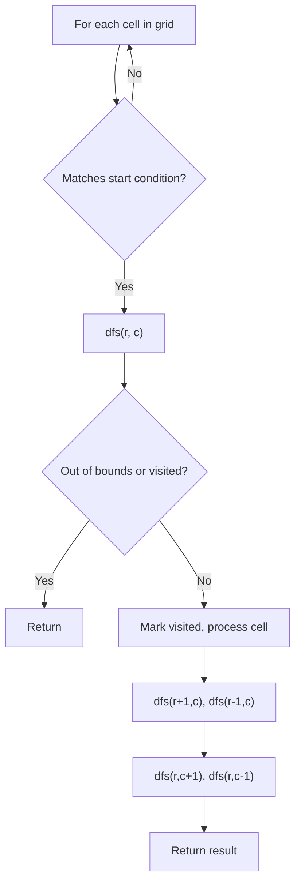
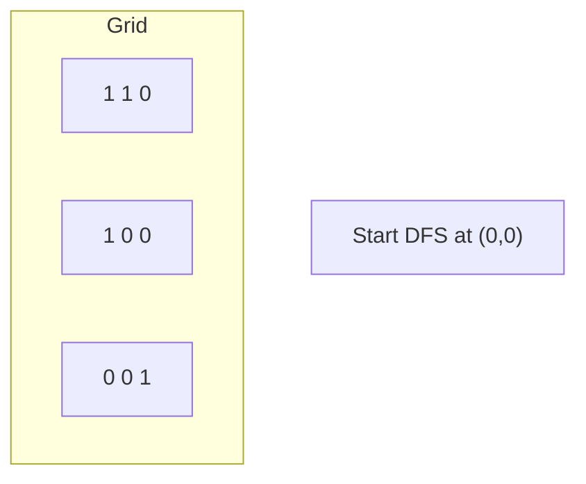
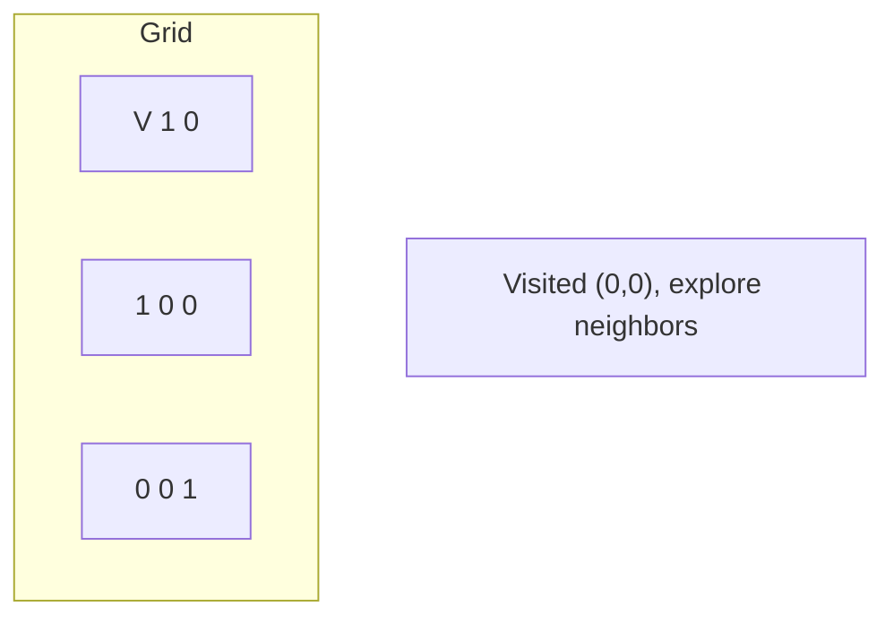
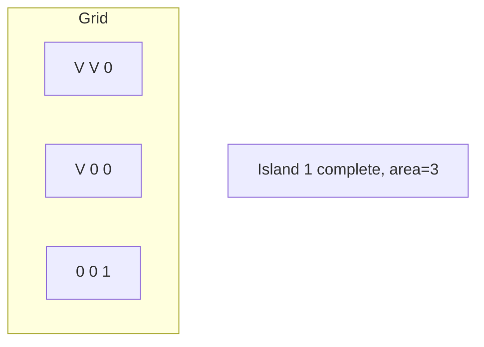
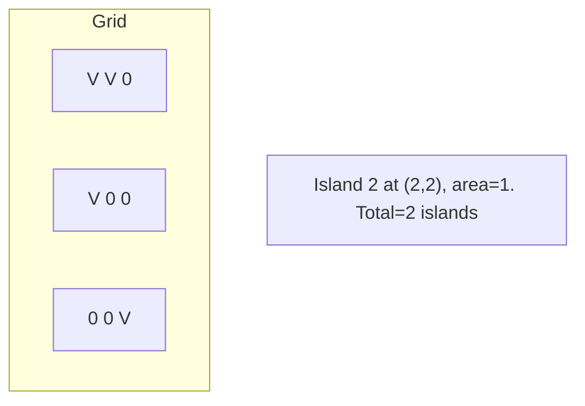

# Problem 419: Battleships in a Board

**Difficulty:** Medium  
**Tags:** Array, Depth-First Search, Matrix  
**Pattern:** DFS on Matrix / Grid  
**Link:** [leetcode.com/problems/battleships-in-a-board](https://leetcode.com/problems/battleships-in-a-board/)

## Description

Given an `m x n` matrix `board` where each cell is a battleship `'X'` or empty `'.'`, return *the number of the **battleships** on* `board`.

**Battleships** can only be placed horizontally or vertically on `board`. In other words, they can only be made of the shape `1 x k` (`1` row, `k` columns) or `k x 1` (`k` rows, `1` column), where `k` can be of any size. At least one horizontal or vertical cell separates between two battleships (i.e., there are no adjacent battleships).

 

Example 1:

```

**Input:** board = [["X",".",".","X"],[".",".",".","X"],[".",".",".","X"]]
**Output:** 2

```

Example 2:

```

**Input:** board = [["."]]
**Output:** 0

```

 

**Constraints:**

	- `m == board.length`
	- `n == board[i].length`
	- `1 <= m, n <= 200`
	- `board[i][j]` is either `'.'` or `'X'`.

 

**Follow up:** Could you do it in one-pass, using only `O(1)` extra memory and without modifying the values `board`?

## Approach: DFS on Matrix / Grid

Treat the grid as a graph where each cell connects to its 4 (or 8) neighbors. DFS from target cells, marking visited to avoid revisiting.

## Pseudocode

```
1. For each cell (r, c) in grid:
   a. If cell meets start condition:
      - Call dfs(r, c)
2. dfs(r, c):
   a. If out of bounds or visited or invalid: return
   b. Mark cell visited
   c. Recurse on 4 neighbors: up, down, left, right
3. Return result
```

## Algorithm Flow



## Visual State Transitions

**DFS on Grid (Island/Flood Fill):**

**Frame 1: Find first land cell**


**Frame 2: DFS explores connected cells**


**Frame 3: Mark entire island**


**Frame 4: Find second island**



## Complexity Analysis

- **Time:** O(m * n)
- **Space:** O(m * n)

## Solution (Python3)

```python
class Solution:
    def countBattleships(self, board: List[List[str]]) -> int:
        # DFS on grid - O(m*n) time
        if not board:
            return 0
        rows, cols = len(board), len(board[0])
        count = 0
        
        def dfs(r, c):
            if r < 0 or r >= rows or c < 0 or c >= cols:
                return
            if board[r][c] == '0' or board[r][c] == 0:
                return
            board[r][c] = '0'
            dfs(r+1, c); dfs(r-1, c)
            dfs(r, c+1); dfs(r, c-1)
        
        for r in range(rows):
            for c in range(cols):
                if board[r][c] == '1' or board[r][c] == 1:
                    dfs(r, c)
                    count += 1
        return count
```

## Solution (C++)

```cpp
#include <functional>
#include <string>
#include <vector>
using namespace std;

class Solution {
public:
    int countBattleships(vector<vector<string>>& board) {
        // DFS on grid - O(m*n) time
        if (board.empty()) return 0;
        int rows = board.size(), cols = board[0].size();
        int count = 0;
        function<void(int, int)> dfs = [&](int r, int c) {
            if (r < 0 || r >= rows || c < 0 || c >= cols) return;
            if (board[r][c] == '0') return;
            board[r][c] = '0';
            dfs(r+1, c); dfs(r-1, c);
            dfs(r, c+1); dfs(r, c-1);
        };
        for (int r = 0; r < rows; r++) {
            for (int c = 0; c < cols; c++) {
                if (board[r][c] == '1') {
                    dfs(r, c);
                    count++;
                }
            }
        }
        return count;
    }
};
```
