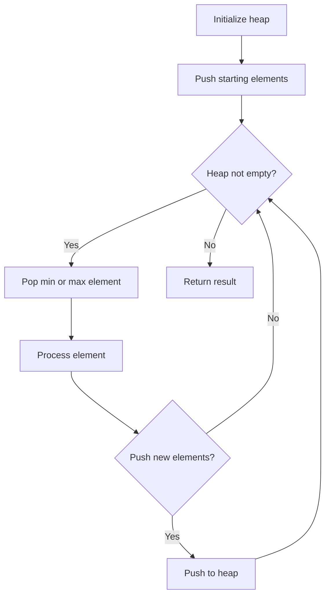
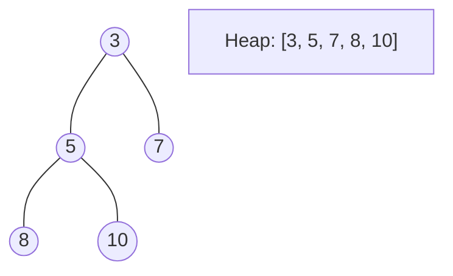
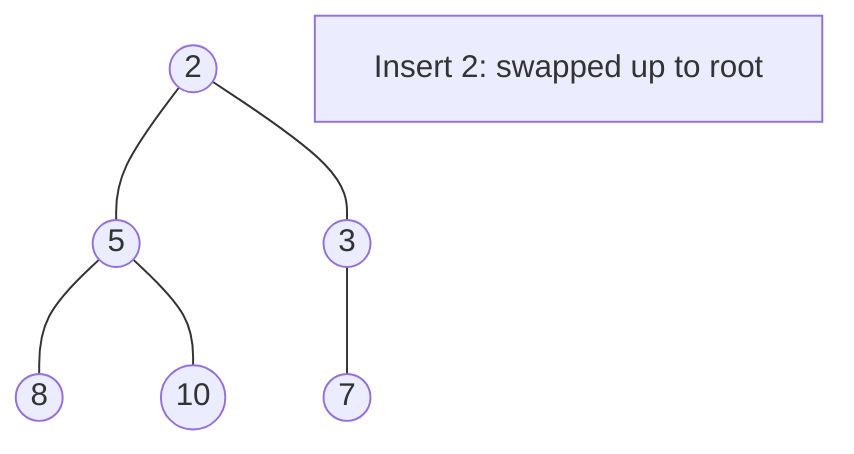
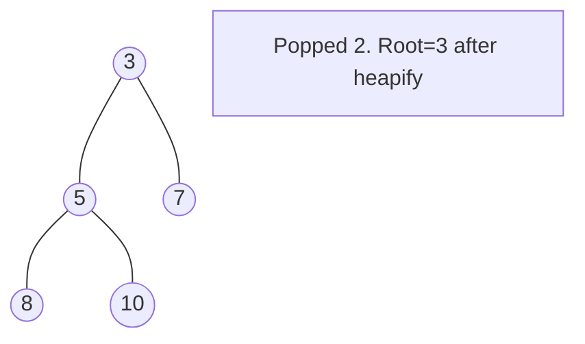

# Problem 420: Strong Password Checker

**Difficulty:** Hard  
**Tags:** String, Greedy, Heap (Priority Queue)  
**Pattern:** Heap / Priority Queue  
**Link:** [leetcode.com/problems/strong-password-checker](https://leetcode.com/problems/strong-password-checker/)

## Description

A password is considered strong if the below conditions are all met:

	- It has at least `6` characters and at most `20` characters.
	- It contains at least **one lowercase** letter, at least **one uppercase** letter, and at least **one digit**.
	- It does not contain three repeating characters in a row (i.e., `"B**aaa**bb0"` is weak, but `"B**aa**b**a**0"` is strong).

Given a string `password`, return *the minimum number of steps required to make `password` strong. if `password` is already strong, return `0`.*

In one step, you can:

	- Insert one character to `password`,
	- Delete one character from `password`, or
	- Replace one character of `password` with another character.

 

Example 1:

```
**Input:** password = "a"
**Output:** 5

```
Example 2:

```
**Input:** password = "aA1"
**Output:** 3

```
Example 3:

```
**Input:** password = "1337C0d3"
**Output:** 0

```

 

**Constraints:**

	- `1 <= password.length <= 50`
	- `password` consists of letters, digits, dot `'.'` or exclamation mark `'!'`.

## Approach: Heap / Priority Queue

Use a min-heap or max-heap to efficiently access the smallest/largest element. Push elements and pop the top to process in priority order.

## Pseudocode

```
1. Initialize heap (min or max)
2. Push initial elements onto heap
3. While heap not empty and condition:
   a. Pop top element (min or max)
   b. Process element
   c. Push new elements if needed
4. Return result
```

## Algorithm Flow



## Visual State Transitions

**Heap Operations (Min-Heap):**

**Frame 1: Initial heap**


**Frame 2: Insert 2 - bubble up**


**Frame 3: Pop minimum (2) - heapify down**



## Complexity Analysis

- **Time:** O(n log n)
- **Space:** O(n)

## Solution (Python3)

```python
class Solution:
    def strongPasswordChecker(self, password: str) -> int:
        # Heap/Priority Queue - O(n log k) time
        import heapq
        if not password:
            return 0
        # Min heap (negate for max heap)
        heap = []
        for val in password:
            heapq.heappush(heap, val)
            if len(heap) > (password if isinstance(password, int) else len(password)):
                heapq.heappop(heap)
        return heap[0] if heap else 0
```

## Solution (C++)

```cpp
#include <queue>
#include <string>
#include <vector>
using namespace std;

class Solution {
public:
    int strongPasswordChecker(string& password) {
        // Heap/Priority Queue - O(n log k) time
        priority_queue<int, vector<int>, greater<int>> pq;
        for (int val : password) {
            pq.push(val);
            if ((int)pq.size() > password)
                pq.pop();
        }
        return pq.empty() ? 0 : pq.top();
    }
};
```
