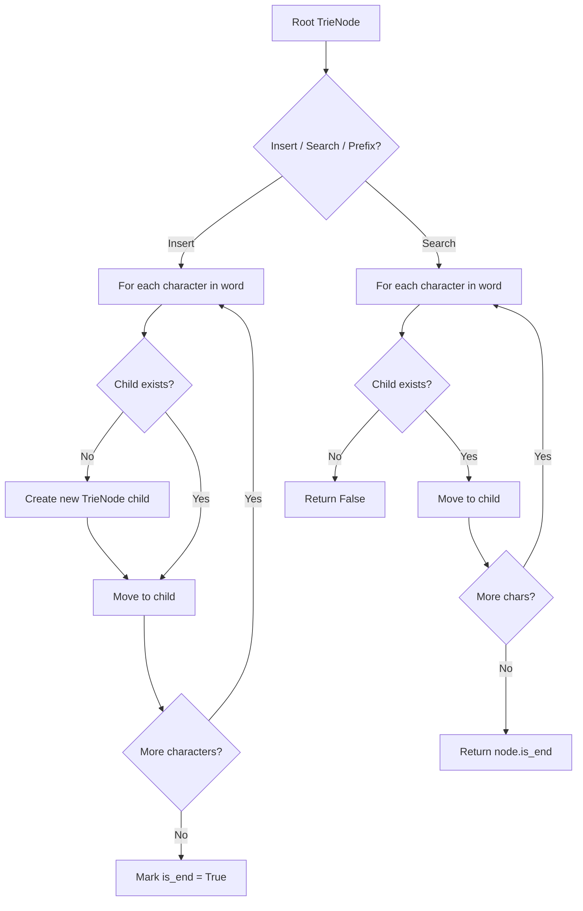
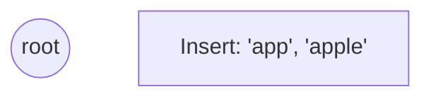
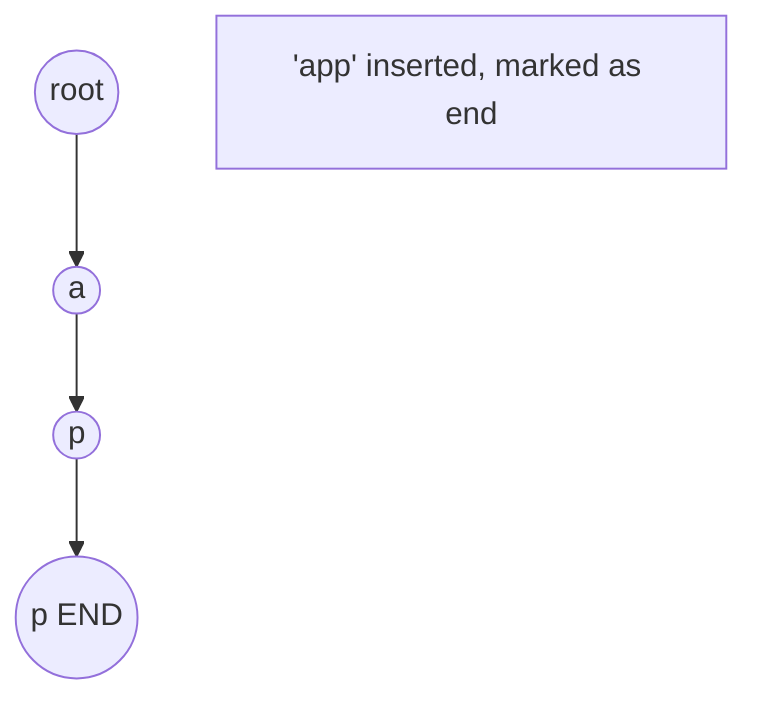
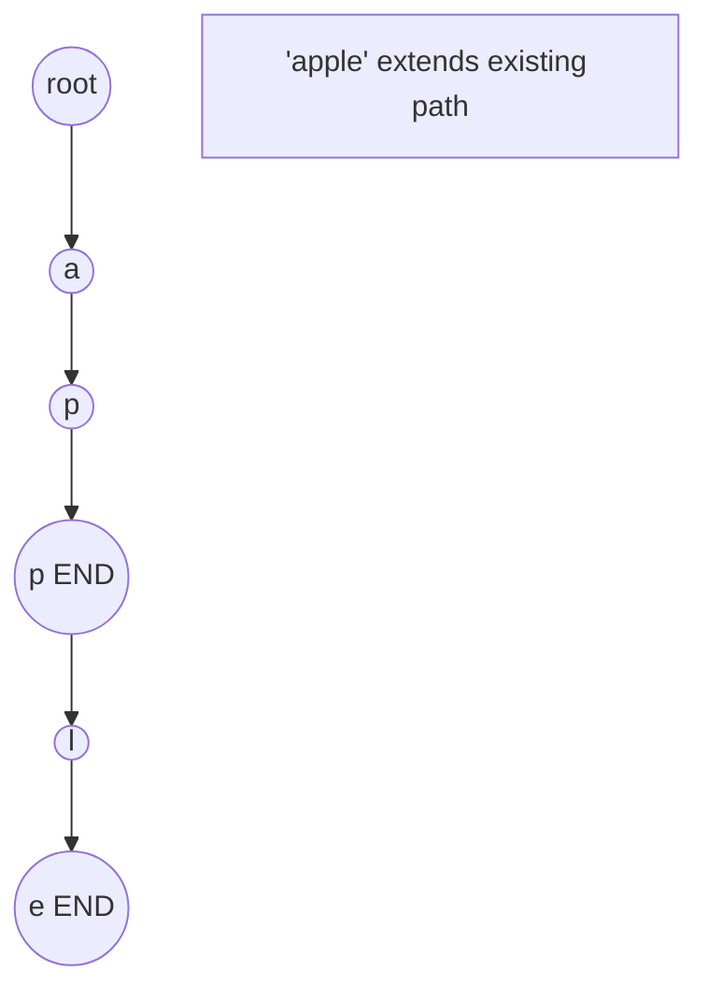
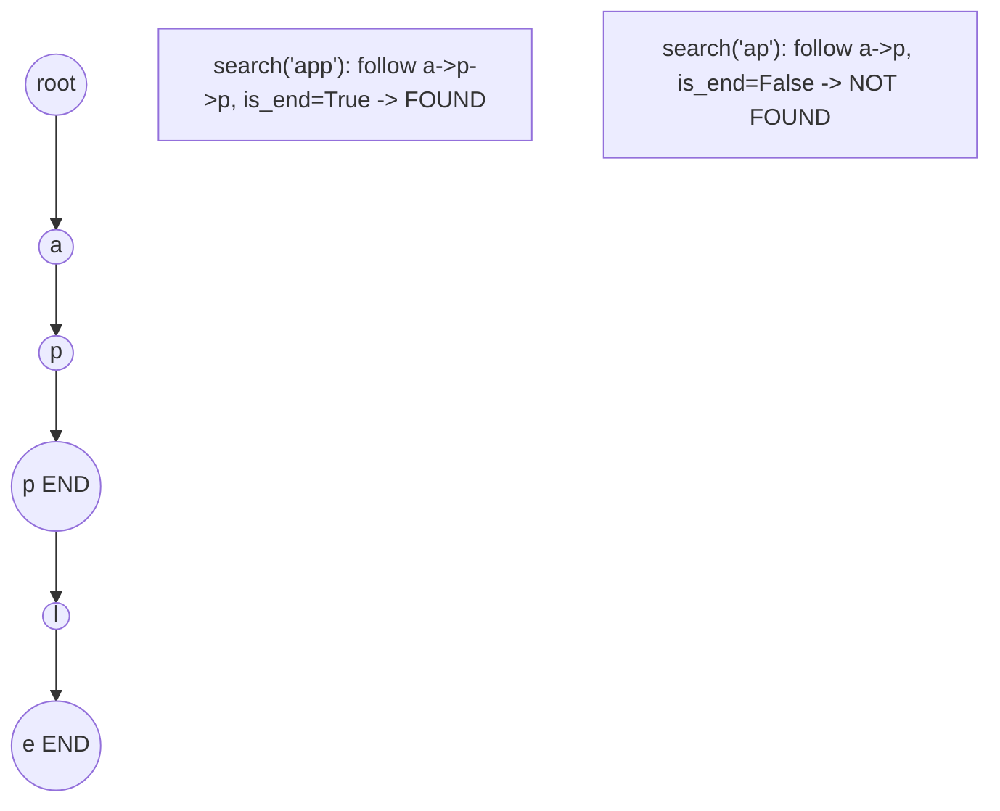

# Problem 421: Maximum XOR of Two Numbers in an Array

**Difficulty:** Medium  
**Tags:** Array, Hash Table, Bit Manipulation, Trie  
**Pattern:** Trie / Prefix Tree  
**Link:** [leetcode.com/problems/maximum-xor-of-two-numbers-in-an-array](https://leetcode.com/problems/maximum-xor-of-two-numbers-in-an-array/)

## Description

Given an integer array `nums`, return *the maximum result of *`nums[i] XOR nums[j]`, where `0 <= i <= j < n`.

 

Example 1:

```

**Input:** nums = [3,10,5,25,2,8]
**Output:** 28
**Explanation:** The maximum result is 5 XOR 25 = 28.

```

Example 2:

```

**Input:** nums = [14,70,53,83,49,91,36,80,92,51,66,70]
**Output:** 127

```

 

**Constraints:**

	- `1 <= nums.length <= 2 * 10^5`
	- `0 <= nums[i] <= 2^31 - 1`

## Approach: Trie / Prefix Tree

Build a trie (prefix tree) where each node represents a character. Insert words character by character, and search by following child pointers. Supports efficient prefix matching.

## Pseudocode

```
1. TrieNode: children = {}, is_end = False
2. Insert(word):
   - For each char: create child if absent, move to child
   - Mark last node as end
3. Search(word):
   - For each char: if child absent return False, move to child
   - Return node.is_end
4. StartsWith(prefix): same as search but return True at end
```

## Algorithm Flow



## Visual State Transitions

**Trie Insert and Search:**

**Frame 1: Empty trie**


**Frame 2: Insert 'app'**


**Frame 3: Insert 'apple'**


**Frame 4: Search 'app' = True, 'ap' = False**



## Complexity Analysis

- **Time:** O(L) per operation
- **Space:** O(N * L)

## Solution (Python3)

```python
class Solution:
    def findMaximumXOR(self, nums: List[int]) -> int:
        # Trie-based approach
        trie = {}
        # Build trie from word list
        words = nums if isinstance(nums, list) else [nums]
        for word in words:
            node = trie
            for ch in word:
                if ch not in node:
                    node[ch] = {}
                node = node[ch]
            node['#'] = True
        
        # Search in trie
        def search(word):
            node = trie
            for ch in word:
                if ch not in node:
                    return False
                node = node[ch]
            return '#' in node
        
        return 0
```

## Solution (C++)

```cpp
#include <string>
#include <vector>
using namespace std;

class Solution {
public:
    int findMaximumXOR(vector<int>& nums) {
        // Trie-based approach
        struct TrieNode {
            TrieNode* children[26] = {};
            bool isEnd = false;
        };
        TrieNode* root = new TrieNode();
        // Build trie
        for (auto& word : nums) {
            TrieNode* node = root;
            for (char ch : word) {
                int idx = ch - 'a';
                if (!node->children[idx])
                    node->children[idx] = new TrieNode();
                node = node->children[idx];
            }
            node->isEnd = true;
        }
        return 0;
    }
};
```
