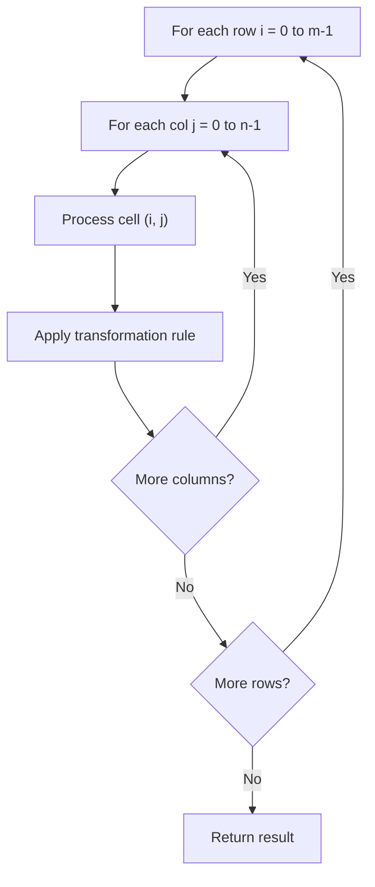

# Problem 422: Valid Word Square

**Difficulty:** Easy  
**Tags:** Array, Matrix  
**Pattern:** Matrix / 2D Array  
**Link:** [leetcode.com/problems/valid-word-square](https://leetcode.com/problems/valid-word-square/)

## Description

*(Premium problem -- description requires LeetCode subscription)*

## Approach: Matrix / 2D Array

Process the matrix row by row or column by column. Common patterns: rotation, spiral traversal, in-place modification, transposition.

## Pseudocode

```
1. For each row i:
   For each column j:
     Process cell (i, j) based on neighbors or rules
2. Handle boundary conditions
3. Return modified matrix or computed result
```

## Algorithm Flow



## Complexity Analysis

- **Time:** O(m * n)
- **Space:** O(1) extra

## Solution (Python3)

```python
class Solution:
    pass
```

## Solution (C++)

```cpp
class Solution {
public:
    // Design problem stub
};
```
