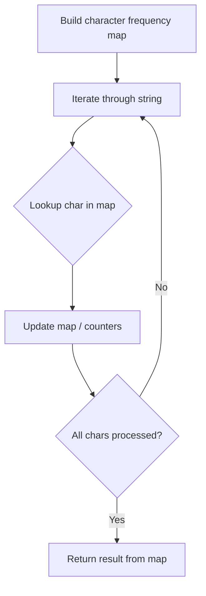

# Problem 423: Reconstruct Original Digits from English

**Difficulty:** Medium  
**Tags:** Hash Table, Math, String  
**Pattern:** Hash Map String Processing  
**Link:** [leetcode.com/problems/reconstruct-original-digits-from-english](https://leetcode.com/problems/reconstruct-original-digits-from-english/)

## Description

Given a string `s` containing an out-of-order English representation of digits `0-9`, return *the digits in **ascending** order*.

 

Example 1:

```
**Input:** s = "owoztneoer"
**Output:** "012"

```
Example 2:

```
**Input:** s = "fviefuro"
**Output:** "45"

```

 

**Constraints:**

	- `1 <= s.length <= 10^5`
	- `s[i]` is one of the characters `["e","g","f","i","h","o","n","s","r","u","t","w","v","x","z"]`.
	- `s` is **guaranteed** to be valid.

## Approach: Hash Map String Processing

Use a hash map to count character frequencies or map characters/strings for O(1) lookups. Process the string in one or two passes.

## Pseudocode

```
1. Build frequency map / char-to-index map
2. Iterate through string:
   a. Look up character in map
   b. Update counts or mappings
3. Return result based on map state
```

## Algorithm Flow



## Complexity Analysis

- **Time:** O(n)
- **Space:** O(n)

## Solution (Python3)

```python
class Solution:
    def originalDigits(self, s: str) -> str:
        # Hash map for string/character frequency - O(n) time
        freq = {}
        for ch in s:
            freq[ch] = freq.get(ch, 0) + 1
        # Process frequency map
        for ch, cnt in freq.items():
            if cnt == 1:
                return s.index(ch)
        return ""
```

## Solution (C++)

```cpp
#include <string>
#include <unordered_map>
#include <vector>
using namespace std;

class Solution {
public:
    string originalDigits(string& s) {
        // Hash map for string/character frequency - O(n) time
        unordered_map<char, int> freq;
        for (char ch : s) {
            freq[ch]++;
        }
        // Process frequency map
        for (int i = 0; i < s.size(); i++) {
            if (freq[s[i]] == 1) return i;
        }
        return "";
    }
};
```
