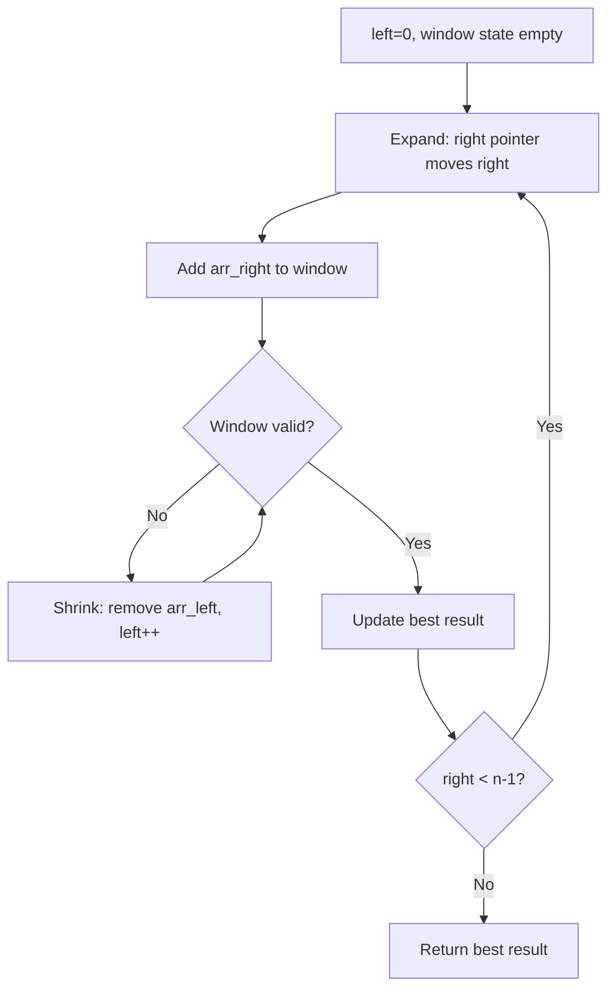
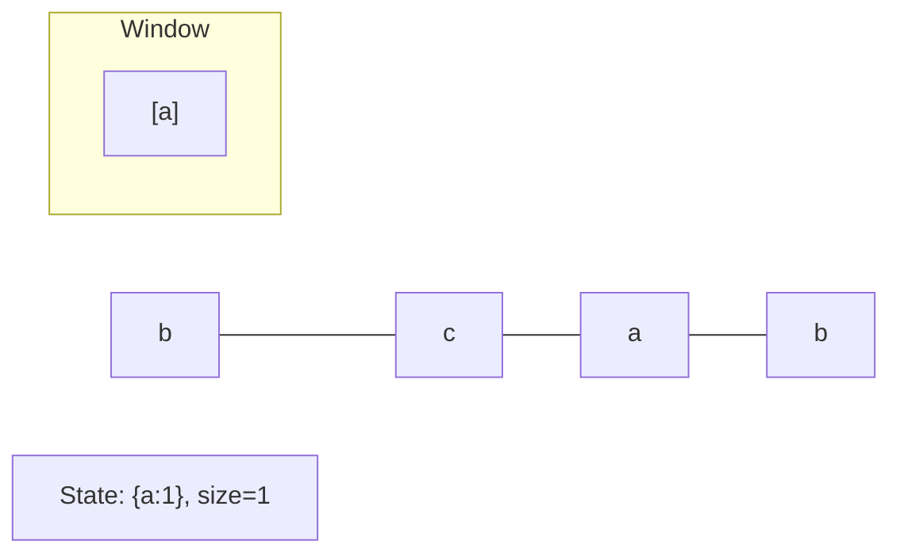
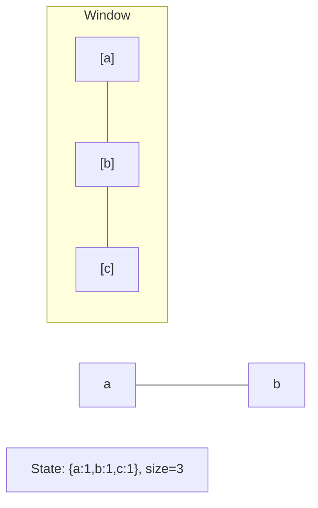
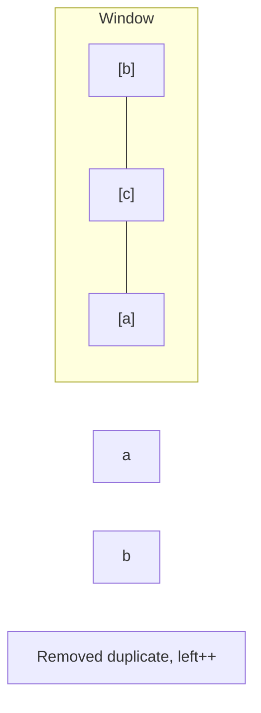
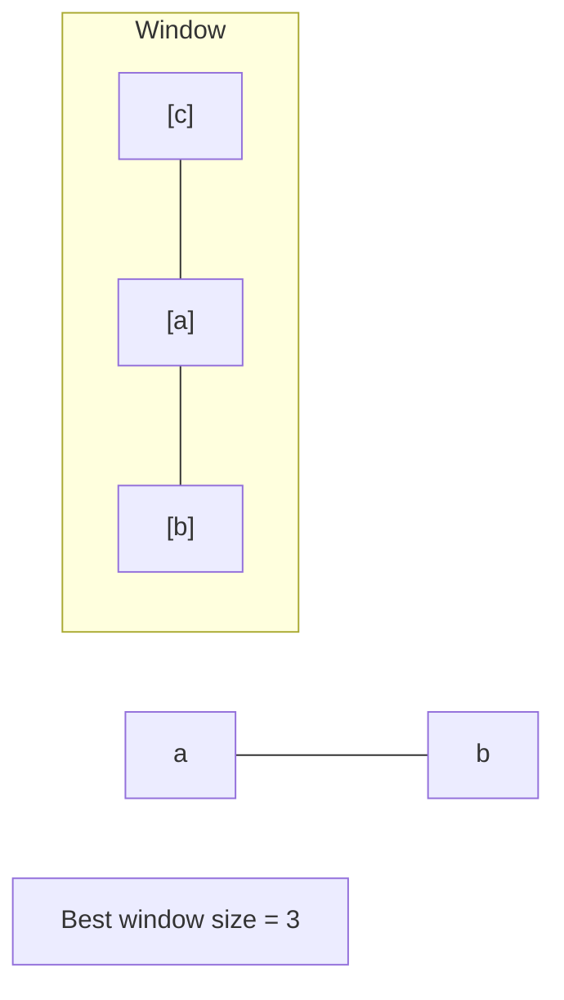

# Problem 424: Longest Repeating Character Replacement

**Difficulty:** Medium  
**Tags:** Hash Table, String, Sliding Window  
**Pattern:** Sliding Window  
**Link:** [leetcode.com/problems/longest-repeating-character-replacement](https://leetcode.com/problems/longest-repeating-character-replacement/)

## Description

You are given a string `s` and an integer `k`. You can choose any character of the string and change it to any other uppercase English character. You can perform this operation at most `k` times.

Return *the length of the longest substring containing the same letter you can get after performing the above operations*.

 

Example 1:

```

**Input:** s = "ABAB", k = 2
**Output:** 4
**Explanation:** Replace the two 'A's with two 'B's or vice versa.

```

Example 2:

```

**Input:** s = "AABABBA", k = 1
**Output:** 4
**Explanation:** Replace the one 'A' in the middle with 'B' and form "AABBBBA".
The substring "BBBB" has the longest repeating letters, which is 4.
There may exists other ways to achieve this answer too.
```

 

**Constraints:**

	- `1 <= s.length <= 10^5`
	- `s` consists of only uppercase English letters.
	- `0 <= k <= s.length`

## Approach: Sliding Window

Maintain a window over the data using two pointers. Expand the right boundary to include new elements, and shrink the left boundary when the window constraint is violated. Track the optimal window.

## Pseudocode

```
1. Initialize left = 0, result = initial_value
2. For right in range(n):
   a. Add element at right to window state
   b. While window is invalid:
      - Remove element at left from window state
      - left++
   c. Update result = best of (result, window size/value)
3. Return result
```

## Algorithm Flow



## Visual State Transitions

**Sliding Window Step-by-Step:**

**Frame 1: Initial window (left=0, right=0)**


**Frame 2: Expand right (right=2)**


**Frame 3: Violation - shrink left**


**Frame 4: Continue expanding**



## Complexity Analysis

- **Time:** O(n)
- **Space:** O(k)

## Solution (Python3)

```python
class Solution:
    def characterReplacement(self, s: str, k: int) -> int:
        # Sliding window approach - O(n) time, O(k) space
        from collections import defaultdict
        window = defaultdict(int)
        left = 0
        result = 0
        for right in range(len(s)):
            window[s[right]] += 1
            while len(window) > (k if isinstance(k, int) else len(s)):
                window[s[left]] -= 1
                if window[s[left]] == 0:
                    del window[s[left]]
                left += 1
            result = max(result, right - left + 1)
        return result
```

## Solution (C++)

```cpp
#include <algorithm>
#include <string>
#include <unordered_map>
#include <vector>
using namespace std;

class Solution {
public:
    int characterReplacement(string& s, int k) {
        // Sliding window approach - O(n) time, O(k) space
        unordered_map<char, int> window;
        int left = 0, result = 0;
        for (int right = 0; right < s.size(); right++) {
            window[s[right]]++;
            while ((int)window.size() > k) {
                window[s[left]]--;
                if (window[s[left]] == 0)
                    window.erase(s[left]);
                left++;
            }
            result = max(result, right - left + 1);
        }
        return result;
    }
};
```
