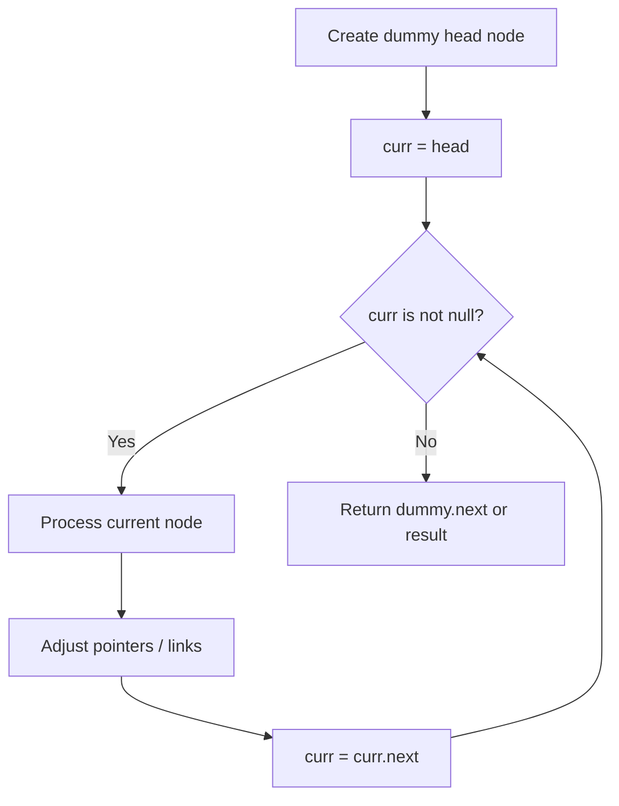
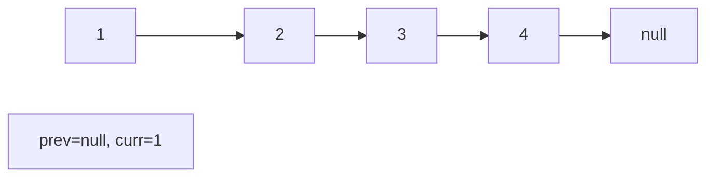
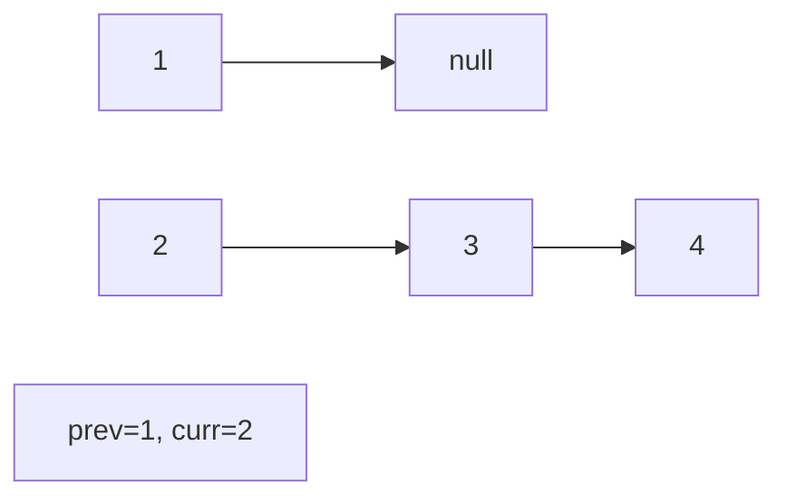
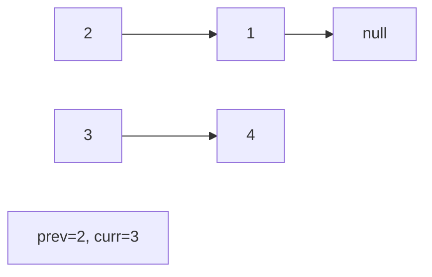
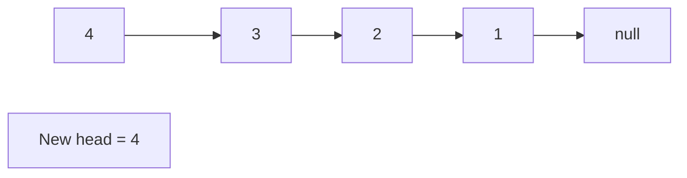

# Problem 426: Convert Binary Search Tree to Sorted Doubly Linked List

**Difficulty:** Medium  
**Tags:** Linked List, Stack, Tree, Depth-First Search, Binary Search Tree, Binary Tree, Doubly-Linked List  
**Pattern:** Linked List  
**Link:** [leetcode.com/problems/convert-binary-search-tree-to-sorted-doubly-linked-list](https://leetcode.com/problems/convert-binary-search-tree-to-sorted-doubly-linked-list/)

## Description

*(Premium problem -- description requires LeetCode subscription)*

## Approach: Linked List

Traverse or manipulate the linked list using pointer techniques. Common patterns: dummy head node for edge cases, fast/slow pointers for cycle detection or middle finding, in-place reversal, and merge operations.

## Pseudocode

```
1. Create dummy head if needed
2. Initialize pointer(s) at head
3. Traverse / modify list:
   a. Process current node
   b. Adjust next pointers as needed
   c. Move to next node
4. Return dummy.next or result
```

## Algorithm Flow



## Visual State Transitions

**Linked List Operation (Reverse):**

**Frame 1: Initial list**


**Frame 2: Reverse first link**


**Frame 3: Reverse second link**


**Frame 4: Fully reversed**



## Complexity Analysis

- **Time:** O(n)
- **Space:** O(1)

## Solution (Python3)

```python
class Solution:
    pass
```

## Solution (C++)

```cpp
class Solution {
public:
    // Design problem stub
};
```
