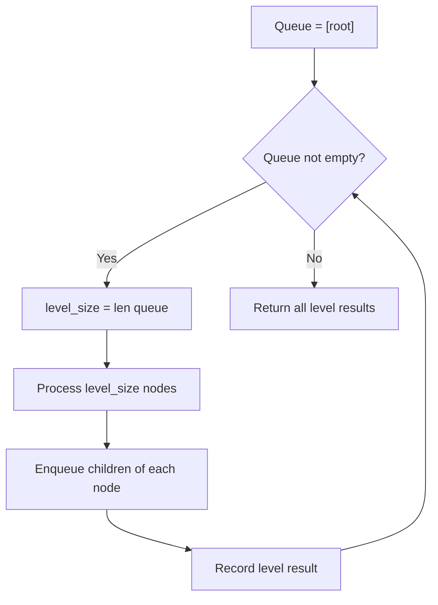

# Problem 429: N-ary Tree Level Order Traversal

**Difficulty:** Medium  
**Tags:** Tree, Breadth-First Search  
**Pattern:** BFS Level-Order Traversal  
**Link:** [leetcode.com/problems/n-ary-tree-level-order-traversal](https://leetcode.com/problems/n-ary-tree-level-order-traversal/)

## Description

Given an n-ary tree, return the *level order* traversal of its nodes' values.

*Nary-Tree input serialization is represented in their level order traversal, each group of children is separated by the null value (See examples).*

 

Example 1:

```

**Input:** root = [1,null,3,2,4,null,5,6]
**Output:** [[1],[3,2,4],[5,6]]

```

Example 2:

```

**Input:** root = [1,null,2,3,4,5,null,null,6,7,null,8,null,9,10,null,null,11,null,12,null,13,null,null,14]
**Output:** [[1],[2,3,4,5],[6,7,8,9,10],[11,12,13],[14]]

```

 

**Constraints:**

	- The height of the n-ary tree is less than or equal to `1000`
	- The total number of nodes is between `[0, 10^4]`

## Approach: BFS Level-Order Traversal

Traverse the tree level by level using a queue. Process all nodes at the current depth before moving to the next level.

## Pseudocode

```
1. If root is null, return empty
2. Queue = [root]
3. While queue not empty:
   a. level_size = len(queue)
   b. For i in range(level_size):
      - node = dequeue
      - Process node
      - Enqueue node.left, node.right if not null
4. Return result
```

## Algorithm Flow



## Complexity Analysis

- **Time:** O(n)
- **Space:** O(w)

## Solution (Python3)

```python
class Node:
    def __init__(self, val: Optional[int], children: Optional[List['Node']]):
        # Initialize data structure
        self.val = val
        self.children = children

    def levelOrder(self, root: 'Node') -> List[List[int]]:
        return []

```

## Solution (C++)

```cpp
#include <queue>
#include <string>
#include <vector>
using namespace std;

class Node {
public:
    Node(int val, vector<Node*>& children) {
        // Initialize
    }

    vector<vector<int>> levelOrder(Node* root) {
        return {};
    }

};
```
