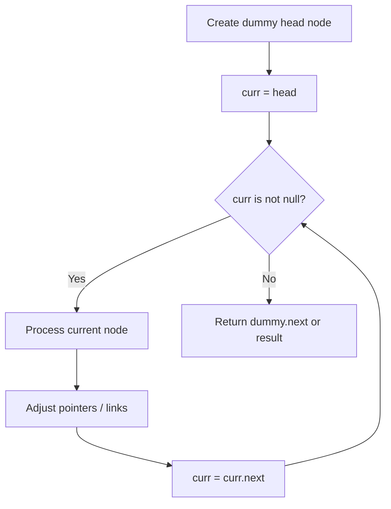
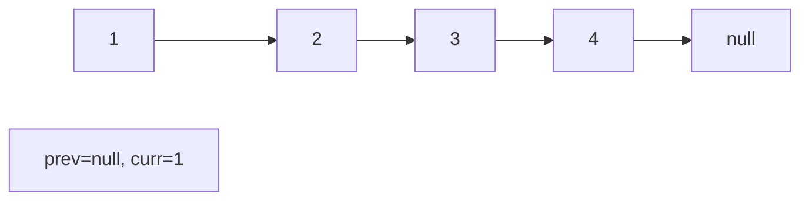
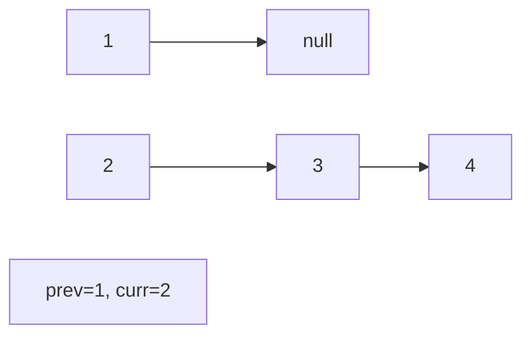
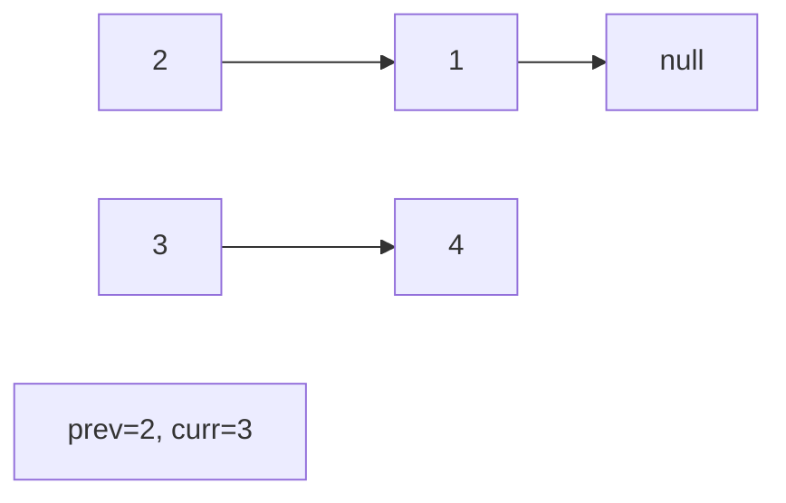
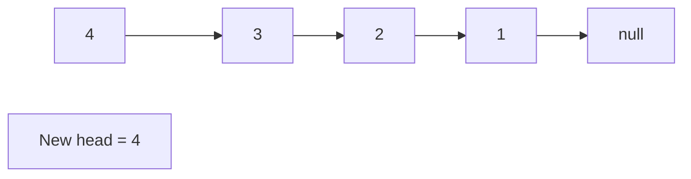

# Problem 430: Flatten a Multilevel Doubly Linked List

**Difficulty:** Medium  
**Tags:** Linked List, Depth-First Search, Doubly-Linked List  
**Pattern:** Linked List  
**Link:** [leetcode.com/problems/flatten-a-multilevel-doubly-linked-list](https://leetcode.com/problems/flatten-a-multilevel-doubly-linked-list/)

## Description

You are given a doubly linked list, which contains nodes that have a next pointer, a previous pointer, and an additional **child pointer**. This child pointer may or may not point to a separate doubly linked list, also containing these special nodes. These child lists may have one or more children of their own, and so on, to produce a **multilevel data structure** as shown in the example below.

Given the `head` of the first level of the list, **flatten** the list so that all the nodes appear in a single-level, doubly linked list. Let `curr` be a node with a child list. The nodes in the child list should appear **after** `curr` and **before** `curr.next` in the flattened list.

Return *the *`head`* of the flattened list. The nodes in the list must have **all** of their child pointers set to *`null`.

 

Example 1:

```

**Input:** head = [1,2,3,4,5,6,null,null,null,7,8,9,10,null,null,11,12]
**Output:** [1,2,3,7,8,11,12,9,10,4,5,6]
**Explanation:** The multilevel linked list in the input is shown.
After flattening the multilevel linked list it becomes:

```

Example 2:

```

**Input:** head = [1,2,null,3]
**Output:** [1,3,2]
**Explanation:** The multilevel linked list in the input is shown.
After flattening the multilevel linked list it becomes:

```

Example 3:

```

**Input:** head = []
**Output:** []
**Explanation:** There could be empty list in the input.

```

 

**Constraints:**

	- The number of Nodes will not exceed `1000`.
	- `1 <= Node.val <= 10^5`

 

**How the multilevel linked list is represented in test cases:**

We use the multilevel linked list from **Example 1** above:

```

 1---2---3---4---5---6--NULL
         |
         7---8---9---10--NULL
             |
             11--12--NULL
```

The serialization of each level is as follows:

```

[1,2,3,4,5,6,null]
[7,8,9,10,null]
[11,12,null]

```

To serialize all levels together, we will add nulls in each level to signify no node connects to the upper node of the previous level. The serialization becomes:

```

[1,    2,    3, 4, 5, 6, null]
             |
[null, null, 7,    8, 9, 10, null]
                   |
[            null, 11, 12, null]

```

Merging the serialization of each level and removing trailing nulls we obtain:

```

[1,2,3,4,5,6,null,null,null,7,8,9,10,null,null,11,12]

```

## Approach: Linked List

Traverse or manipulate the linked list using pointer techniques. Common patterns: dummy head node for edge cases, fast/slow pointers for cycle detection or middle finding, in-place reversal, and merge operations.

## Pseudocode

```
1. Create dummy head if needed
2. Initialize pointer(s) at head
3. Traverse / modify list:
   a. Process current node
   b. Adjust next pointers as needed
   c. Move to next node
4. Return dummy.next or result
```

## Algorithm Flow



## Visual State Transitions

**Linked List Operation (Reverse):**

**Frame 1: Initial list**


**Frame 2: Reverse first link**


**Frame 3: Reverse second link**


**Frame 4: Fully reversed**



## Complexity Analysis

- **Time:** O(n)
- **Space:** O(1)

## Solution (Python3)

```python
class Node:
    def __init__(self, val: int, prev: int, next: int, child: int):
        # Initialize data structure
        self.val = val
        self.prev = prev
        self.next = next
        self.child = child

    def flatten(self, head: 'Optional[Node]') -> 'Optional[Node]':
        return None

```

## Solution (C++)

```cpp
#include <string>
#include <vector>
using namespace std;

class Node {
public:
    Node(int val, int prev, int next, int child) {
        // Initialize
    }

    Node* flatten(Node* head) {
        return nullptr;
    }

};
```
