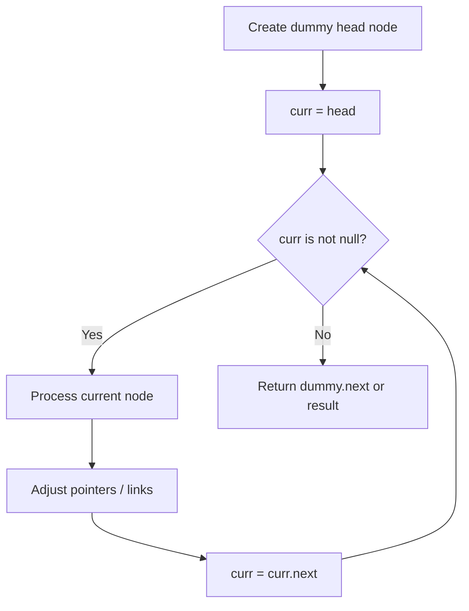
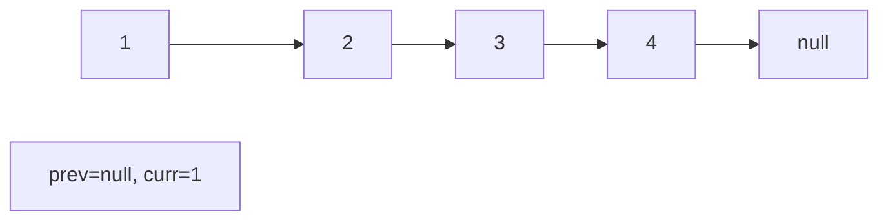
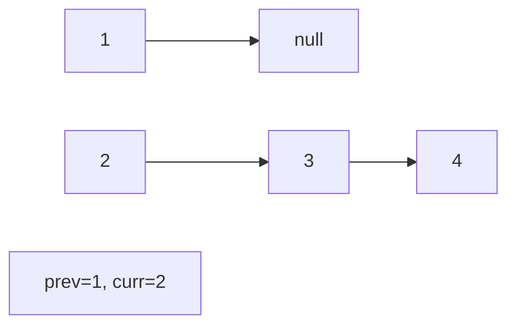
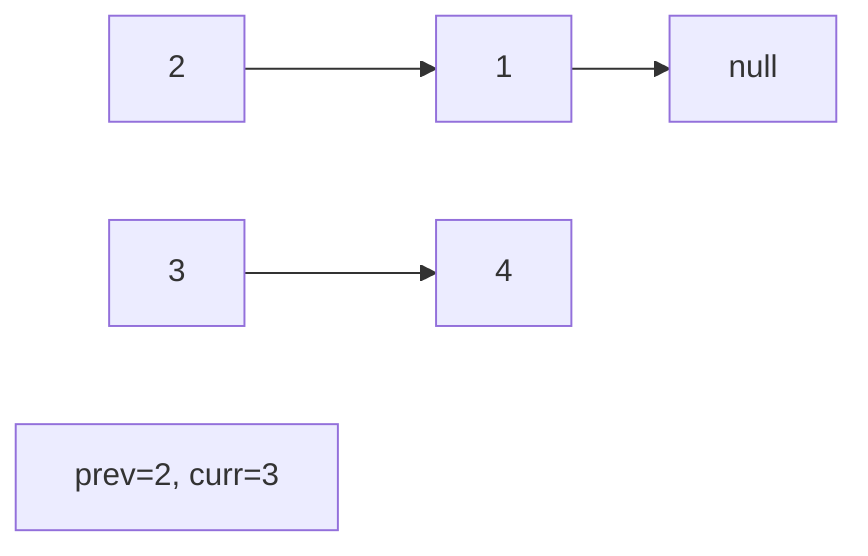
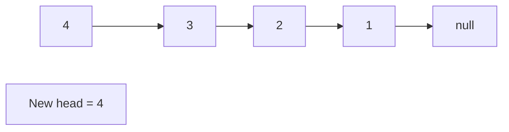

# Problem 432: All O`one Data Structure

**Difficulty:** Hard  
**Tags:** Hash Table, Linked List, Design, Doubly-Linked List  
**Pattern:** Linked List  
**Link:** [leetcode.com/problems/all-oone-data-structure](https://leetcode.com/problems/all-oone-data-structure/)

## Description

Design a data structure to store the strings' count with the ability to return the strings with minimum and maximum counts.

Implement the `AllOne` class:

	- `AllOne()` Initializes the object of the data structure.
	- `inc(String key)` Increments the count of the string `key` by `1`. If `key` does not exist in the data structure, insert it with count `1`.
	- `dec(String key)` Decrements the count of the string `key` by `1`. If the count of `key` is `0` after the decrement, remove it from the data structure. It is guaranteed that `key` exists in the data structure before the decrement.
	- `getMaxKey()` Returns one of the keys with the maximal count. If no element exists, return an empty string `""`.
	- `getMinKey()` Returns one of the keys with the minimum count. If no element exists, return an empty string `""`.

**Note** that each function must run in `O(1)` average time complexity.

 

Example 1:

```

**Input**
["AllOne", "inc", "inc", "getMaxKey", "getMinKey", "inc", "getMaxKey", "getMinKey"]
[[], ["hello"], ["hello"], [], [], ["leet"], [], []]
**Output**
[null, null, null, "hello", "hello", null, "hello", "leet"]

**Explanation**
AllOne allOne = new AllOne();
allOne.inc("hello");
allOne.inc("hello");
allOne.getMaxKey(); // return "hello"
allOne.getMinKey(); // return "hello"
allOne.inc("leet");
allOne.getMaxKey(); // return "hello"
allOne.getMinKey(); // return "leet"

```

 

**Constraints:**

	- `1 <= key.length <= 10`
	- `key` consists of lowercase English letters.
	- It is guaranteed that for each call to `dec`, `key` is existing in the data structure.
	- At most `5 * 10^4` calls will be made to `inc`, `dec`, `getMaxKey`, and `getMinKey`.

## Approach: Linked List

Traverse or manipulate the linked list using pointer techniques. Common patterns: dummy head node for edge cases, fast/slow pointers for cycle detection or middle finding, in-place reversal, and merge operations.

## Pseudocode

```
1. Create dummy head if needed
2. Initialize pointer(s) at head
3. Traverse / modify list:
   a. Process current node
   b. Adjust next pointers as needed
   c. Move to next node
4. Return dummy.next or result
```

## Algorithm Flow



## Visual State Transitions

**Linked List Operation (Reverse):**

**Frame 1: Initial list**


**Frame 2: Reverse first link**


**Frame 3: Reverse second link**


**Frame 4: Fully reversed**



## Complexity Analysis

- **Time:** O(n)
- **Space:** O(1)

## Solution (Python3)

```python
class AllOne:
    def __init__(self):
        # Initialize data structure
        pass

    def inc(self, key: str) -> None:
        return None

    def dec(self, key: str) -> None:
        return None

    def getMaxKey(self) -> str:
        return ""

    def getMinKey(self) -> str:
        return ""

```

## Solution (C++)

```cpp
#include <string>
#include <vector>
using namespace std;

class AllOne {
public:
    AllOne() {
        // Initialize
    }

    void inc(string& key) {
        return ;
    }

    void dec(string& key) {
        return ;
    }

    string getMaxKey() {
        return "";
    }

    string getMinKey() {
        return "";
    }

};
```
