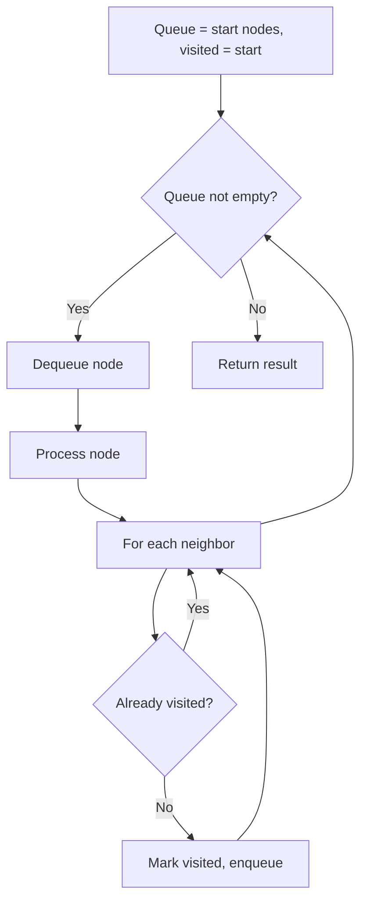
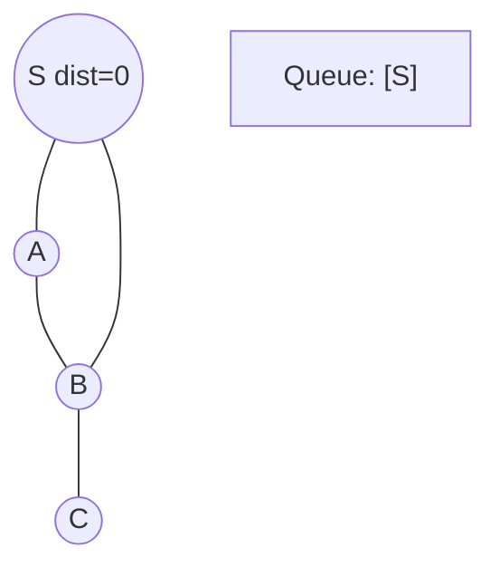
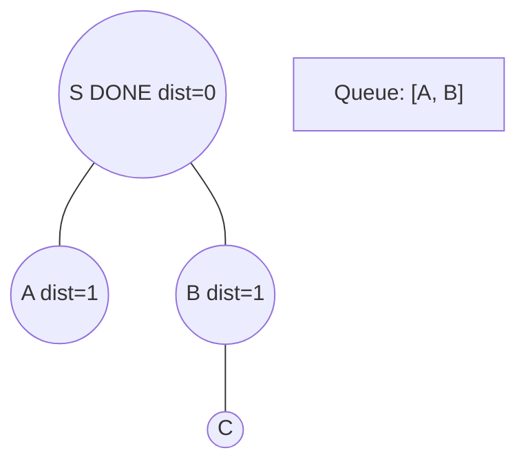
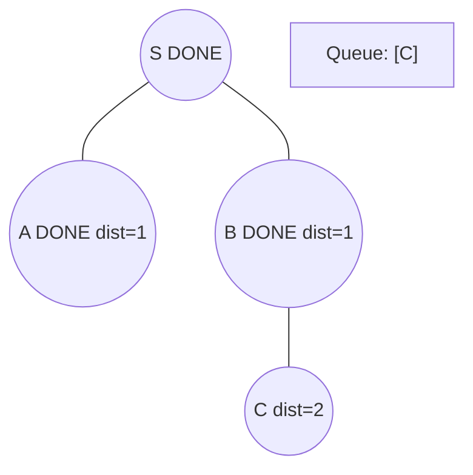
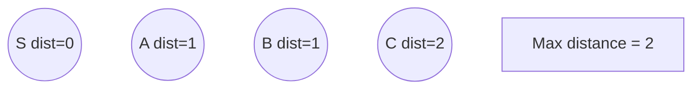

# Problem 433: Minimum Genetic Mutation

**Difficulty:** Medium  
**Tags:** Hash Table, String, Breadth-First Search  
**Pattern:** BFS Graph Traversal  
**Link:** [leetcode.com/problems/minimum-genetic-mutation](https://leetcode.com/problems/minimum-genetic-mutation/)

## Description

A gene string can be represented by an 8-character long string, with choices from `'A'`, `'C'`, `'G'`, and `'T'`.

Suppose we need to investigate a mutation from a gene string `startGene` to a gene string `endGene` where one mutation is defined as one single character changed in the gene string.

	- For example, `"AACCGGTT" --> "AACCGGTA"` is one mutation.

There is also a gene bank `bank` that records all the valid gene mutations. A gene must be in `bank` to make it a valid gene string.

Given the two gene strings `startGene` and `endGene` and the gene bank `bank`, return *the minimum number of mutations needed to mutate from *`startGene`* to *`endGene`. If there is no such a mutation, return `-1`.

Note that the starting point is assumed to be valid, so it might not be included in the bank.

 

Example 1:

```

**Input:** startGene = "AACCGGTT", endGene = "AACCGGTA", bank = ["AACCGGTA"]
**Output:** 1

```

Example 2:

```

**Input:** startGene = "AACCGGTT", endGene = "AAACGGTA", bank = ["AACCGGTA","AACCGCTA","AAACGGTA"]
**Output:** 2

```

 

**Constraints:**

	- `0 <= bank.length <= 10`
	- `startGene.length == endGene.length == bank[i].length == 8`
	- `startGene`, `endGene`, and `bank[i]` consist of only the characters `['A', 'C', 'G', 'T']`.

## Approach: BFS Graph Traversal

Explore the graph breadth-first using a queue. Process nodes level by level; BFS finds shortest paths in unweighted graphs.

## Pseudocode

```
1. Initialize queue with start node(s), visited set
2. While queue not empty:
   a. Dequeue node
   b. Process node
   c. For each unvisited neighbor:
      - Mark visited, enqueue
3. Return result
```

## Algorithm Flow



## Visual State Transitions

**BFS Level-by-Level Traversal:**

**Frame 1: Start BFS from source**


**Frame 2: Process level 0, enqueue neighbors**


**Frame 3: Process level 1**


**Frame 4: All nodes reached**



## Complexity Analysis

- **Time:** O(V + E)
- **Space:** O(V)

## Solution (Python3)

```python
class Solution:
    def minMutation(self, startGene: str, endGene: str, bank: List[str]) -> int:
        # BFS on graph - O(V+E) time
        from collections import deque
        if not startGene:
            return 0
        visited = set()
        queue = deque([0])
        visited.add(0)
        dist = 0
        while queue:
            for _ in range(len(queue)):
                node = queue.popleft()
                # Process node
            dist += 1
        return dist
```

## Solution (C++)

```cpp
#include <queue>
#include <string>
#include <unordered_set>
#include <vector>
using namespace std;

class Solution {
public:
    int minMutation(string& startGene, string& endGene, vector<string>& bank) {
        // BFS on graph - O(V+E) time
        if (startGene.empty()) return 0;
        queue<int> q;
        unordered_set<int> visited;
        q.push(0);
        visited.insert(0);
        int dist = 0;
        while (!q.empty()) {
            int sz = q.size();
            for (int i = 0; i < sz; i++) {
                int node = q.front(); q.pop();
                // Process node
            }
            dist++;
        }
        return dist;
    }
};
```
