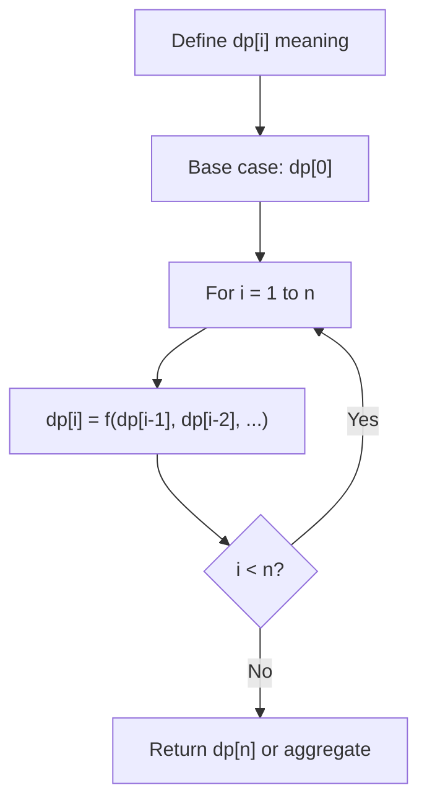
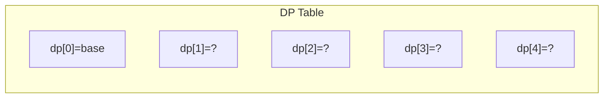
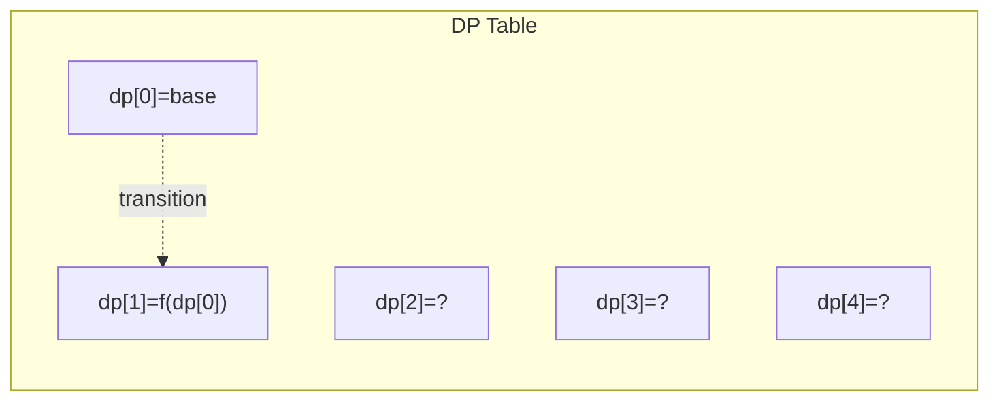
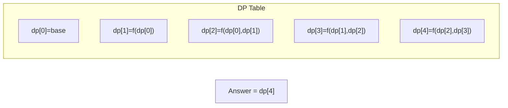

# Problem 435: Non-overlapping Intervals

**Difficulty:** Medium  
**Tags:** Array, Dynamic Programming, Greedy, Sorting  
**Pattern:** Dynamic Programming (1D)  
**Link:** [leetcode.com/problems/non-overlapping-intervals](https://leetcode.com/problems/non-overlapping-intervals/)

## Description

Given an array of intervals `intervals` where `intervals[i] = [starti, endi]`, return *the minimum number of intervals you need to remove to make the rest of the intervals non-overlapping*.

**Note** that intervals which only touch at a point are **non-overlapping**. For example, `[1, 2]` and `[2, 3]` are non-overlapping.

 

Example 1:

```

**Input:** intervals = [[1,2],[2,3],[3,4],[1,3]]
**Output:** 1
**Explanation:** [1,3] can be removed and the rest of the intervals are non-overlapping.

```

Example 2:

```

**Input:** intervals = [[1,2],[1,2],[1,2]]
**Output:** 2
**Explanation:** You need to remove two [1,2] to make the rest of the intervals non-overlapping.

```

Example 3:

```

**Input:** intervals = [[1,2],[2,3]]
**Output:** 0
**Explanation:** You don't need to remove any of the intervals since they're already non-overlapping.

```

 

**Constraints:**

	- `1 <= intervals.length <= 10^5`
	- `intervals[i].length == 2`
	- `-5 * 10^4 <= starti < endi <= 5 * 10^4`

## Approach: Dynamic Programming (1D)

Break the problem into overlapping subproblems. Define dp[i] as the optimal value for the subproblem ending at or considering index i. Build the solution bottom-up, using previously computed dp values.

## Pseudocode

```
1. Define dp[i] = optimal value for subproblem i
2. Base case: dp[0] = initial value
3. For i from 1 to n:
   a. dp[i] = recurrence(dp[i-1], dp[i-2], ...)
4. Return dp[n] or max/min of dp
```

## Algorithm Flow



## Visual State Transitions

**1D Dynamic Programming Table Build:**

**Frame 1: Initialize base cases**


**Frame 2: Fill dp[1] from dp[0]**


**Frame 3: Fill remaining cells**



## Complexity Analysis

- **Time:** O(n)
- **Space:** O(n)

## Solution (Python3)

```python
class Solution:
    def eraseOverlapIntervals(self, intervals: List[List[int]]) -> int:
        # Dynamic programming (1D) - O(n) time, O(n) space
        if not intervals:
            return 0
        n = len(intervals) if isinstance(intervals, list) else intervals
        dp = [0] * (n + 1)
        dp[0] = 1  # base case
        for i in range(1, n + 1):
            dp[i] = dp[i-1]  # transition (customize per problem)
            if i >= 2:
                dp[i] += dp[i-2]
        return dp[n]
```

## Solution (C++)

```cpp
#include <string>
#include <vector>
using namespace std;

class Solution {
public:
    int eraseOverlapIntervals(vector<vector<int>>& intervals) {
        // Dynamic programming (1D) - O(n) time, O(n) space
        int n = intervals;
        if (n <= 0) return 0;
        vector<int> dp(n + 1, 0);
        dp[0] = 1;
        for (int i = 1; i <= n; i++) {
            dp[i] = dp[i-1];
            if (i >= 2) dp[i] += dp[i-2];
        }
        return dp[n];
    }
};
```
