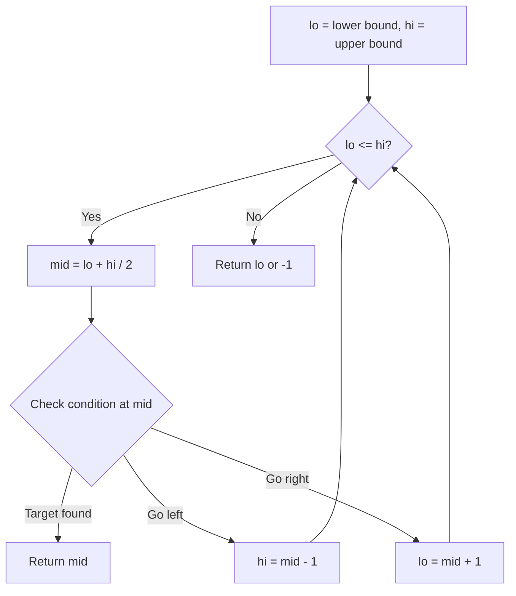
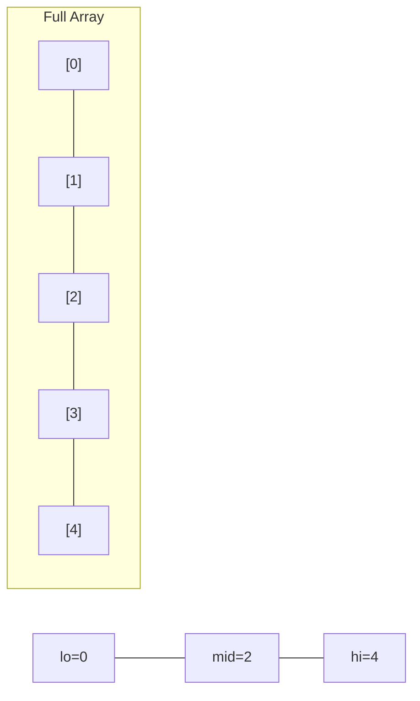
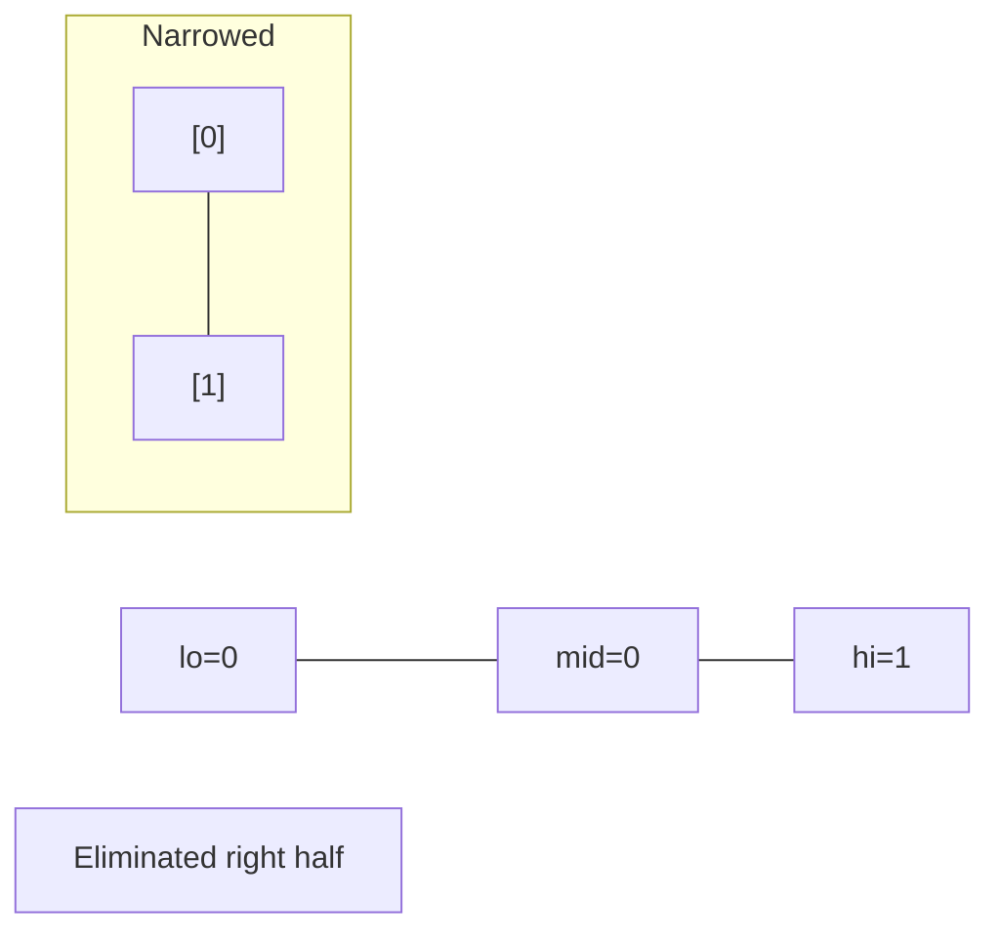
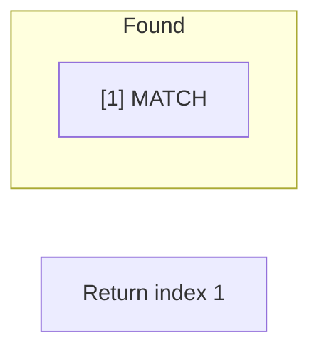

# Problem 436: Find Right Interval

**Difficulty:** Medium  
**Tags:** Array, Binary Search, Sorting  
**Pattern:** Binary Search  
**Link:** [leetcode.com/problems/find-right-interval](https://leetcode.com/problems/find-right-interval/)

## Description

You are given an array of `intervals`, where `intervals[i] = [starti, endi]` and each `starti` is **unique**.

The **right interval** for an interval `i` is an interval `j` such that `startj >= endi` and `startj` is **minimized**. Note that `i` may equal `j`.

Return *an array of **right interval** indices for each interval `i`*. If no **right interval** exists for interval `i`, then put `-1` at index `i`.

 

Example 1:

```

**Input:** intervals = [[1,2]]
**Output:** [-1]
**Explanation:** There is only one interval in the collection, so it outputs -1.

```

Example 2:

```

**Input:** intervals = [[3,4],[2,3],[1,2]]
**Output:** [-1,0,1]
**Explanation:** There is no right interval for [3,4].
The right interval for [2,3] is [3,4] since start0 = 3 is the smallest start that is >= end1 = 3.
The right interval for [1,2] is [2,3] since start1 = 2 is the smallest start that is >= end2 = 2.

```

Example 3:

```

**Input:** intervals = [[1,4],[2,3],[3,4]]
**Output:** [-1,2,-1]
**Explanation:** There is no right interval for [1,4] and [3,4].
The right interval for [2,3] is [3,4] since start2 = 3 is the smallest start that is >= end1 = 3.

```

 

**Constraints:**

	- `1 <= intervals.length <= 2 * 10^4`
	- `intervals[i].length == 2`
	- `-10^6 <= starti <= endi <= 10^6`
	- The start point of each interval is **unique**.

## Approach: Binary Search

Use binary search to halve the search space each iteration. Define the search range [lo, hi], compute mid, and decide which half to keep based on the problem's monotonic condition.

## Pseudocode

```
1. lo = lower_bound, hi = upper_bound
2. While lo <= hi (or lo < hi):
   a. mid = (lo + hi) // 2
   b. If condition(mid) is satisfied: record answer, search left half
   c. Else: search right half
3. Return answer
```

## Algorithm Flow



## Visual State Transitions

**Binary Search Step-by-Step:**

**Frame 1: Initial search space**


**Frame 2: Compare mid, narrow search**


**Frame 3: Found target**



## Complexity Analysis

- **Time:** O(log n)
- **Space:** O(1)

## Solution (Python3)

```python
class Solution:
    def findRightInterval(self, intervals: List[List[int]]) -> List[int]:
        # Binary search - O(log n) time, O(1) space
        lo, hi = 0, len(intervals) - 1
        while lo <= hi:
            mid = lo + (hi - lo) // 2
            if intervals[mid] == intervals:
                return mid
            elif intervals[mid] < intervals:
                lo = mid + 1
            else:
                hi = mid - 1
        return []
```

## Solution (C++)

```cpp
#include <string>
#include <vector>
using namespace std;

class Solution {
public:
    vector<int> findRightInterval(vector<vector<int>>& intervals) {
        // Binary search - O(log n) time, O(1) space
        int lo = 0, hi = intervals.size() - 1;
        while (lo <= hi) {
            int mid = lo + (hi - lo) / 2;
            if (intervals[mid] == intervals) {
                return mid;
            } else if (intervals[mid] < intervals) {
                lo = mid + 1;
            } else {
                hi = mid - 1;
            }
        }
        return {};
    }
};
```
