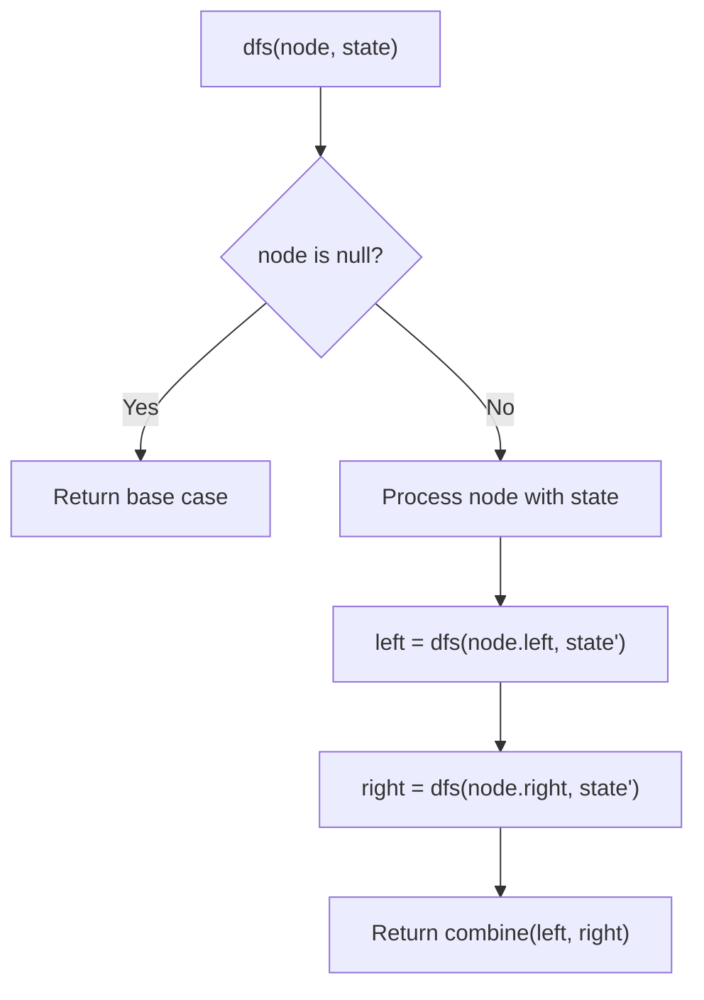
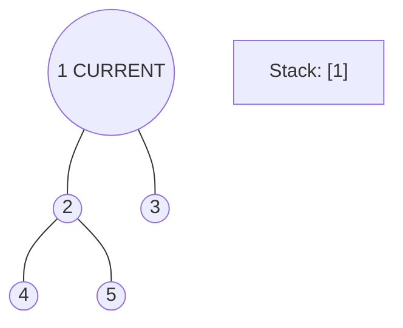
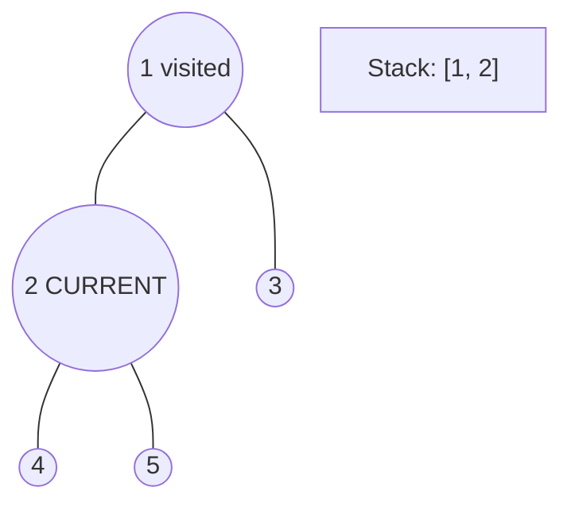
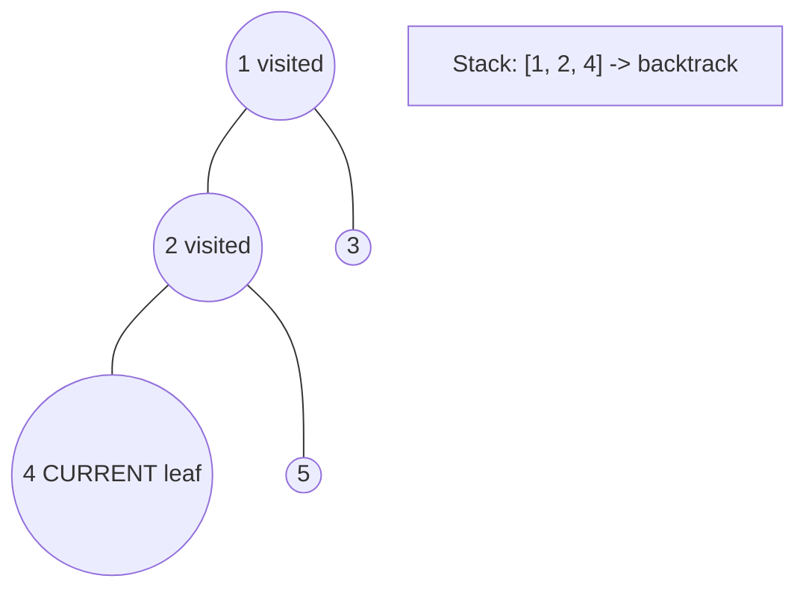
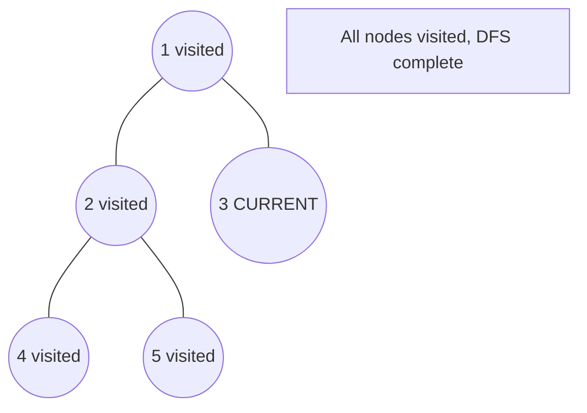

# Problem 437: Path Sum III

**Difficulty:** Medium  
**Tags:** Tree, Depth-First Search, Binary Tree  
**Pattern:** DFS Tree Traversal  
**Link:** [leetcode.com/problems/path-sum-iii](https://leetcode.com/problems/path-sum-iii/)

## Description

Given the `root` of a binary tree and an integer `targetSum`, return *the number of paths where the sum of the values along the path equals* `targetSum`.

The path does not need to start or end at the root or a leaf, but it must go downwards (i.e., traveling only from parent nodes to child nodes).

 

Example 1:

```

**Input:** root = [10,5,-3,3,2,null,11,3,-2,null,1], targetSum = 8
**Output:** 3
**Explanation:** The paths that sum to 8 are shown.

```

Example 2:

```

**Input:** root = [5,4,8,11,null,13,4,7,2,null,null,5,1], targetSum = 22
**Output:** 3

```

 

**Constraints:**

	- The number of nodes in the tree is in the range `[0, 1000]`.
	- `-10^9 <= Node.val <= 10^9`
	- `-1000 <= targetSum <= 1000`

## Approach: DFS Tree Traversal

Perform depth-first search on the tree. Recurse on left and right subtrees, combining results bottom-up. Track state (path, depth, sum) during traversal.

## Pseudocode

```
1. Define dfs(node, state):
   a. Base case: if null, return default
   b. Process node with current state
   c. left_result = dfs(node.left, updated_state)
   d. right_result = dfs(node.right, updated_state)
   e. Return combine(left_result, right_result)
2. Return dfs(root, initial_state)
```

## Algorithm Flow



## Visual State Transitions

**DFS Tree Traversal Step-by-Step:**

**Frame 1: Start at root**


**Frame 2: Go left - visit node 2**


**Frame 3: Go left - visit node 4 (leaf)**


**Frame 4: Backtrack, visit node 5, then node 3**



## Complexity Analysis

- **Time:** O(n)
- **Space:** O(h)

## Solution (Python3)

```python
class Solution:
    def pathSum(self, root: Optional[TreeNode], targetSum: int) -> int:
        # DFS on binary tree - O(n) time, O(h) space
        def dfs(node):
            if not node:
                return 0
            left = dfs(node.left)
            right = dfs(node.right)
            return 1 + max(left, right)
        
        result = dfs(root)
        return result
```

## Solution (C++)

```cpp
#include <algorithm>
#include <functional>
#include <string>
#include <vector>
using namespace std;

class Solution {
public:
    int pathSum(TreeNode* root, int targetSum) {
        // DFS on binary tree - O(n) time, O(h) space
        function<int(TreeNode*)> dfs = [&](TreeNode* node) -> int {
            if (!node) return 0;
            int left = dfs(node->left);
            int right = dfs(node->right);
            return 1 + max(left, right);
        };
        return dfs(root);
    }
};
```
