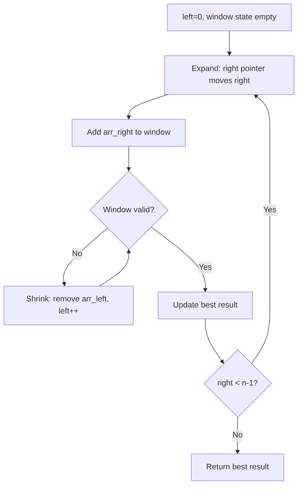
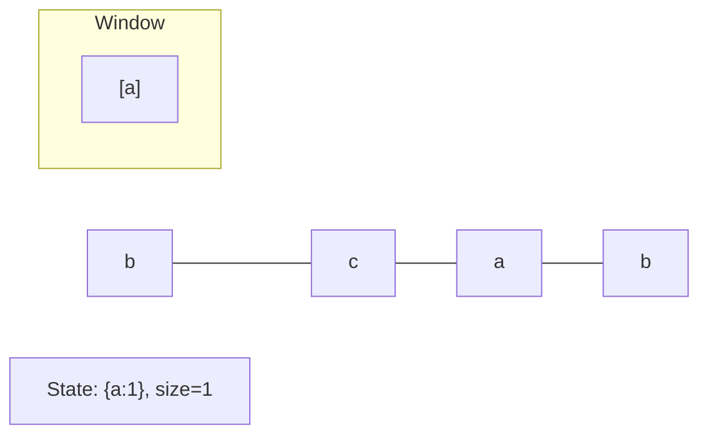
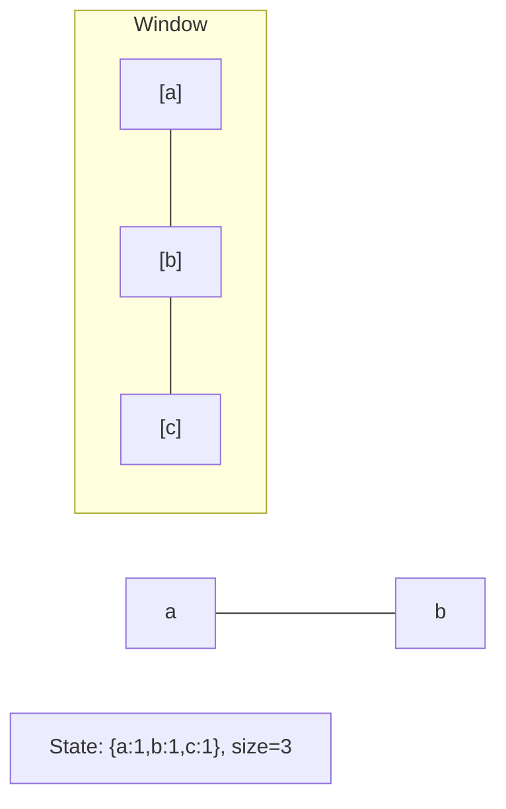
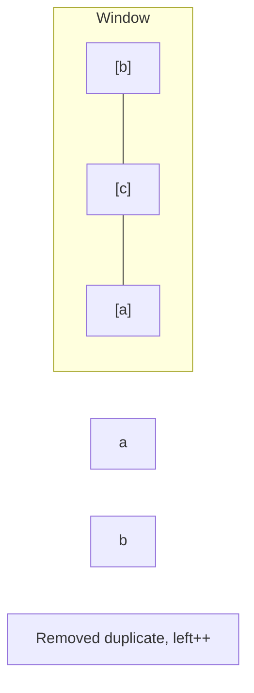
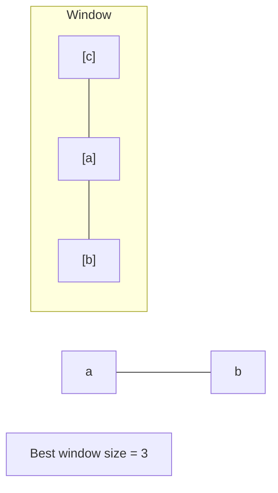

# Problem 438: Find All Anagrams in a String

**Difficulty:** Medium  
**Tags:** Hash Table, String, Sliding Window  
**Pattern:** Sliding Window  
**Link:** [leetcode.com/problems/find-all-anagrams-in-a-string](https://leetcode.com/problems/find-all-anagrams-in-a-string/)

## Description

Given two strings `s` and `p`, return an array of all the start indices of `p`'s anagrams in `s`. You may return the answer in **any order**.

 

Example 1:

```

**Input:** s = "cbaebabacd", p = "abc"
**Output:** [0,6]
**Explanation:**
The substring with start index = 0 is "cba", which is an anagram of "abc".
The substring with start index = 6 is "bac", which is an anagram of "abc".

```

Example 2:

```

**Input:** s = "abab", p = "ab"
**Output:** [0,1,2]
**Explanation:**
The substring with start index = 0 is "ab", which is an anagram of "ab".
The substring with start index = 1 is "ba", which is an anagram of "ab".
The substring with start index = 2 is "ab", which is an anagram of "ab".

```

 

**Constraints:**

	- `1 <= s.length, p.length <= 3 * 10^4`
	- `s` and `p` consist of lowercase English letters.

## Approach: Sliding Window

Maintain a window over the data using two pointers. Expand the right boundary to include new elements, and shrink the left boundary when the window constraint is violated. Track the optimal window.

## Pseudocode

```
1. Initialize left = 0, result = initial_value
2. For right in range(n):
   a. Add element at right to window state
   b. While window is invalid:
      - Remove element at left from window state
      - left++
   c. Update result = best of (result, window size/value)
3. Return result
```

## Algorithm Flow



## Visual State Transitions

**Sliding Window Step-by-Step:**

**Frame 1: Initial window (left=0, right=0)**


**Frame 2: Expand right (right=2)**


**Frame 3: Violation - shrink left**


**Frame 4: Continue expanding**



## Complexity Analysis

- **Time:** O(n)
- **Space:** O(k)

## Solution (Python3)

```python
class Solution:
    def findAnagrams(self, s: str, p: str) -> List[int]:
        # Sliding window approach - O(n) time, O(k) space
        from collections import defaultdict
        window = defaultdict(int)
        left = 0
        result = 0
        for right in range(len(s)):
            window[s[right]] += 1
            while len(window) > (p if isinstance(p, int) else len(s)):
                window[s[left]] -= 1
                if window[s[left]] == 0:
                    del window[s[left]]
                left += 1
            result = max(result, right - left + 1)
        return result
```

## Solution (C++)

```cpp
#include <algorithm>
#include <string>
#include <unordered_map>
#include <vector>
using namespace std;

class Solution {
public:
    vector<int> findAnagrams(string& s, string& p) {
        // Sliding window approach - O(n) time, O(k) space
        unordered_map<char, int> window;
        int left = 0, result = 0;
        for (int right = 0; right < s.size(); right++) {
            window[s[right]]++;
            while ((int)window.size() > p) {
                window[s[left]]--;
                if (window[s[left]] == 0)
                    window.erase(s[left]);
                left++;
            }
            result = max(result, right - left + 1);
        }
        return result;
    }
};
```
