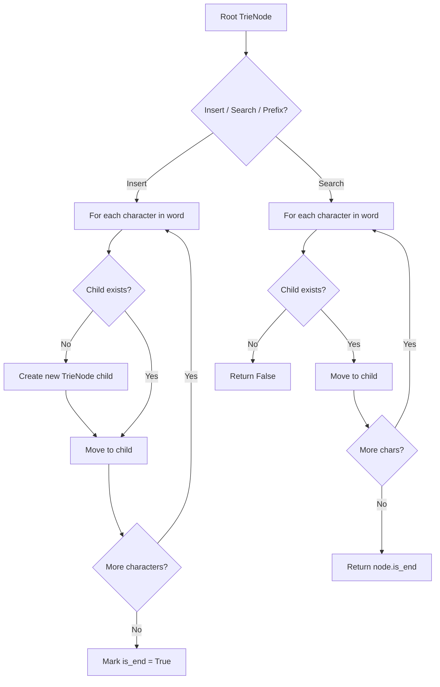
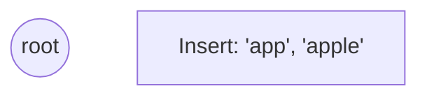
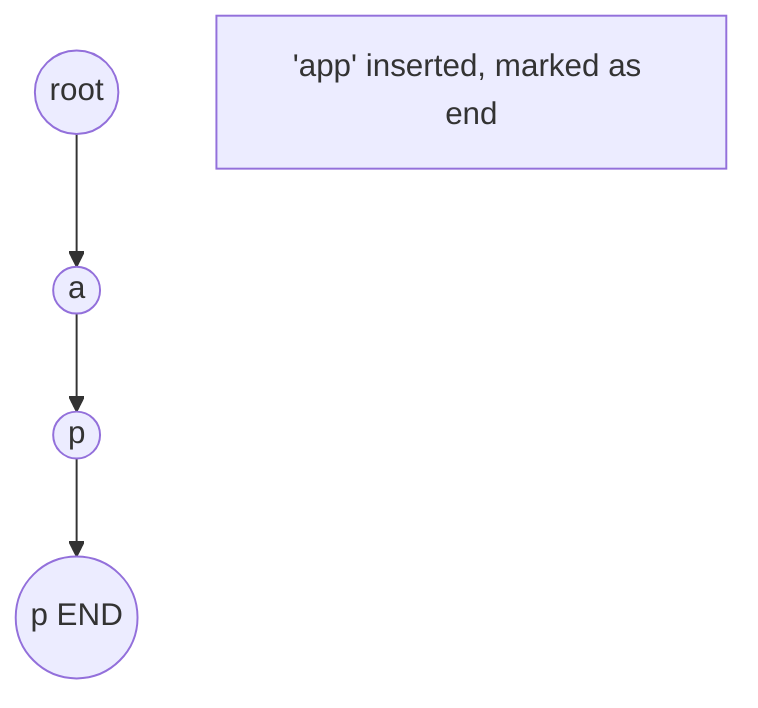
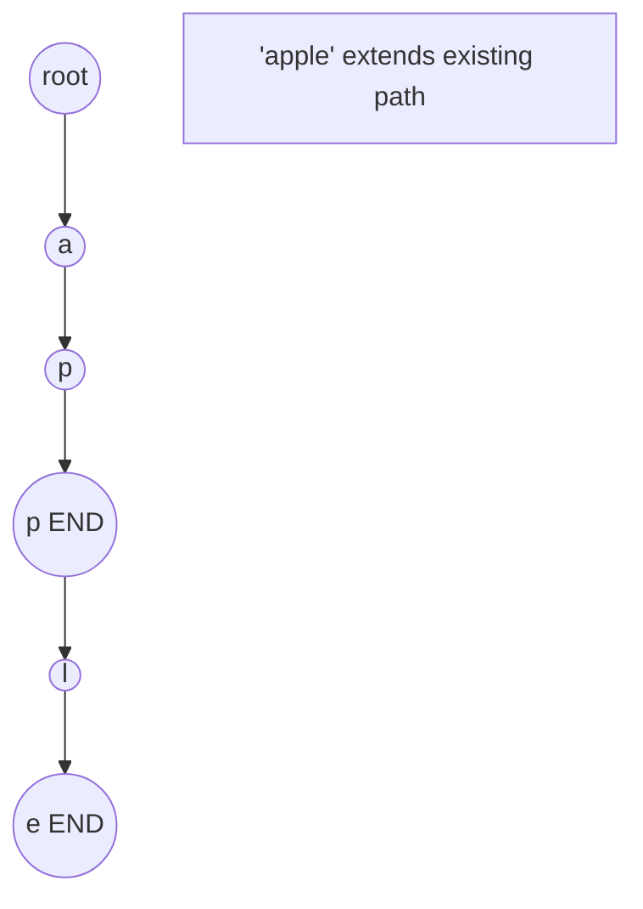
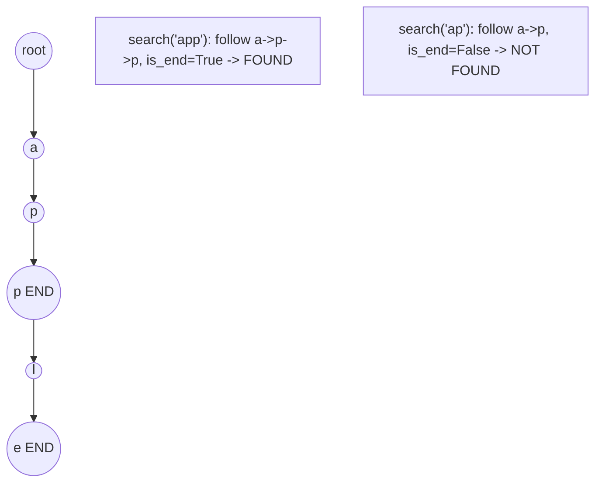

# Problem 440: K-th Smallest in Lexicographical Order

**Difficulty:** Hard  
**Tags:** Trie  
**Pattern:** Trie / Prefix Tree  
**Link:** [leetcode.com/problems/k-th-smallest-in-lexicographical-order](https://leetcode.com/problems/k-th-smallest-in-lexicographical-order/)

## Description

Given two integers `n` and `k`, return *the* `k^th` *lexicographically smallest integer in the range* `[1, n]`.

 

Example 1:

```

**Input:** n = 13, k = 2
**Output:** 10
**Explanation:** The lexicographical order is [1, 10, 11, 12, 13, 2, 3, 4, 5, 6, 7, 8, 9], so the second smallest number is 10.

```

Example 2:

```

**Input:** n = 1, k = 1
**Output:** 1

```

 

**Constraints:**

	- `1 <= k <= n <= 10^9`

## Approach: Trie / Prefix Tree

Build a trie (prefix tree) where each node represents a character. Insert words character by character, and search by following child pointers. Supports efficient prefix matching.

## Pseudocode

```
1. TrieNode: children = {}, is_end = False
2. Insert(word):
   - For each char: create child if absent, move to child
   - Mark last node as end
3. Search(word):
   - For each char: if child absent return False, move to child
   - Return node.is_end
4. StartsWith(prefix): same as search but return True at end
```

## Algorithm Flow



## Visual State Transitions

**Trie Insert and Search:**

**Frame 1: Empty trie**


**Frame 2: Insert 'app'**


**Frame 3: Insert 'apple'**


**Frame 4: Search 'app' = True, 'ap' = False**



## Complexity Analysis

- **Time:** O(L) per operation
- **Space:** O(N * L)

## Solution (Python3)

```python
class Solution:
    def findKthNumber(self, n: int, k: int) -> int:
        # Trie-based approach
        trie = {}
        # Build trie from word list
        words = n if isinstance(n, list) else [n]
        for word in words:
            node = trie
            for ch in word:
                if ch not in node:
                    node[ch] = {}
                node = node[ch]
            node['#'] = True
        
        # Search in trie
        def search(word):
            node = trie
            for ch in word:
                if ch not in node:
                    return False
                node = node[ch]
            return '#' in node
        
        return 0
```

## Solution (C++)

```cpp
#include <string>
#include <vector>
using namespace std;

class Solution {
public:
    int findKthNumber(int n, int k) {
        // Trie-based approach
        struct TrieNode {
            TrieNode* children[26] = {};
            bool isEnd = false;
        };
        TrieNode* root = new TrieNode();
        // Build trie
        for (auto& word : n) {
            TrieNode* node = root;
            for (char ch : word) {
                int idx = ch - 'a';
                if (!node->children[idx])
                    node->children[idx] = new TrieNode();
                node = node->children[idx];
            }
            node->isEnd = true;
        }
        return 0;
    }
};
```
