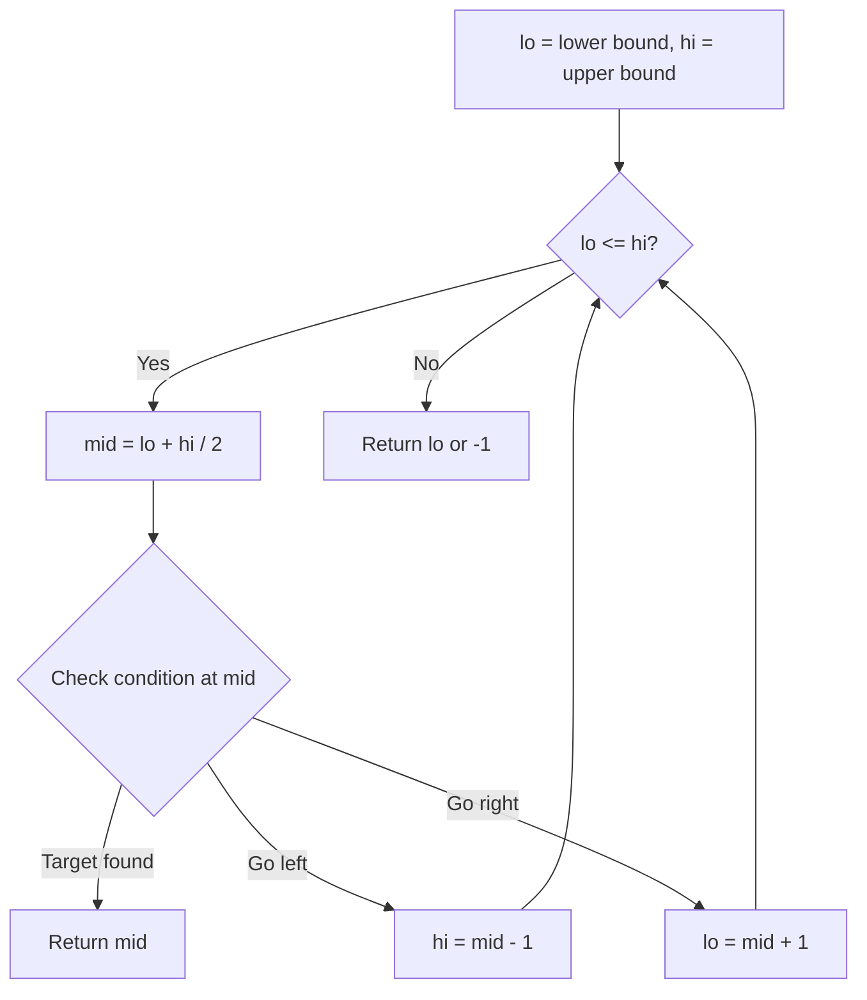
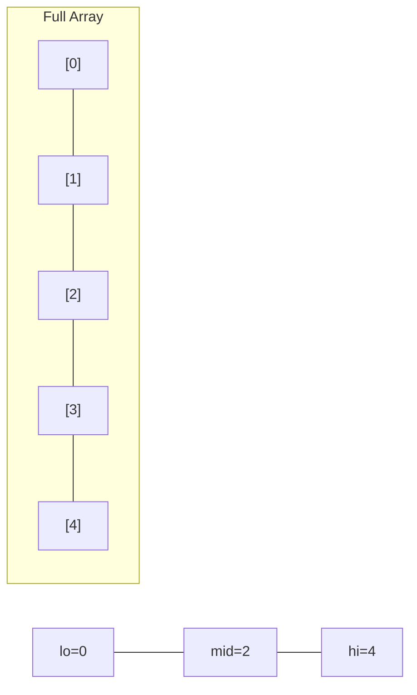
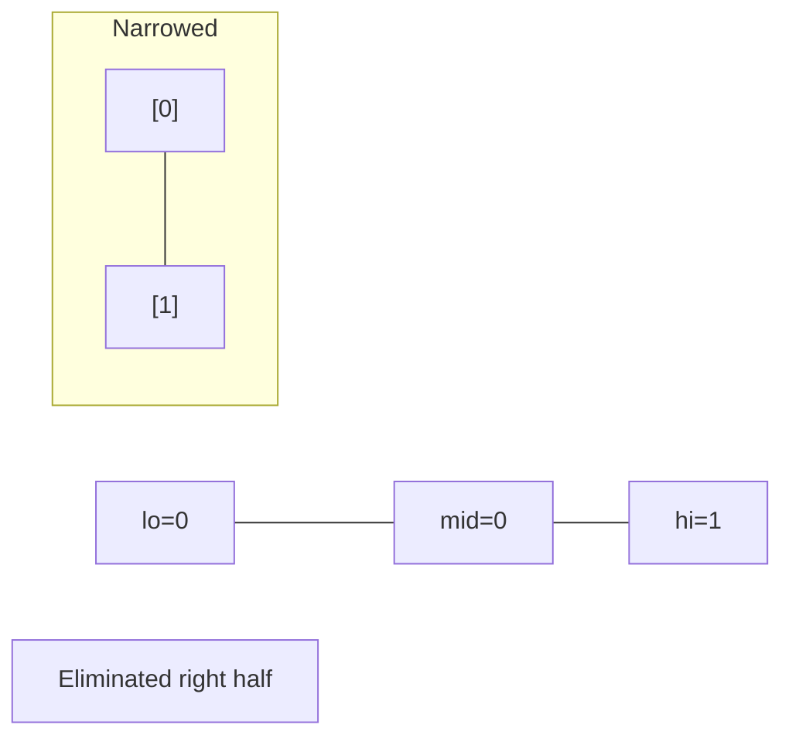
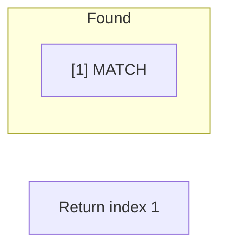

# Problem 441: Arranging Coins

**Difficulty:** Easy  
**Tags:** Math, Binary Search  
**Pattern:** Binary Search  
**Link:** [leetcode.com/problems/arranging-coins](https://leetcode.com/problems/arranging-coins/)

## Description

You have `n` coins and you want to build a staircase with these coins. The staircase consists of `k` rows where the `i^th` row has exactly `i` coins. The last row of the staircase **may be** incomplete.

Given the integer `n`, return *the number of **complete rows** of the staircase you will build*.

 

Example 1:

```

**Input:** n = 5
**Output:** 2
**Explanation:** Because the 3rd row is incomplete, we return 2.

```

Example 2:

```

**Input:** n = 8
**Output:** 3
**Explanation:** Because the 4th row is incomplete, we return 3.

```

 

**Constraints:**

	- `1 <= n <= 2^31 - 1`

## Approach: Binary Search

Use binary search to halve the search space each iteration. Define the search range [lo, hi], compute mid, and decide which half to keep based on the problem's monotonic condition.

## Pseudocode

```
1. lo = lower_bound, hi = upper_bound
2. While lo <= hi (or lo < hi):
   a. mid = (lo + hi) // 2
   b. If condition(mid) is satisfied: record answer, search left half
   c. Else: search right half
3. Return answer
```

## Algorithm Flow



## Visual State Transitions

**Binary Search Step-by-Step:**

**Frame 1: Initial search space**


**Frame 2: Compare mid, narrow search**


**Frame 3: Found target**



## Complexity Analysis

- **Time:** O(log n)
- **Space:** O(1)

## Solution (Python3)

```python
class Solution:
    def arrangeCoins(self, n: int) -> int:
        # Binary search - O(log n) time, O(1) space
        lo, hi = 0, len(n) - 1
        while lo <= hi:
            mid = lo + (hi - lo) // 2
            if n[mid] == n:
                return mid
            elif n[mid] < n:
                lo = mid + 1
            else:
                hi = mid - 1
        return 0
```

## Solution (C++)

```cpp
#include <string>
#include <vector>
using namespace std;

class Solution {
public:
    int arrangeCoins(int n) {
        // Binary search - O(log n) time, O(1) space
        int lo = 0, hi = n.size() - 1;
        while (lo <= hi) {
            int mid = lo + (hi - lo) / 2;
            if (n[mid] == n) {
                return mid;
            } else if (n[mid] < n) {
                lo = mid + 1;
            } else {
                hi = mid - 1;
            }
        }
        return 0;
    }
};
```
