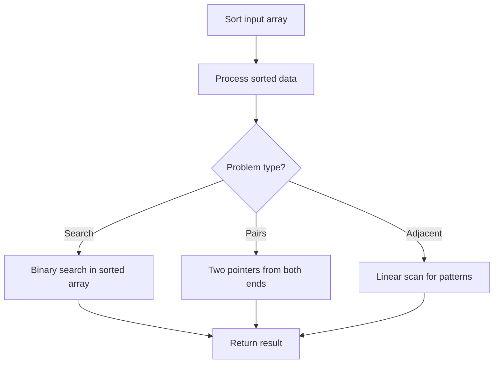

# Problem 442: Find All Duplicates in an Array

**Difficulty:** Medium  
**Tags:** Array, Hash Table, Sorting  
**Pattern:** Sorting  
**Link:** [leetcode.com/problems/find-all-duplicates-in-an-array](https://leetcode.com/problems/find-all-duplicates-in-an-array/)

## Description

Given an integer array `nums` of length `n` where all the integers of `nums` are in the range `[1, n]` and each integer appears **at most** **twice**, return *an array of all the integers that appears **twice***.

You must write an algorithm that runs in `O(n)` time and uses only *constant* auxiliary space, excluding the space needed to store the output

 

Example 1:

```
**Input:** nums = [4,3,2,7,8,2,3,1]
**Output:** [2,3]

```
Example 2:

```
**Input:** nums = [1,1,2]
**Output:** [1]

```
Example 3:

```
**Input:** nums = [1]
**Output:** []

```

 

**Constraints:**

	- `n == nums.length`
	- `1 <= n <= 10^5`
	- `1 <= nums[i] <= n`
	- Each element in `nums` appears **once** or **twice**.

## Approach: Sorting

Sort the data to enable efficient processing. After sorting, use techniques like binary search, two pointers, or linear scan to solve the problem.

## Pseudocode

```
1. Sort the input array
2. Process sorted data:
   - Use binary search for lookups
   - Use two pointers for pair finding
   - Scan for adjacent patterns
3. Return result
```

## Algorithm Flow



## Complexity Analysis

- **Time:** O(n log n)
- **Space:** O(n)

## Solution (Python3)

```python
class Solution:
    def findDuplicates(self, nums: List[int]) -> List[int]:
        # Sort-based approach - O(n log n) time
        nums.sort(key=lambda x: x[0] if isinstance(x, (list, tuple)) else x)
        result = [nums[0]]
        for i in range(1, len(nums)):
            curr = nums[i]
            if isinstance(curr, (list, tuple)) and isinstance(result[-1], (list, tuple)):
                if curr[0] <= result[-1][1]:
                    result[-1] = [result[-1][0], max(result[-1][1], curr[1])]
                else:
                    result.append(curr)
            else:
                result.append(curr)
        return result
```

## Solution (C++)

```cpp
#include <algorithm>
#include <string>
#include <vector>
using namespace std;

class Solution {
public:
    vector<int> findDuplicates(vector<int>& nums) {
        // Sort-based approach - O(n log n) time
        sort(nums.begin(), nums.end());
        vector<vector<int>> result;
        result.push_back(nums[0]);
        for (int i = 1; i < (int)nums.size(); i++) {
            if (nums[i][0] <= result.back()[1]) {
                result.back()[1] = max(result.back()[1], nums[i][1]);
            } else {
                result.push_back(nums[i]);
            }
        }
        return result;
    }
};
```
