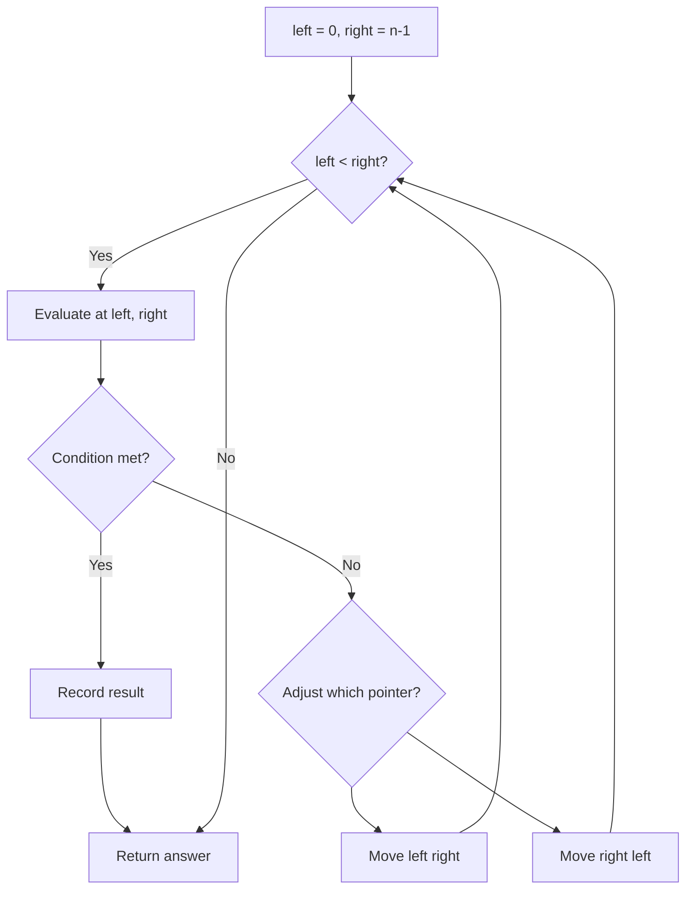
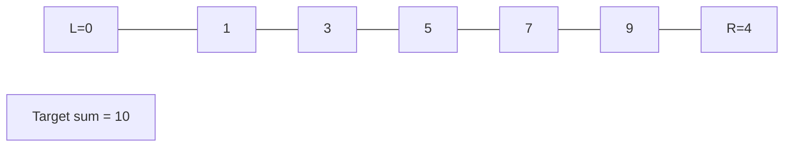
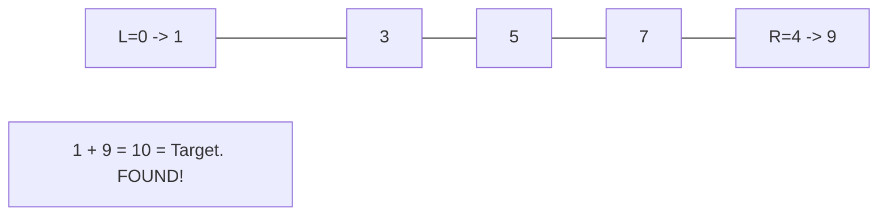

# Problem 443: String Compression

**Difficulty:** Medium  
**Tags:** Two Pointers, String  
**Pattern:** Two Pointers  
**Link:** [leetcode.com/problems/string-compression](https://leetcode.com/problems/string-compression/)

## Description

Given an array of characters `chars`, compress it using the following algorithm:

Begin with an empty string `s`. For each group of **consecutive repeating characters** in `chars`:

	- If the group's length is `1`, append the character to `s`.
	- Otherwise, append the character followed by the group's length.

The compressed string `s` **should not be returned separately**, but instead, be stored **in the input character array `chars`**. Note that group lengths that are `10` or longer will be split into multiple characters in `chars`.

After you are done **modifying the input array,** return *the new length of the array*.

You must write an algorithm that uses only constant extra space.

**Note: **The characters in the array beyond the returned length do not matter and should be ignored.

 

Example 1:

```

**Input:** chars = ["a","a","b","b","c","c","c"]
**Output:** Return 6, and the first 6 characters of the input array should be: ["a","2","b","2","c","3"]
**Explanation:** The groups are "aa", "bb", and "ccc". This compresses to "a2b2c3".

```

Example 2:

```

**Input:** chars = ["a"]
**Output:** Return 1, and the first character of the input array should be: ["a"]
**Explanation:** The only group is "a", which remains uncompressed since it's a single character.

```

Example 3:

```

**Input:** chars = ["a","b","b","b","b","b","b","b","b","b","b","b","b"]
**Output:** Return 4, and the first 4 characters of the input array should be: ["a","b","1","2"].
**Explanation:** The groups are "a" and "bbbbbbbbbbbb". This compresses to "ab12".
```

 

**Constraints:**

	- `1 <= chars.length <= 2000`
	- `chars[i]` is a lowercase English letter, uppercase English letter, digit, or symbol.

## Approach: Two Pointers

Use two pointers moving through the data structure. Depending on the problem, pointers may move toward each other (converging), in the same direction (fast/slow), or independently.

## Pseudocode

```
1. Initialize left = 0, right = n-1 (or two independent pointers)
2. While pointers haven't crossed:
   a. Evaluate condition at pointer positions
   b. Move left pointer right or right pointer left
3. Return result
```

## Algorithm Flow



## Visual State Transitions

**Two Pointer Convergence:**

**Frame 1: Initialize pointers**


**Frame 2: Sum = 1+9 = 10, found!**



## Complexity Analysis

- **Time:** O(n)
- **Space:** O(1)

## Solution (Python3)

```python
class Solution:
    def compress(self, chars: List[str]) -> int:
        # Two pointer approach - O(n) time, O(1) space
        left, right = 0, len(chars) - 1
        while left < right:
            curr = chars[left] + chars[right]
            if curr == chars:
                return [left, right]
            elif curr < chars:
                left += 1
            else:
                right -= 1
        return 0
```

## Solution (C++)

```cpp
#include <string>
#include <vector>
using namespace std;

class Solution {
public:
    int compress(vector<string>& chars) {
        // Two pointer approach - O(n) time, O(1) space
        int left = 0, right = chars.size() - 1;
        while (left < right) {
            int curr = chars[left] + chars[right];
            if (curr == chars) {
                return {left, right};
            } else if (curr < chars) {
                left++;
            } else {
                right--;
            }
        }
        return 0;
    }
};
```
