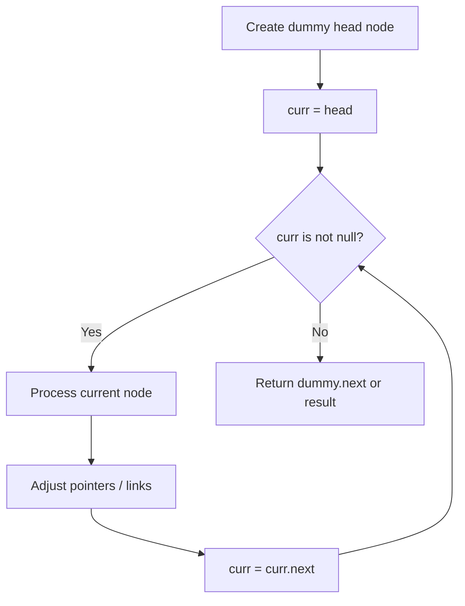
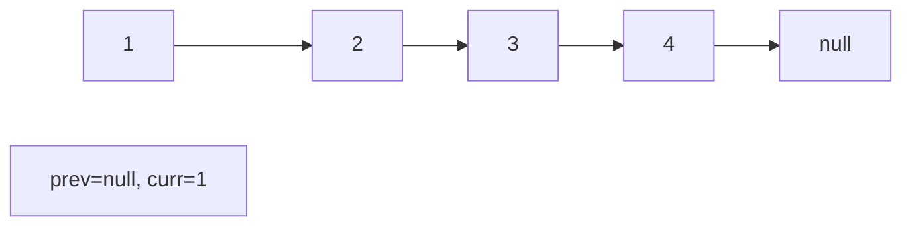
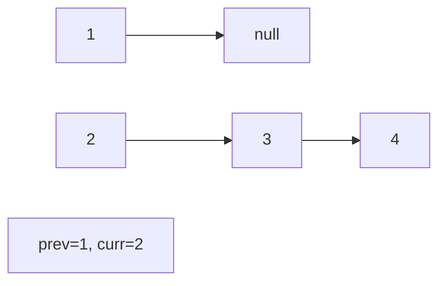
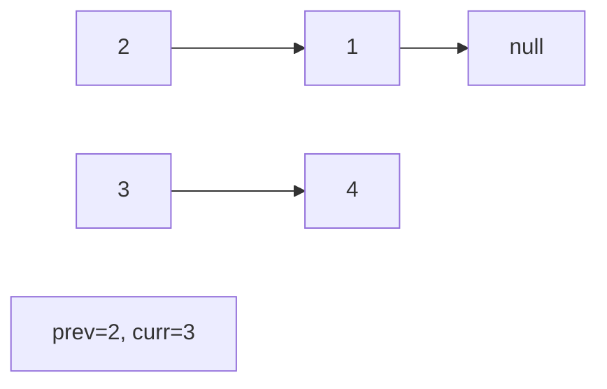
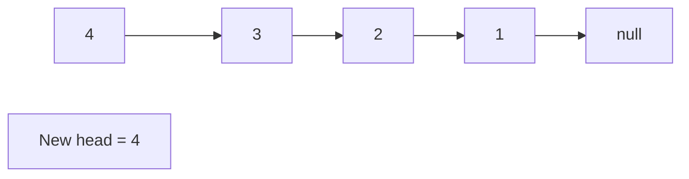

# Problem 445: Add Two Numbers II

**Difficulty:** Medium  
**Tags:** Linked List, Math, Stack  
**Pattern:** Linked List  
**Link:** [leetcode.com/problems/add-two-numbers-ii](https://leetcode.com/problems/add-two-numbers-ii/)

## Description

You are given two **non-empty** linked lists representing two non-negative integers. The most significant digit comes first and each of their nodes contains a single digit. Add the two numbers and return the sum as a linked list.

You may assume the two numbers do not contain any leading zero, except the number 0 itself.

 

Example 1:

```

**Input:** l1 = [7,2,4,3], l2 = [5,6,4]
**Output:** [7,8,0,7]

```

Example 2:

```

**Input:** l1 = [2,4,3], l2 = [5,6,4]
**Output:** [8,0,7]

```

Example 3:

```

**Input:** l1 = [0], l2 = [0]
**Output:** [0]

```

 

**Constraints:**

	- The number of nodes in each linked list is in the range `[1, 100]`.
	- `0 <= Node.val <= 9`
	- It is guaranteed that the list represents a number that does not have leading zeros.

 

**Follow up:** Could you solve it without reversing the input lists?

## Approach: Linked List

Traverse or manipulate the linked list using pointer techniques. Common patterns: dummy head node for edge cases, fast/slow pointers for cycle detection or middle finding, in-place reversal, and merge operations.

## Pseudocode

```
1. Create dummy head if needed
2. Initialize pointer(s) at head
3. Traverse / modify list:
   a. Process current node
   b. Adjust next pointers as needed
   c. Move to next node
4. Return dummy.next or result
```

## Algorithm Flow



## Visual State Transitions

**Linked List Operation (Reverse):**

**Frame 1: Initial list**


**Frame 2: Reverse first link**


**Frame 3: Reverse second link**


**Frame 4: Fully reversed**



## Complexity Analysis

- **Time:** O(n)
- **Space:** O(1)

## Solution (Python3)

```python
class Solution:
    def addTwoNumbers(self, l1: Optional[ListNode], l2: Optional[ListNode]) -> Optional[ListNode]:
        # Linked list traversal/manipulation
        dummy = ListNode(0)
        dummy.next = l1
        prev, curr = dummy, l1
        while curr:
            nxt = curr.next
            # Process current node
            prev = curr
            curr = nxt
        return dummy.next
```

## Solution (C++)

```cpp
#include <string>
#include <vector>
using namespace std;

class Solution {
public:
    ListNode* addTwoNumbers(ListNode* l1, ListNode* l2) {
        // Linked list traversal/manipulation
        ListNode dummy(0);
        dummy.next = l1;
        ListNode* prev = &dummy;
        ListNode* curr = l1;
        while (curr) {
            ListNode* nxt = curr->next;
            // Process current node
            prev = curr;
            curr = nxt;
        }
        return dummy.next;
    }
};
```
