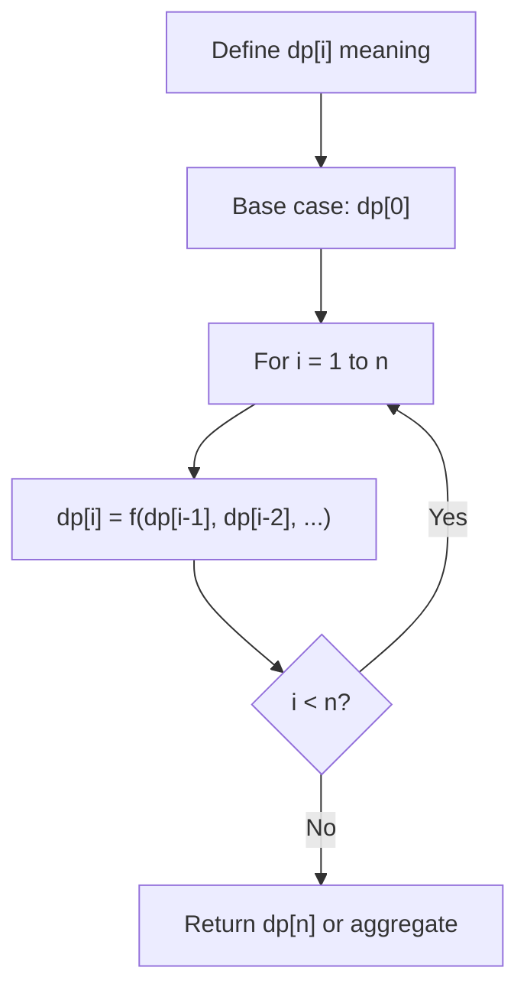
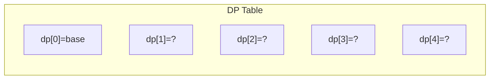
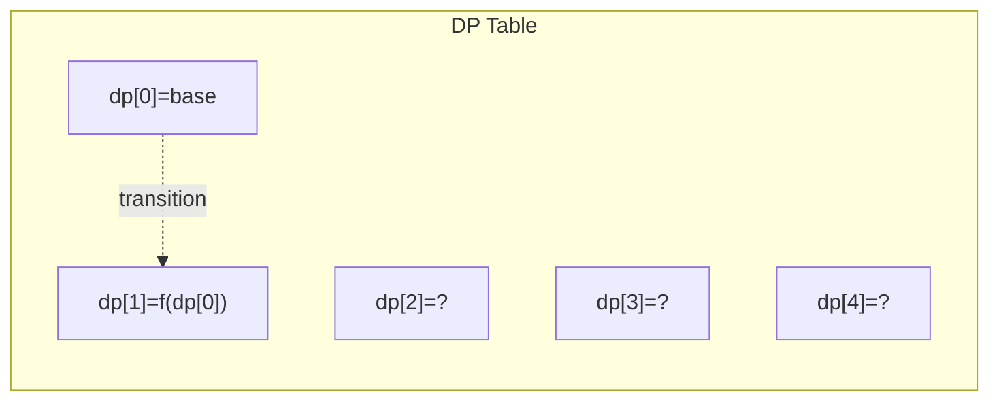
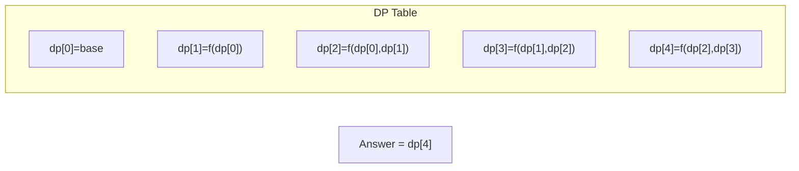

# Problem 446: Arithmetic Slices II - Subsequence

**Difficulty:** Hard  
**Tags:** Array, Dynamic Programming  
**Pattern:** Dynamic Programming (1D)  
**Link:** [leetcode.com/problems/arithmetic-slices-ii-subsequence](https://leetcode.com/problems/arithmetic-slices-ii-subsequence/)

## Description

Given an integer array `nums`, return *the number of all the **arithmetic subsequences** of* `nums`.

A sequence of numbers is called arithmetic if it consists of **at least three elements** and if the difference between any two consecutive elements is the same.

	- For example, `[1, 3, 5, 7, 9]`, `[7, 7, 7, 7]`, and `[3, -1, -5, -9]` are arithmetic sequences.
	- For example, `[1, 1, 2, 5, 7]` is not an arithmetic sequence.

A **subsequence** of an array is a sequence that can be formed by removing some elements (possibly none) of the array.

	- For example, `[2,5,10]` is a subsequence of `[1,2,1,**2**,4,1,**5**,**10**]`.

The test cases are generated so that the answer fits in **32-bit** integer.

 

Example 1:

```

**Input:** nums = [2,4,6,8,10]
**Output:** 7
**Explanation:** All arithmetic subsequence slices are:
[2,4,6]
[4,6,8]
[6,8,10]
[2,4,6,8]
[4,6,8,10]
[2,4,6,8,10]
[2,6,10]

```

Example 2:

```

**Input:** nums = [7,7,7,7,7]
**Output:** 16
**Explanation:** Any subsequence of this array is arithmetic.

```

 

**Constraints:**

	- `1  <= nums.length <= 1000`
	- `-2^31 <= nums[i] <= 2^31 - 1`

## Approach: Dynamic Programming (1D)

Break the problem into overlapping subproblems. Define dp[i] as the optimal value for the subproblem ending at or considering index i. Build the solution bottom-up, using previously computed dp values.

## Pseudocode

```
1. Define dp[i] = optimal value for subproblem i
2. Base case: dp[0] = initial value
3. For i from 1 to n:
   a. dp[i] = recurrence(dp[i-1], dp[i-2], ...)
4. Return dp[n] or max/min of dp
```

## Algorithm Flow



## Visual State Transitions

**1D Dynamic Programming Table Build:**

**Frame 1: Initialize base cases**


**Frame 2: Fill dp[1] from dp[0]**


**Frame 3: Fill remaining cells**



## Complexity Analysis

- **Time:** O(n)
- **Space:** O(n)

## Solution (Python3)

```python
class Solution:
    def numberOfArithmeticSlices(self, nums: List[int]) -> int:
        # Dynamic programming (1D) - O(n) time, O(n) space
        if not nums:
            return 0
        n = len(nums) if isinstance(nums, list) else nums
        dp = [0] * (n + 1)
        dp[0] = 1  # base case
        for i in range(1, n + 1):
            dp[i] = dp[i-1]  # transition (customize per problem)
            if i >= 2:
                dp[i] += dp[i-2]
        return dp[n]
```

## Solution (C++)

```cpp
#include <string>
#include <vector>
using namespace std;

class Solution {
public:
    int numberOfArithmeticSlices(vector<int>& nums) {
        // Dynamic programming (1D) - O(n) time, O(n) space
        int n = nums;
        if (n <= 0) return 0;
        vector<int> dp(n + 1, 0);
        dp[0] = 1;
        for (int i = 1; i <= n; i++) {
            dp[i] = dp[i-1];
            if (i >= 2) dp[i] += dp[i-2];
        }
        return dp[n];
    }
};
```
