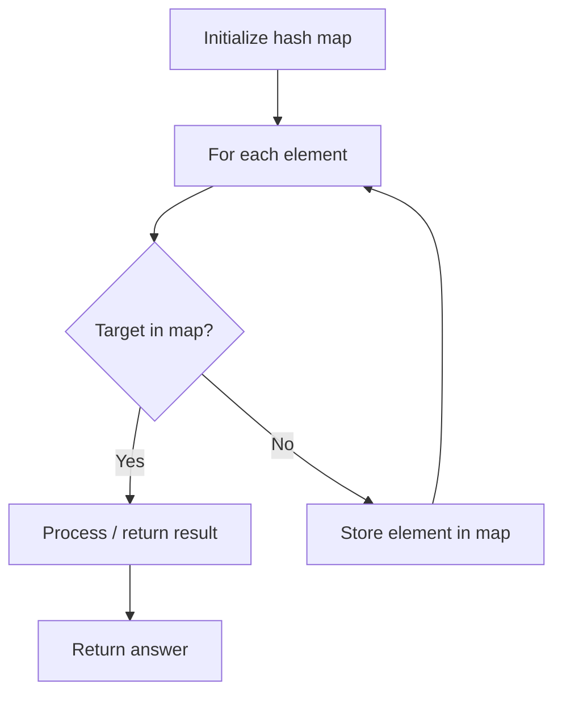

# Problem 448: Find All Numbers Disappeared in an Array

**Difficulty:** Easy  
**Tags:** Array, Hash Table  
**Pattern:** Hash Map Lookup  
**Link:** [leetcode.com/problems/find-all-numbers-disappeared-in-an-array](https://leetcode.com/problems/find-all-numbers-disappeared-in-an-array/)

## Description

Given an array `nums` of `n` integers where `nums[i]` is in the range `[1, n]`, return *an array of all the integers in the range* `[1, n]` *that do not appear in* `nums`.

 

Example 1:

```
**Input:** nums = [4,3,2,7,8,2,3,1]
**Output:** [5,6]

```
Example 2:

```
**Input:** nums = [1,1]
**Output:** [2]

```

 

**Constraints:**

	- `n == nums.length`
	- `1 <= n <= 10^5`
	- `1 <= nums[i] <= n`

 

**Follow up:** Could you do it without extra space and in `O(n)` runtime? You may assume the returned list does not count as extra space.

## Approach: Hash Map Lookup

Use a hash map (dictionary) to store elements for O(1) lookup. Iterate through the input, checking membership or counting frequencies in the map.

## Pseudocode

```
1. Initialize hash map
2. Iterate through elements:
   a. Check if target/complement exists in map
   b. If found: process result
   c. Otherwise: store element in map
3. Return result
```

## Algorithm Flow



## Complexity Analysis

- **Time:** O(n)
- **Space:** O(n)

## Solution (Python3)

```python
class Solution:
    def findDisappearedNumbers(self, nums: List[int]) -> List[int]:
        # Hash map approach - O(n) time, O(n) space
        seen = {}
        for i, val in enumerate(nums):
            complement = nums - val
            if complement in seen:
                return [seen[complement], i]
            seen[val] = i
        return []
```

## Solution (C++)

```cpp
#include <string>
#include <unordered_map>
#include <vector>
using namespace std;

class Solution {
public:
    vector<int> findDisappearedNumbers(vector<int>& nums) {
        // Hash map approach - O(n) time, O(n) space
        unordered_map<int, int> seen;
        for (int i = 0; i < nums.size(); i++) {
            int complement = nums - nums[i];
            if (seen.count(complement)) {
                return {seen[complement], i};
            }
            seen[nums[i]] = i;
        }
        return {};
    }
};
```
