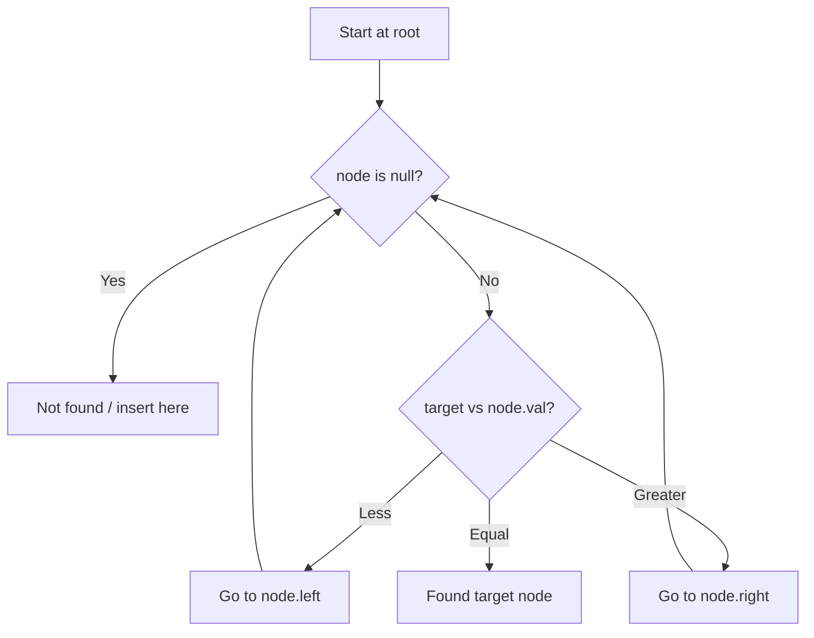

# Problem 449: Serialize and Deserialize BST

**Difficulty:** Medium  
**Tags:** String, Tree, Depth-First Search, Breadth-First Search, Design, Binary Search Tree, Binary Tree  
**Pattern:** Binary Search Tree  
**Link:** [leetcode.com/problems/serialize-and-deserialize-bst](https://leetcode.com/problems/serialize-and-deserialize-bst/)

## Description

Serialization is converting a data structure or object into a sequence of bits so that it can be stored in a file or memory buffer, or transmitted across a network connection link to be reconstructed later in the same or another computer environment.

Design an algorithm to serialize and deserialize a **binary search tree**. There is no restriction on how your serialization/deserialization algorithm should work. You need to ensure that a binary search tree can be serialized to a string, and this string can be deserialized to the original tree structure.

**The encoded string should be as compact as possible.**

 

Example 1:

```
**Input:** root = [2,1,3]
**Output:** [2,1,3]

```
Example 2:

```
**Input:** root = []
**Output:** []

```

 

**Constraints:**

	- The number of nodes in the tree is in the range `[0, 10^4]`.
	- `0 <= Node.val <= 10^4`
	- The input tree is **guaranteed** to be a binary search tree.

## Approach: Binary Search Tree

Leverage BST property: left < root < right. Navigate left for smaller values, right for larger values. Inorder traversal yields sorted order.

## Pseudocode

```
1. Start at root
2. Compare target with current node:
   a. If target < node.val: go left
   b. If target > node.val: go right
   c. If equal: found
3. Return result
```

## Algorithm Flow



## Complexity Analysis

- **Time:** O(h)
- **Space:** O(h)

## Solution (Python3)

```python
class Codec:
    def serialize(self, root: Optional[TreeNode]) -> str:
        return ""

    def deserialize(self, data: str) -> Optional[TreeNode]:
        return None

```

## Solution (C++)

```cpp
#include <functional>
#include <string>
#include <vector>
using namespace std;

class Codec {
public:
    string serialize(TreeNode* root) {
        return "";
    }

    TreeNode* deserialize(string& data) {
        return nullptr;
    }

};
```
