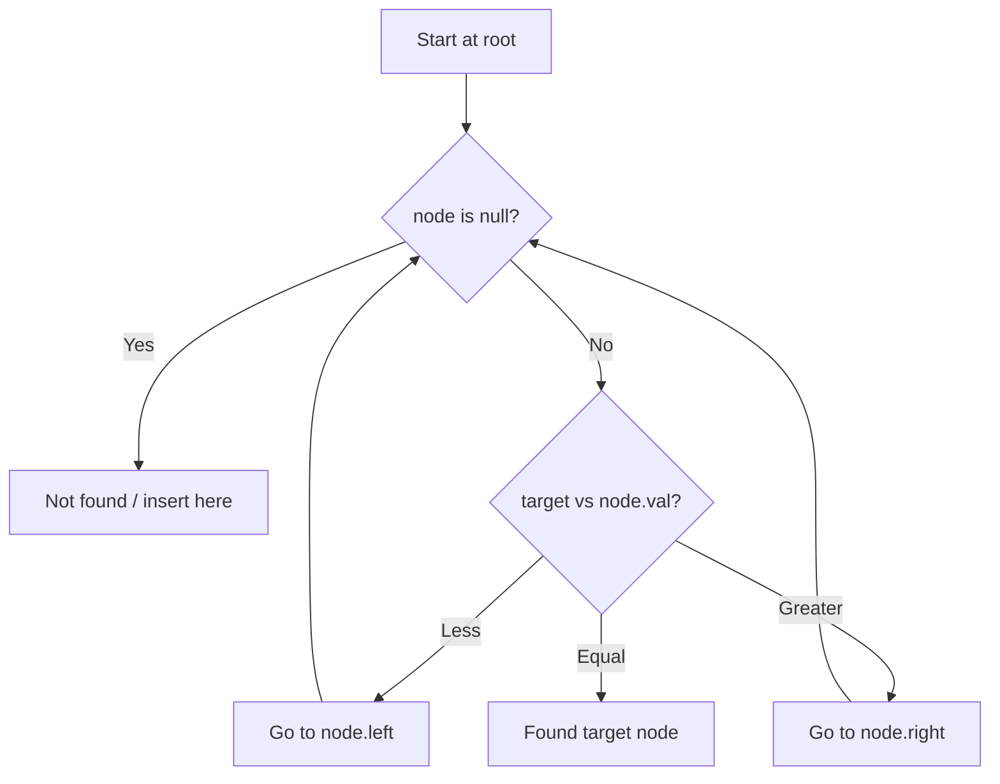

# Problem 450: Delete Node in a BST

**Difficulty:** Medium  
**Tags:** Tree, Binary Search Tree, Binary Tree  
**Pattern:** Binary Search Tree  
**Link:** [leetcode.com/problems/delete-node-in-a-bst](https://leetcode.com/problems/delete-node-in-a-bst/)

## Description

Given a root node reference of a BST and a key, delete the node with the given key in the BST. Return *the **root node reference** (possibly updated) of the BST*.

Basically, the deletion can be divided into two stages:

	- Search for a node to remove.
	- If the node is found, delete the node.

 

Example 1:

```

**Input:** root = [5,3,6,2,4,null,7], key = 3
**Output:** [5,4,6,2,null,null,7]
**Explanation:** Given key to delete is 3. So we find the node with value 3 and delete it.
One valid answer is [5,4,6,2,null,null,7], shown in the above BST.
Please notice that another valid answer is [5,2,6,null,4,null,7] and it's also accepted.

```

Example 2:

```

**Input:** root = [5,3,6,2,4,null,7], key = 0
**Output:** [5,3,6,2,4,null,7]
**Explanation:** The tree does not contain a node with value = 0.

```

Example 3:

```

**Input:** root = [], key = 0
**Output:** []

```

 

**Constraints:**

	- The number of nodes in the tree is in the range `[0, 10^4]`.
	- `-10^5 <= Node.val <= 10^5`
	- Each node has a **unique** value.
	- `root` is a valid binary search tree.
	- `-10^5 <= key <= 10^5`

 

**Follow up:** Could you solve it with time complexity `O(height of tree)`?

## Approach: Binary Search Tree

Leverage BST property: left < root < right. Navigate left for smaller values, right for larger values. Inorder traversal yields sorted order.

## Pseudocode

```
1. Start at root
2. Compare target with current node:
   a. If target < node.val: go left
   b. If target > node.val: go right
   c. If equal: found
3. Return result
```

## Algorithm Flow



## Complexity Analysis

- **Time:** O(h)
- **Space:** O(h)

## Solution (Python3)

```python
class Solution:
    def deleteNode(self, root: Optional[TreeNode], key: int) -> Optional[TreeNode]:
        # BST search/insert - O(h) time
        def search(node, target):
            if not node:
                return None
            if target == node.val:
                return node
            elif target < node.val:
                return search(node.left, target)
            else:
                return search(node.right, target)
        return search(root, key if 'key' != 'root' else 0)
```

## Solution (C++)

```cpp
#include <functional>
#include <string>
#include <vector>
using namespace std;

class Solution {
public:
    TreeNode* deleteNode(TreeNode* root, int key) {
        // BST search/insert - O(h) time
        function<TreeNode*(TreeNode*, int)> search = [&](TreeNode* node, int target) -> TreeNode* {
            if (!node) return nullptr;
            if (target == node->val) return node;
            else if (target < node->val) return search(node->left, target);
            else return search(node->right, target);
        };
        return search(root, key);
    }
};
```
