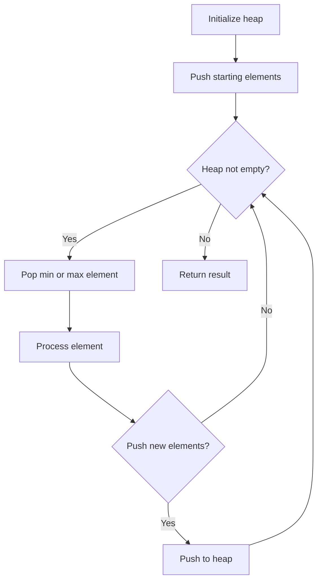
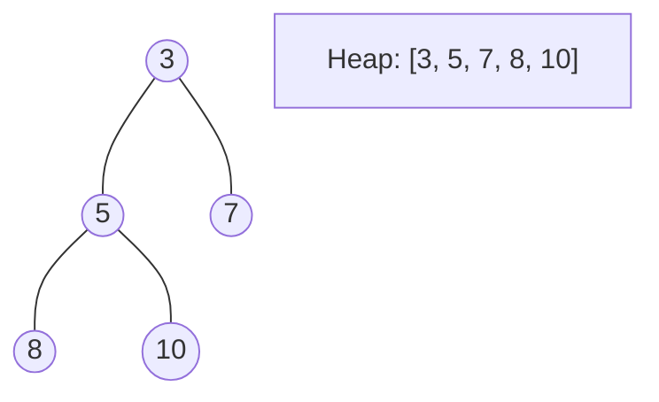
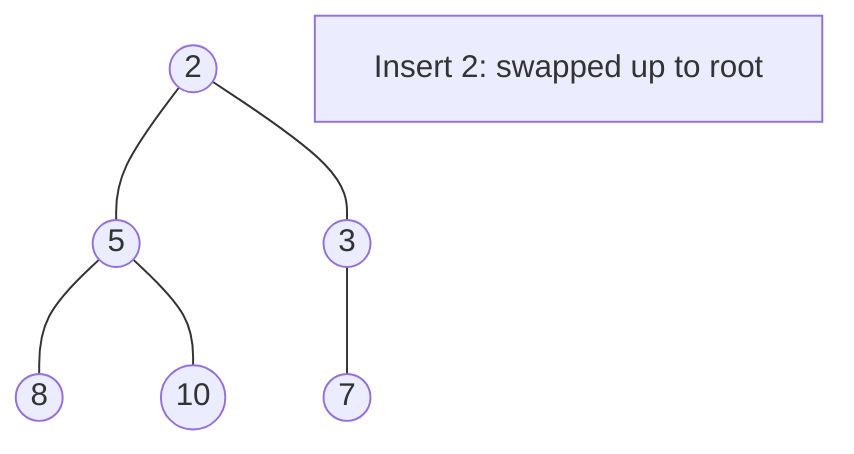
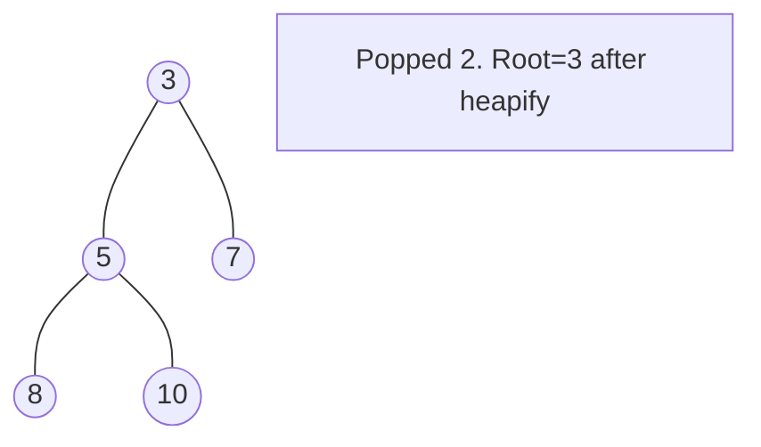

# Problem 451: Sort Characters By Frequency

**Difficulty:** Medium  
**Tags:** Hash Table, String, Sorting, Heap (Priority Queue), Bucket Sort, Counting  
**Pattern:** Heap / Priority Queue  
**Link:** [leetcode.com/problems/sort-characters-by-frequency](https://leetcode.com/problems/sort-characters-by-frequency/)

## Description

Given a string `s`, sort it in **decreasing order** based on the **frequency** of the characters. The **frequency** of a character is the number of times it appears in the string.

Return *the sorted string*. If there are multiple answers, return *any of them*.

 

Example 1:

```

**Input:** s = "tree"
**Output:** "eert"
**Explanation:** 'e' appears twice while 'r' and 't' both appear once.
So 'e' must appear before both 'r' and 't'. Therefore "eetr" is also a valid answer.

```

Example 2:

```

**Input:** s = "cccaaa"
**Output:** "aaaccc"
**Explanation:** Both 'c' and 'a' appear three times, so both "cccaaa" and "aaaccc" are valid answers.
Note that "cacaca" is incorrect, as the same characters must be together.

```

Example 3:

```

**Input:** s = "Aabb"
**Output:** "bbAa"
**Explanation:** "bbaA" is also a valid answer, but "Aabb" is incorrect.
Note that 'A' and 'a' are treated as two different characters.

```

 

**Constraints:**

	- `1 <= s.length <= 5 * 10^5`
	- `s` consists of uppercase and lowercase English letters and digits.

## Approach: Heap / Priority Queue

Use a min-heap or max-heap to efficiently access the smallest/largest element. Push elements and pop the top to process in priority order.

## Pseudocode

```
1. Initialize heap (min or max)
2. Push initial elements onto heap
3. While heap not empty and condition:
   a. Pop top element (min or max)
   b. Process element
   c. Push new elements if needed
4. Return result
```

## Algorithm Flow



## Visual State Transitions

**Heap Operations (Min-Heap):**

**Frame 1: Initial heap**


**Frame 2: Insert 2 - bubble up**


**Frame 3: Pop minimum (2) - heapify down**



## Complexity Analysis

- **Time:** O(n log n)
- **Space:** O(n)

## Solution (Python3)

```python
class Solution:
    def frequencySort(self, s: str) -> str:
        # Heap/Priority Queue - O(n log k) time
        import heapq
        if not s:
            return ""
        # Min heap (negate for max heap)
        heap = []
        for val in s:
            heapq.heappush(heap, val)
            if len(heap) > (s if isinstance(s, int) else len(s)):
                heapq.heappop(heap)
        return heap[0] if heap else ""
```

## Solution (C++)

```cpp
#include <queue>
#include <string>
#include <vector>
using namespace std;

class Solution {
public:
    string frequencySort(string& s) {
        // Heap/Priority Queue - O(n log k) time
        priority_queue<int, vector<int>, greater<int>> pq;
        for (int val : s) {
            pq.push(val);
            if ((int)pq.size() > s)
                pq.pop();
        }
        return pq.empty() ? "" : pq.top();
    }
};
```
