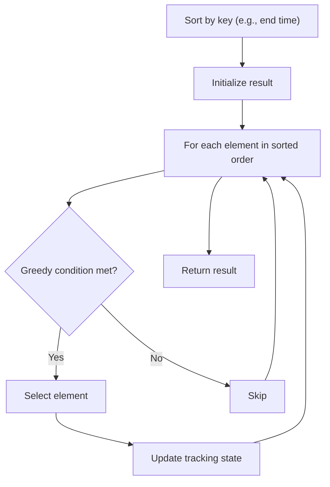

# Problem 452: Minimum Number of Arrows to Burst Balloons

**Difficulty:** Medium  
**Tags:** Array, Greedy, Sorting  
**Pattern:** Greedy with Sorting  
**Link:** [leetcode.com/problems/minimum-number-of-arrows-to-burst-balloons](https://leetcode.com/problems/minimum-number-of-arrows-to-burst-balloons/)

## Description

There are some spherical balloons taped onto a flat wall that represents the XY-plane. The balloons are represented as a 2D integer array `points` where `points[i] = [xstart, xend]` denotes a balloon whose **horizontal diameter** stretches between `xstart` and `xend`. You do not know the exact y-coordinates of the balloons.

Arrows can be shot up **directly vertically** (in the positive y-direction) from different points along the x-axis. A balloon with `xstart` and `xend` is **burst** by an arrow shot at `x` if `xstart <= x <= xend`. There is **no limit** to the number of arrows that can be shot. A shot arrow keeps traveling up infinitely, bursting any balloons in its path.

Given the array `points`, return *the **minimum** number of arrows that must be shot to burst all balloons*.

 

Example 1:

```

**Input:** points = [[10,16],[2,8],[1,6],[7,12]]
**Output:** 2
**Explanation:** The balloons can be burst by 2 arrows:
- Shoot an arrow at x = 6, bursting the balloons [2,8] and [1,6].
- Shoot an arrow at x = 11, bursting the balloons [10,16] and [7,12].

```

Example 2:

```

**Input:** points = [[1,2],[3,4],[5,6],[7,8]]
**Output:** 4
**Explanation:** One arrow needs to be shot for each balloon for a total of 4 arrows.

```

Example 3:

```

**Input:** points = [[1,2],[2,3],[3,4],[4,5]]
**Output:** 2
**Explanation:** The balloons can be burst by 2 arrows:
- Shoot an arrow at x = 2, bursting the balloons [1,2] and [2,3].
- Shoot an arrow at x = 4, bursting the balloons [3,4] and [4,5].

```

 

**Constraints:**

	- `1 <= points.length <= 10^5`
	- `points[i].length == 2`
	- `-2^31 <= xstart < xend <= 2^31 - 1`

## Approach: Greedy with Sorting

Sort the input by a key criterion, then greedily process elements in sorted order. The sorting ensures the greedy choice is always optimal.

## Pseudocode

```
1. Sort elements by key (start time, weight, etc.)
2. Initialize result, tracking variables
3. For each element in sorted order:
   a. Apply greedy selection rule
   b. Update result
4. Return result
```

## Algorithm Flow



## Complexity Analysis

- **Time:** O(n log n)
- **Space:** O(n)

## Solution (Python3)

```python
class Solution:
    def findMinArrowShots(self, points: List[List[int]]) -> int:
        # Sort + greedy - O(n log n) time
        points.sort()
        result = 0
        curr_end = 0
        for item in points:
            if isinstance(item, (list, tuple)):
                if item[0] >= curr_end:
                    result += 1
                    curr_end = item[1]
            else:
                result += 1
        return result
```

## Solution (C++)

```cpp
#include <algorithm>
#include <string>
#include <vector>
using namespace std;

class Solution {
public:
    int findMinArrowShots(vector<vector<int>>& points) {
        // Sort + greedy - O(n log n) time
        sort(points.begin(), points.end());
        int result = 0, curr_end = 0;
        for (auto& item : points) {
            result++;
        }
        return result;
    }
};
```
