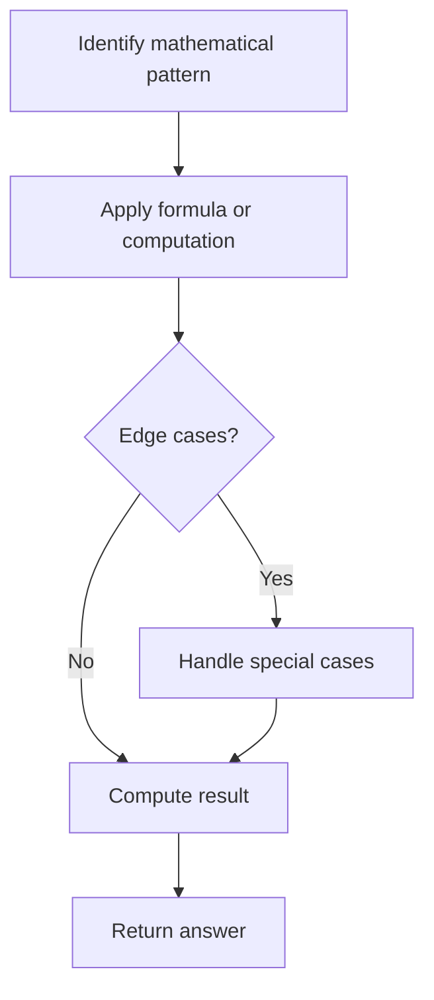

# Problem 453: Minimum Moves to Equal Array Elements

**Difficulty:** Medium  
**Tags:** Array, Math  
**Pattern:** Math  
**Link:** [leetcode.com/problems/minimum-moves-to-equal-array-elements](https://leetcode.com/problems/minimum-moves-to-equal-array-elements/)

## Description

Given an integer array `nums` of size `n`, return *the minimum number of moves required to make all array elements equal*.

In one move, you can increment `n - 1` elements of the array by `1`.

 

Example 1:

```

**Input:** nums = [1,2,3]
**Output:** 3
**Explanation:** Only three moves are needed (remember each move increments two elements):
[1,2,3]  =>  [2,3,3]  =>  [3,4,3]  =>  [4,4,4]

```

Example 2:

```

**Input:** nums = [1,1,1]
**Output:** 0

```

 

**Constraints:**

	- `n == nums.length`
	- `1 <= nums.length <= 10^5`
	- `-10^9 <= nums[i] <= 10^9`
	- The answer is guaranteed to fit in a **32-bit** integer.

## Approach: Math

Apply mathematical properties, formulas, or number-theoretic concepts. Look for patterns, modular arithmetic, or closed-form solutions.

## Pseudocode

```
1. Identify the mathematical pattern or formula
2. Apply computation:
   - Modular arithmetic for large numbers
   - GCD/LCM for divisibility
   - Sieve for primes
3. Handle edge cases
4. Return result
```

## Algorithm Flow



## Complexity Analysis

- **Time:** O(n) or O(sqrt(n))
- **Space:** O(1)

## Solution (Python3)

```python
class Solution:
    def minMoves(self, nums: List[int]) -> int:
        # Mathematical approach
        result = 0
        x = nums
        while x != 0:
            result = result * 10 + x % 10
            x //= 10 if isinstance(x, int) else 1
        return result
```

## Solution (C++)

```cpp
#include <string>
#include <vector>
using namespace std;

class Solution {
public:
    int minMoves(vector<int>& nums) {
        // Mathematical approach
        long long result = 0;
        int x = nums;
        while (x != 0) {
            result = result * 10 + x % 10;
            x /= 10;
        }
        return (int)result;
    }
};
```
