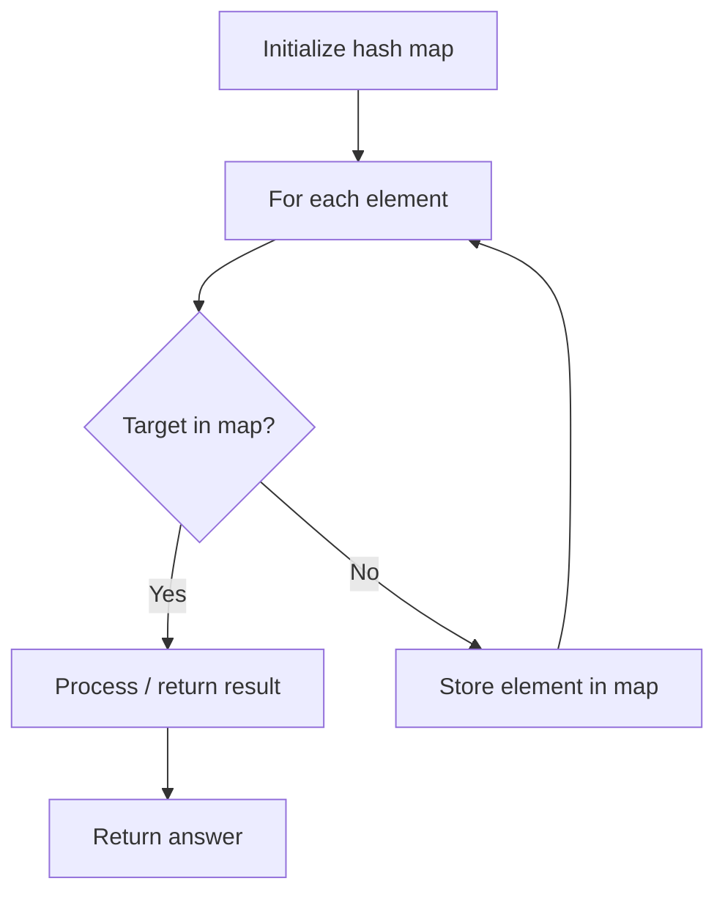

# Problem 454: 4Sum II

**Difficulty:** Medium  
**Tags:** Array, Hash Table  
**Pattern:** Hash Map Lookup  
**Link:** [leetcode.com/problems/4sum-ii](https://leetcode.com/problems/4sum-ii/)

## Description

Given four integer arrays `nums1`, `nums2`, `nums3`, and `nums4` all of length `n`, return the number of tuples `(i, j, k, l)` such that:

	- `0 <= i, j, k, l < n`
	- `nums1[i] + nums2[j] + nums3[k] + nums4[l] == 0`

 

Example 1:

```

**Input:** nums1 = [1,2], nums2 = [-2,-1], nums3 = [-1,2], nums4 = [0,2]
**Output:** 2
**Explanation:**
The two tuples are:
1. (0, 0, 0, 1) -> nums1[0] + nums2[0] + nums3[0] + nums4[1] = 1 + (-2) + (-1) + 2 = 0
2. (1, 1, 0, 0) -> nums1[1] + nums2[1] + nums3[0] + nums4[0] = 2 + (-1) + (-1) + 0 = 0

```

Example 2:

```

**Input:** nums1 = [0], nums2 = [0], nums3 = [0], nums4 = [0]
**Output:** 1

```

 

**Constraints:**

	- `n == nums1.length`
	- `n == nums2.length`
	- `n == nums3.length`
	- `n == nums4.length`
	- `1 <= n <= 200`
	- `-2^28 <= nums1[i], nums2[i], nums3[i], nums4[i] <= 2^28`

## Approach: Hash Map Lookup

Use a hash map (dictionary) to store elements for O(1) lookup. Iterate through the input, checking membership or counting frequencies in the map.

## Pseudocode

```
1. Initialize hash map
2. Iterate through elements:
   a. Check if target/complement exists in map
   b. If found: process result
   c. Otherwise: store element in map
3. Return result
```

## Algorithm Flow



## Complexity Analysis

- **Time:** O(n)
- **Space:** O(n)

## Solution (Python3)

```python
class Solution:
    def fourSumCount(self, nums1: List[int], nums2: List[int], nums3: List[int], nums4: List[int]) -> int:
        # Hash map approach - O(n) time, O(n) space
        seen = {}
        for i, val in enumerate(nums1):
            complement = nums2 - val
            if complement in seen:
                return [seen[complement], i]
            seen[val] = i
        return 0
```

## Solution (C++)

```cpp
#include <string>
#include <unordered_map>
#include <vector>
using namespace std;

class Solution {
public:
    int fourSumCount(vector<int>& nums1, vector<int>& nums2, vector<int>& nums3, vector<int>& nums4) {
        // Hash map approach - O(n) time, O(n) space
        unordered_map<int, int> seen;
        for (int i = 0; i < nums1.size(); i++) {
            int complement = nums2 - nums1[i];
            if (seen.count(complement)) {
                return {seen[complement], i};
            }
            seen[nums1[i]] = i;
        }
        return 0;
    }
};
```
