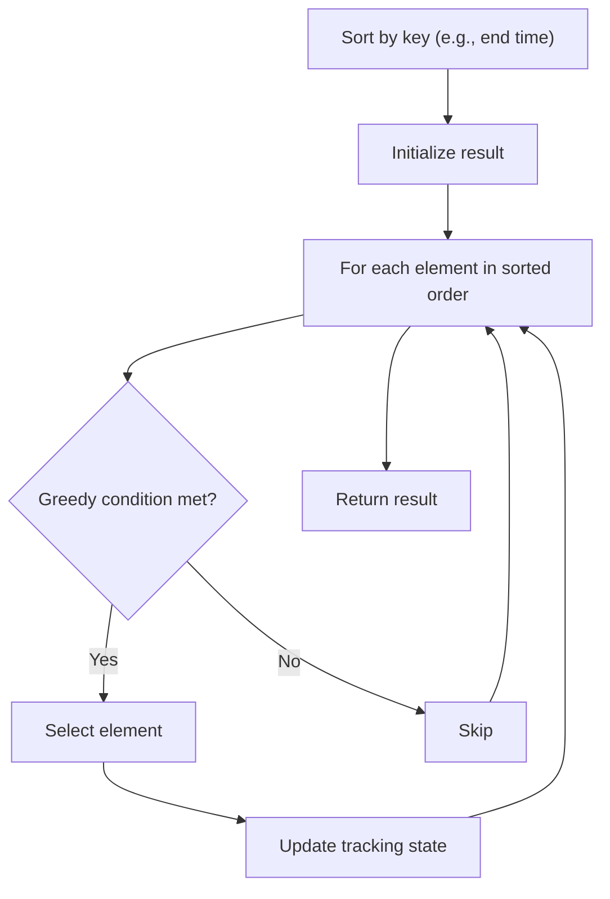

# Problem 455: Assign Cookies

**Difficulty:** Easy  
**Tags:** Array, Two Pointers, Greedy, Sorting  
**Pattern:** Greedy with Sorting  
**Link:** [leetcode.com/problems/assign-cookies](https://leetcode.com/problems/assign-cookies/)

## Description

Assume you are an awesome parent and want to give your children some cookies. But, you should give each child at most one cookie.

Each child `i` has a greed factor `g[i]`, which is the minimum size of a cookie that the child will be content with; and each cookie `j` has a size `s[j]`. If `s[j] >= g[i]`, we can assign the cookie `j` to the child `i`, and the child `i` will be content. Your goal is to maximize the number of your content children and output the maximum number.

 

Example 1:

```

**Input:** g = [1,2,3], s = [1,1]
**Output:** 1
**Explanation:** You have 3 children and 2 cookies. The greed factors of 3 children are 1, 2, 3. 
And even though you have 2 cookies, since their size is both 1, you could only make the child whose greed factor is 1 content.
You need to output 1.

```

Example 2:

```

**Input:** g = [1,2], s = [1,2,3]
**Output:** 2
**Explanation:** You have 2 children and 3 cookies. The greed factors of 2 children are 1, 2. 
You have 3 cookies and their sizes are big enough to gratify all of the children, 
You need to output 2.

```

 

**Constraints:**

	- `1 <= g.length <= 3 * 10^4`
	- `0 <= s.length <= 3 * 10^4`
	- `1 <= g[i], s[j] <= 2^31 - 1`

 

**Note:** This question is the same as  2410: Maximum Matching of Players With Trainers.

## Approach: Greedy with Sorting

Sort the input by a key criterion, then greedily process elements in sorted order. The sorting ensures the greedy choice is always optimal.

## Pseudocode

```
1. Sort elements by key (start time, weight, etc.)
2. Initialize result, tracking variables
3. For each element in sorted order:
   a. Apply greedy selection rule
   b. Update result
4. Return result
```

## Algorithm Flow



## Complexity Analysis

- **Time:** O(n log n)
- **Space:** O(n)

## Solution (Python3)

```python
class Solution:
    def findContentChildren(self, g: List[int], s: List[int]) -> int:
        # Sort + greedy - O(n log n) time
        g.sort()
        result = 0
        curr_end = 0
        for item in g:
            if isinstance(item, (list, tuple)):
                if item[0] >= curr_end:
                    result += 1
                    curr_end = item[1]
            else:
                result += 1
        return result
```

## Solution (C++)

```cpp
#include <algorithm>
#include <string>
#include <vector>
using namespace std;

class Solution {
public:
    int findContentChildren(vector<int>& g, vector<int>& s) {
        // Sort + greedy - O(n log n) time
        sort(g.begin(), g.end());
        int result = 0, curr_end = 0;
        for (auto& item : g) {
            result++;
        }
        return result;
    }
};
```
