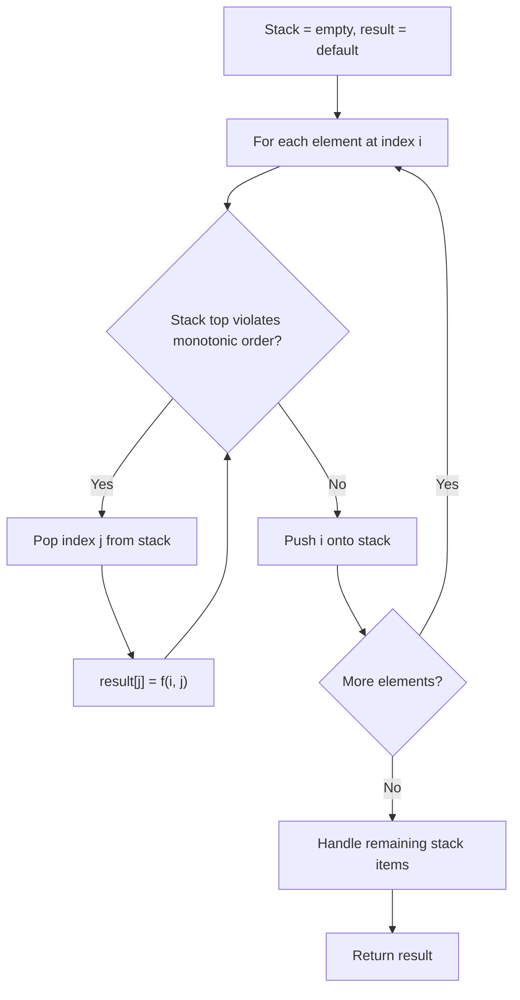
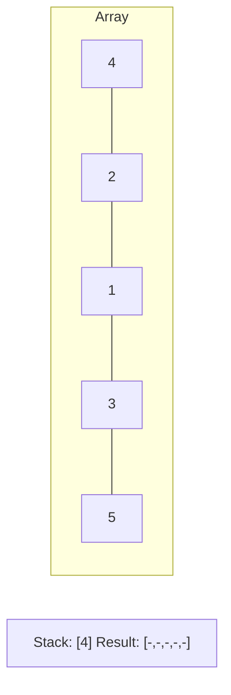
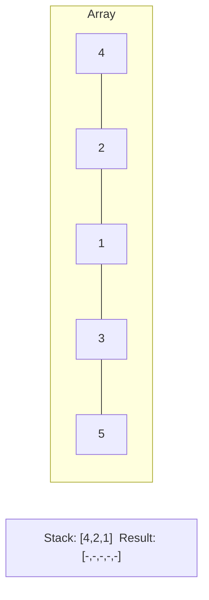
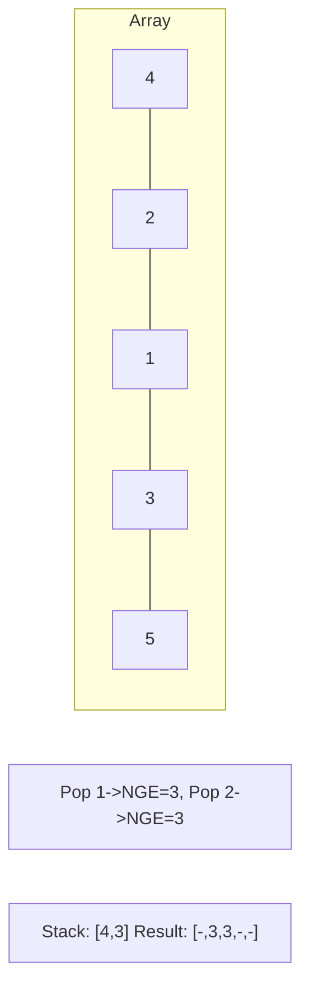
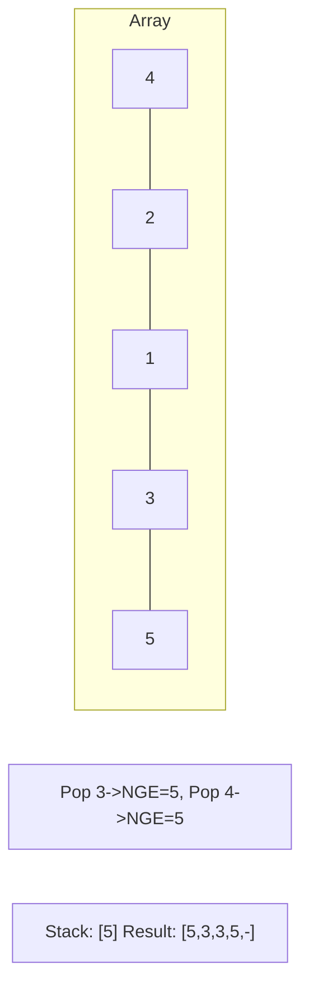

# Problem 456: 132 Pattern

**Difficulty:** Medium  
**Tags:** Array, Binary Search, Stack, Monotonic Stack, Ordered Set  
**Pattern:** Monotonic Stack  
**Link:** [leetcode.com/problems/132-pattern](https://leetcode.com/problems/132-pattern/)

## Description

Given an array of `n` integers `nums`, a **132 pattern** is a subsequence of three integers `nums[i]`, `nums[j]` and `nums[k]` such that `i < j < k` and `nums[i] < nums[k] < nums[j]`.

Return `true`* if there is a **132 pattern** in *`nums`*, otherwise, return *`false`*.*

 

Example 1:

```

**Input:** nums = [1,2,3,4]
**Output:** false
**Explanation:** There is no 132 pattern in the sequence.

```

Example 2:

```

**Input:** nums = [3,1,4,2]
**Output:** true
**Explanation:** There is a 132 pattern in the sequence: [1, 4, 2].

```

Example 3:

```

**Input:** nums = [-1,3,2,0]
**Output:** true
**Explanation:** There are three 132 patterns in the sequence: [-1, 3, 2], [-1, 3, 0] and [-1, 2, 0].

```

 

**Constraints:**

	- `n == nums.length`
	- `1 <= n <= 2 * 10^5`
	- `-10^9 <= nums[i] <= 10^9`

## Approach: Monotonic Stack

Maintain a stack where elements are always in monotonic order (increasing or decreasing). When a new element violates the monotonic property, pop elements and compute results (e.g., next greater/smaller element, spans, areas).

## Pseudocode

```
1. Initialize empty stack, result array
2. For each element (index i):
   a. While stack not empty and arr[i] breaks monotonic order:
      - Pop index j from stack
      - result[j] = compute(i, j)
   b. Push i onto stack
3. Handle remaining elements in stack
4. Return result
```

## Algorithm Flow



## Visual State Transitions

**Monotonic Stack (Next Greater Element):**

**Frame 1: Process first elements**


**Frame 2: Push smaller elements**


**Frame 3: Element 3 pops 1 and 2**


**Frame 4: Element 5 pops all**



## Complexity Analysis

- **Time:** O(n)
- **Space:** O(n)

## Solution (Python3)

```python
class Solution:
    def find132pattern(self, nums: List[int]) -> bool:
        # Monotonic stack - O(n) time, O(n) space
        n = len(nums)
        result = [0] * n
        stack = []  # indices
        for i in range(n):
            while stack and nums[i] > nums[stack[-1]]:
                idx = stack.pop()
                result[idx] = i - idx
            stack.append(i)
        return result
```

## Solution (C++)

```cpp
#include <stack>
#include <string>
#include <vector>
using namespace std;

class Solution {
public:
    bool find132pattern(vector<int>& nums) {
        // Monotonic stack - O(n) time, O(n) space
        int n = nums.size();
        vector<int> result(n, 0);
        stack<int> st;
        for (int i = 0; i < n; i++) {
            while (!st.empty() && nums[i] > nums[st.top()]) {
                int idx = st.top(); st.pop();
                result[idx] = i - idx;
            }
            st.push(i);
        }
        return result;
    }
};
```
