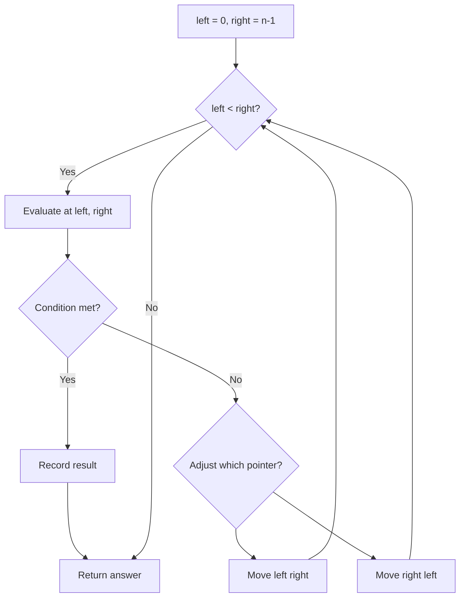
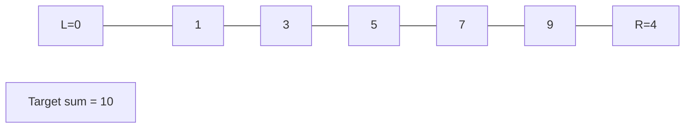
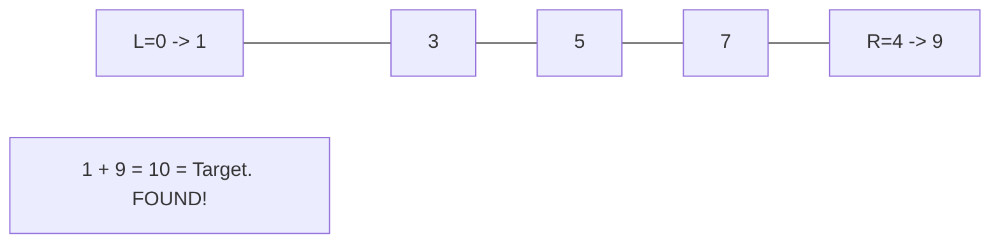

# Problem 457: Circular Array Loop

**Difficulty:** Medium  
**Tags:** Array, Hash Table, Two Pointers  
**Pattern:** Two Pointers  
**Link:** [leetcode.com/problems/circular-array-loop](https://leetcode.com/problems/circular-array-loop/)

## Description

You are playing a game involving a **circular** array of non-zero integers `nums`. Each `nums[i]` denotes the number of indices forward/backward you must move if you are located at index `i`:

	- If `nums[i]` is positive, move `nums[i]` steps **forward**, and
	- If `nums[i]` is negative, move `abs(nums[i])` steps **backward**.

Since the array is **circular**, you may assume that moving forward from the last element puts you on the first element, and moving backwards from the first element puts you on the last element.

A **cycle** in the array consists of a sequence of indices `seq` of length `k` where:

	- Following the movement rules above results in the repeating index sequence `seq[0] -> seq[1] -> ... -> seq[k - 1] -> seq[0] -> ...`
	- Every `nums[seq[j]]` is either **all positive** or **all negative**.
	- `k > 1`

Return `true`* if there is a **cycle** in *`nums`*, or *`false`* otherwise*.

 

Example 1:

```

**Input:** nums = [2,-1,1,2,2]
**Output:** true
**Explanation:** The graph shows how the indices are connected. White nodes are jumping forward, while red is jumping backward.
We can see the cycle 0 --> 2 --> 3 --> 0 --> ..., and all of its nodes are white (jumping in the same direction).

```

Example 2:

```

**Input:** nums = [-1,-2,-3,-4,-5,6]
**Output:** false
**Explanation:** The graph shows how the indices are connected. White nodes are jumping forward, while red is jumping backward.
The only cycle is of size 1, so we return false.

```

Example 3:

```

**Input:** nums = [1,-1,5,1,4]
**Output:** true
**Explanation:** The graph shows how the indices are connected. White nodes are jumping forward, while red is jumping backward.
We can see the cycle 0 --> 1 --> 0 --> ..., and while it is of size > 1, it has a node jumping forward and a node jumping backward, so **it is not a cycle**.
We can see the cycle 3 --> 4 --> 3 --> ..., and all of its nodes are white (jumping in the same direction).

```

 

**Constraints:**

	- `1 <= nums.length <= 5000`
	- `-1000 <= nums[i] <= 1000`
	- `nums[i] != 0`

 

**Follow up:** Could you solve it in `O(n)` time complexity and `O(1)` extra space complexity?

## Approach: Two Pointers

Use two pointers moving through the data structure. Depending on the problem, pointers may move toward each other (converging), in the same direction (fast/slow), or independently.

## Pseudocode

```
1. Initialize left = 0, right = n-1 (or two independent pointers)
2. While pointers haven't crossed:
   a. Evaluate condition at pointer positions
   b. Move left pointer right or right pointer left
3. Return result
```

## Algorithm Flow



## Visual State Transitions

**Two Pointer Convergence:**

**Frame 1: Initialize pointers**


**Frame 2: Sum = 1+9 = 10, found!**



## Complexity Analysis

- **Time:** O(n)
- **Space:** O(1)

## Solution (Python3)

```python
class Solution:
    def circularArrayLoop(self, nums: List[int]) -> bool:
        # Two pointer approach - O(n) time, O(1) space
        left, right = 0, len(nums) - 1
        while left < right:
            curr = nums[left] + nums[right]
            if curr == nums:
                return [left, right]
            elif curr < nums:
                left += 1
            else:
                right -= 1
        return False
```

## Solution (C++)

```cpp
#include <string>
#include <vector>
using namespace std;

class Solution {
public:
    bool circularArrayLoop(vector<int>& nums) {
        // Two pointer approach - O(n) time, O(1) space
        int left = 0, right = nums.size() - 1;
        while (left < right) {
            int curr = nums[left] + nums[right];
            if (curr == nums) {
                return {left, right};
            } else if (curr < nums) {
                left++;
            } else {
                right--;
            }
        }
        return false;
    }
};
```
