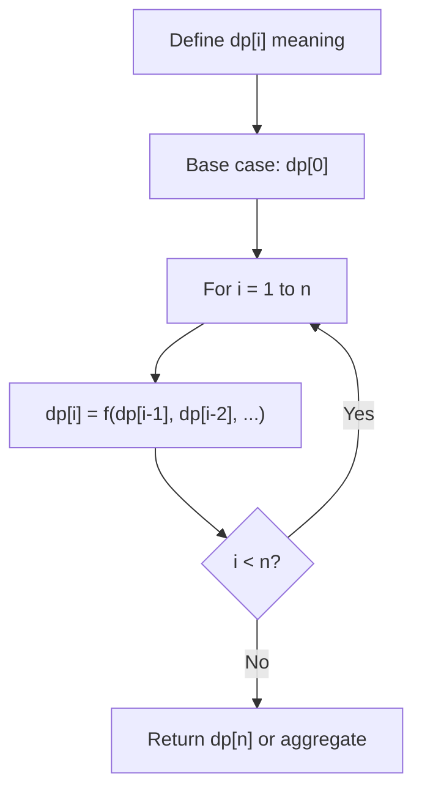
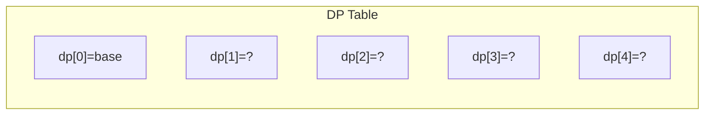
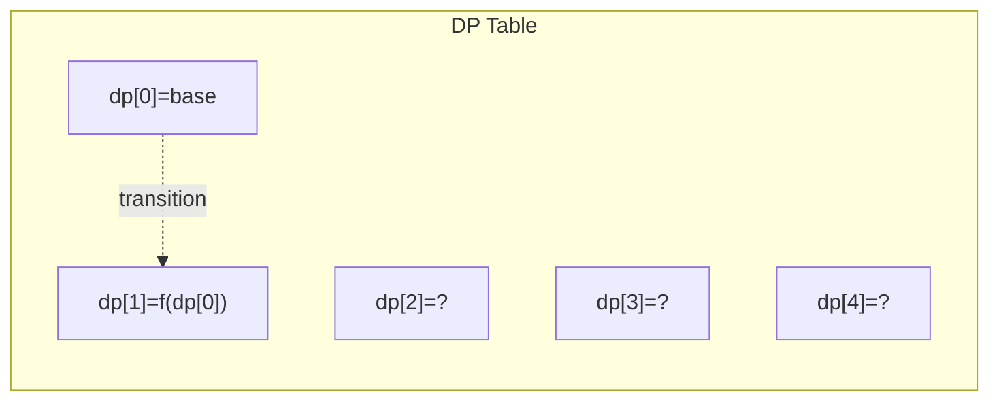
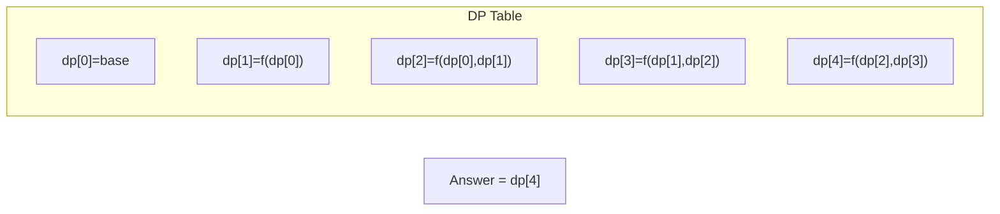

# Problem 458: Poor Pigs

**Difficulty:** Hard  
**Tags:** Math, Dynamic Programming, Combinatorics  
**Pattern:** Dynamic Programming (1D)  
**Link:** [leetcode.com/problems/poor-pigs](https://leetcode.com/problems/poor-pigs/)

## Description

There are `buckets` buckets of liquid, where **exactly one** of the buckets is poisonous. To figure out which one is poisonous, you feed some number of (poor) pigs the liquid to see whether they will die or not. Unfortunately, you only have `minutesToTest` minutes to determine which bucket is poisonous.

You can feed the pigs according to these steps:

	- Choose some live pigs to feed.
	- For each pig, choose which buckets to feed it. The pig will consume all the chosen buckets simultaneously and will take no time. Each pig can feed from any number of buckets, and each bucket can be fed from by any number of pigs.
	- Wait for `minutesToDie` minutes. You may **not** feed any other pigs during this time.
	- After `minutesToDie` minutes have passed, any pigs that have been fed the poisonous bucket will die, and all others will survive.
	- Repeat this process until you run out of time.

Given `buckets`, `minutesToDie`, and `minutesToTest`, return *the **minimum** number of pigs needed to figure out which bucket is poisonous within the allotted time*.

 

Example 1:

```

**Input:** buckets = 4, minutesToDie = 15, minutesToTest = 15
**Output:** 2
**Explanation:** We can determine the poisonous bucket as follows:
At time 0, feed the first pig buckets 1 and 2, and feed the second pig buckets 2 and 3.
At time 15, there are 4 possible outcomes:
- If only the first pig dies, then bucket 1 must be poisonous.
- If only the second pig dies, then bucket 3 must be poisonous.
- If both pigs die, then bucket 2 must be poisonous.
- If neither pig dies, then bucket 4 must be poisonous.

```

Example 2:

```

**Input:** buckets = 4, minutesToDie = 15, minutesToTest = 30
**Output:** 2
**Explanation:** We can determine the poisonous bucket as follows:
At time 0, feed the first pig bucket 1, and feed the second pig bucket 2.
At time 15, there are 2 possible outcomes:
- If either pig dies, then the poisonous bucket is the one it was fed.
- If neither pig dies, then feed the first pig bucket 3, and feed the second pig bucket 4.
At time 30, one of the two pigs must die, and the poisonous bucket is the one it was fed.

```

 

**Constraints:**

	- `1 <= buckets <= 1000`
	- `1 <= minutesToDie <= minutesToTest <= 100`

## Approach: Dynamic Programming (1D)

Break the problem into overlapping subproblems. Define dp[i] as the optimal value for the subproblem ending at or considering index i. Build the solution bottom-up, using previously computed dp values.

## Pseudocode

```
1. Define dp[i] = optimal value for subproblem i
2. Base case: dp[0] = initial value
3. For i from 1 to n:
   a. dp[i] = recurrence(dp[i-1], dp[i-2], ...)
4. Return dp[n] or max/min of dp
```

## Algorithm Flow



## Visual State Transitions

**1D Dynamic Programming Table Build:**

**Frame 1: Initialize base cases**


**Frame 2: Fill dp[1] from dp[0]**


**Frame 3: Fill remaining cells**



## Complexity Analysis

- **Time:** O(n)
- **Space:** O(n)

## Solution (Python3)

```python
class Solution:
    def poorPigs(self, buckets: int, minutesToDie: int, minutesToTest: int) -> int:
        # Dynamic programming (1D) - O(n) time, O(n) space
        if not buckets:
            return 0
        n = len(buckets) if isinstance(buckets, list) else buckets
        dp = [0] * (n + 1)
        dp[0] = 1  # base case
        for i in range(1, n + 1):
            dp[i] = dp[i-1]  # transition (customize per problem)
            if i >= 2:
                dp[i] += dp[i-2]
        return dp[n]
```

## Solution (C++)

```cpp
#include <string>
#include <vector>
using namespace std;

class Solution {
public:
    int poorPigs(int buckets, int minutesToDie, int minutesToTest) {
        // Dynamic programming (1D) - O(n) time, O(n) space
        int n = buckets;
        if (n <= 0) return 0;
        vector<int> dp(n + 1, 0);
        dp[0] = 1;
        for (int i = 1; i <= n; i++) {
            dp[i] = dp[i-1];
            if (i >= 2) dp[i] += dp[i-2];
        }
        return dp[n];
    }
};
```
