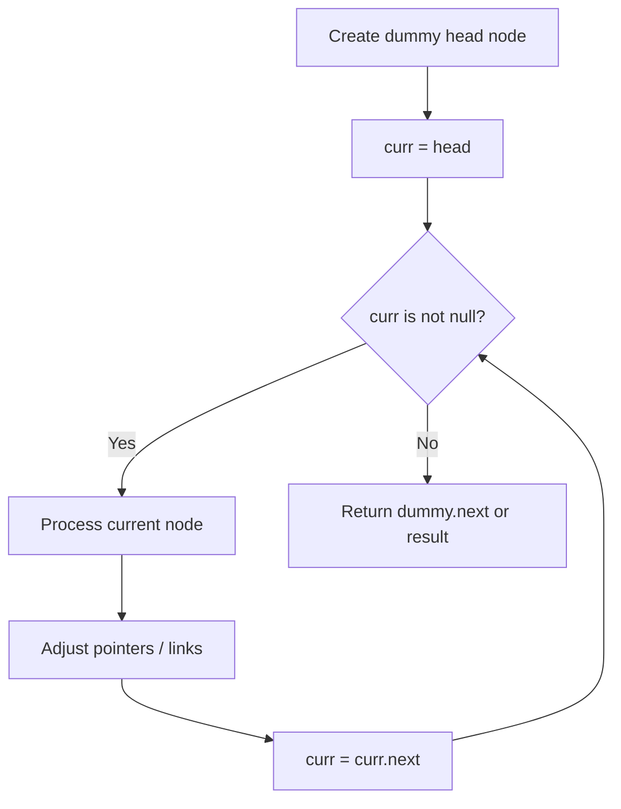
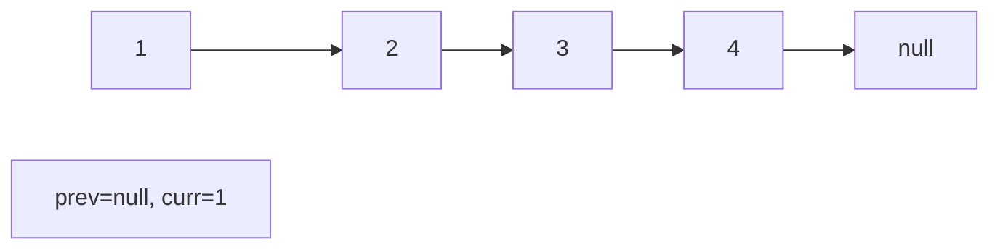
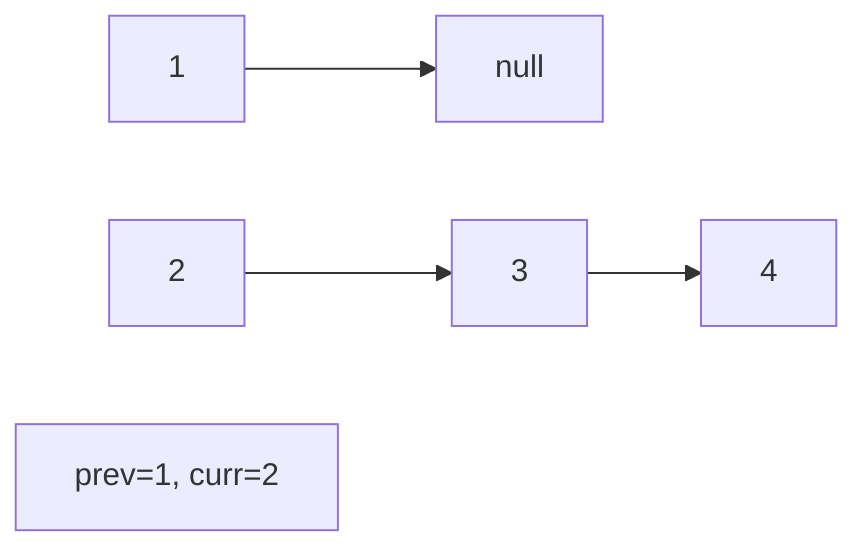
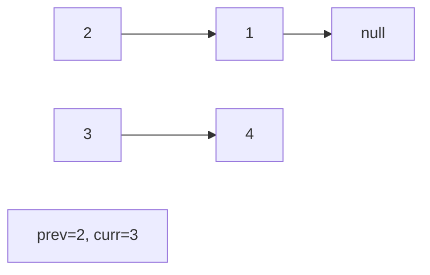
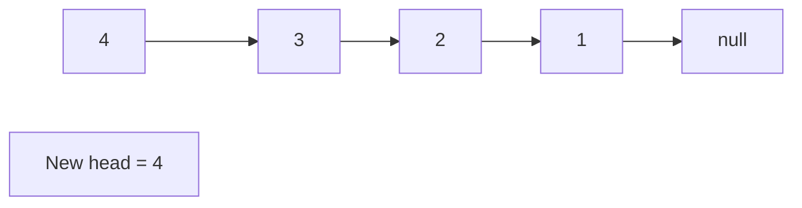

# Problem 460: LFU Cache

**Difficulty:** Hard  
**Tags:** Hash Table, Linked List, Design, Doubly-Linked List  
**Pattern:** Linked List  
**Link:** [leetcode.com/problems/lfu-cache](https://leetcode.com/problems/lfu-cache/)

## Description

Design and implement a data structure for a Least Frequently Used (LFU) cache.

Implement the `LFUCache` class:

	- `LFUCache(int capacity)` Initializes the object with the `capacity` of the data structure.
	- `int get(int key)` Gets the value of the `key` if the `key` exists in the cache. Otherwise, returns `-1`.
	- `void put(int key, int value)` Update the value of the `key` if present, or inserts the `key` if not already present. When the cache reaches its `capacity`, it should invalidate and remove the **least frequently used** key before inserting a new item. For this problem, when there is a **tie** (i.e., two or more keys with the same frequency), the **least recently used** `key` would be invalidated.

To determine the least frequently used key, a **use counter** is maintained for each key in the cache. The key with the smallest **use counter** is the least frequently used key.

When a key is first inserted into the cache, its **use counter** is set to `1` (due to the `put` operation). The **use counter** for a key in the cache is incremented either a `get` or `put` operation is called on it.

The functions get and put must each run in `O(1)` average time complexity.

 

Example 1:

```

**Input**
["LFUCache", "put", "put", "get", "put", "get", "get", "put", "get", "get", "get"]
[[2], [1, 1], [2, 2], [1], [3, 3], [2], [3], [4, 4], [1], [3], [4]]
**Output**
[null, null, null, 1, null, -1, 3, null, -1, 3, 4]

**Explanation**
// cnt(x) = the use counter for key x
// cache=[] will show the last used order for tiebreakers (leftmost element is  most recent)
LFUCache lfu = new LFUCache(2);
lfu.put(1, 1);   // cache=[1,_], cnt(1)=1
lfu.put(2, 2);   // cache=[2,1], cnt(2)=1, cnt(1)=1
lfu.get(1);      // return 1
                 // cache=[1,2], cnt(2)=1, cnt(1)=2
lfu.put(3, 3);   // 2 is the LFU key because cnt(2)=1 is the smallest, invalidate 2.
                 // cache=[3,1], cnt(3)=1, cnt(1)=2
lfu.get(2);      // return -1 (not found)
lfu.get(3);      // return 3
                 // cache=[3,1], cnt(3)=2, cnt(1)=2
lfu.put(4, 4);   // Both 1 and 3 have the same cnt, but 1 is LRU, invalidate 1.
                 // cache=[4,3], cnt(4)=1, cnt(3)=2
lfu.get(1);      // return -1 (not found)
lfu.get(3);      // return 3
                 // cache=[3,4], cnt(4)=1, cnt(3)=3
lfu.get(4);      // return 4
                 // cache=[4,3], cnt(4)=2, cnt(3)=3

```

 

**Constraints:**

	- `1 <= capacity <= 10^4`
	- `0 <= key <= 10^5`
	- `0 <= value <= 10^9`
	- At most `2 * 10^5` calls will be made to `get` and `put`.

## Approach: Linked List

Traverse or manipulate the linked list using pointer techniques. Common patterns: dummy head node for edge cases, fast/slow pointers for cycle detection or middle finding, in-place reversal, and merge operations.

## Pseudocode

```
1. Create dummy head if needed
2. Initialize pointer(s) at head
3. Traverse / modify list:
   a. Process current node
   b. Adjust next pointers as needed
   c. Move to next node
4. Return dummy.next or result
```

## Algorithm Flow



## Visual State Transitions

**Linked List Operation (Reverse):**

**Frame 1: Initial list**


**Frame 2: Reverse first link**


**Frame 3: Reverse second link**


**Frame 4: Fully reversed**



## Complexity Analysis

- **Time:** O(n)
- **Space:** O(1)

## Solution (Python3)

```python
class LFUCache:
    def __init__(self, capacity: int):
        # Initialize data structure
        self.capacity = capacity

    def get(self, key: int) -> int:
        return 0

    def put(self, key: int, value: int) -> None:
        return None

```

## Solution (C++)

```cpp
#include <string>
#include <vector>
using namespace std;

class LFUCache {
public:
    LFUCache(int capacity) {
        // Initialize
    }

    int get(int key) {
        return 0;
    }

    void put(int key, int value) {
        return ;
    }

};
```
