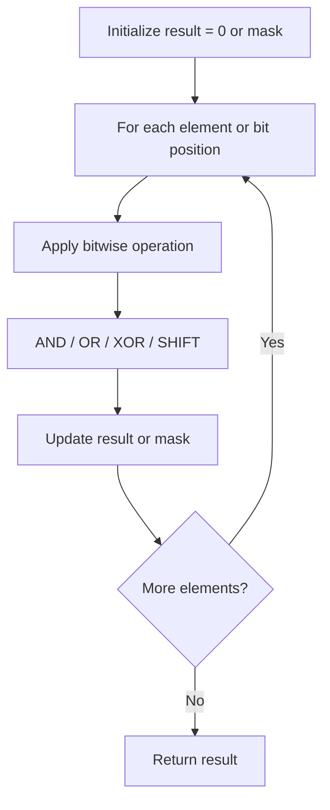

# Problem 461: Hamming Distance

**Difficulty:** Easy  
**Tags:** Bit Manipulation  
**Pattern:** Bit Manipulation  
**Link:** [leetcode.com/problems/hamming-distance](https://leetcode.com/problems/hamming-distance/)

## Description

The Hamming distance between two integers is the number of positions at which the corresponding bits are different.

Given two integers `x` and `y`, return *the **Hamming distance** between them*.

 

Example 1:

```

**Input:** x = 1, y = 4
**Output:** 2
**Explanation:**
1   (0 0 0 1)
4   (0 1 0 0)
       ↑   ↑
The above arrows point to positions where the corresponding bits are different.

```

Example 2:

```

**Input:** x = 3, y = 1
**Output:** 1

```

 

**Constraints:**

	- `0 <= x, y <= 2^31 - 1`

 

**Note:** This question is the same as  2220: Minimum Bit Flips to Convert Number.

## Approach: Bit Manipulation

Operate on individual bits using bitwise operators (AND, OR, XOR, shift). Common tricks: x & (x-1) removes lowest set bit, x ^ x = 0, XOR all elements to find unique.

## Pseudocode

```
1. Apply bitwise operations:
   - XOR all elements to cancel paired bits
   - Use bitmask to track state
   - Shift and mask to extract/set individual bits
2. Return result
```

## Algorithm Flow



## Complexity Analysis

- **Time:** O(n) or O(log n)
- **Space:** O(1)

## Solution (Python3)

```python
class Solution:
    def hammingDistance(self, x: int, y: int) -> int:
        # Bit manipulation - O(n) time, O(1) space
        result = 0
        for val in x:
            result ^= val
        return result
```

## Solution (C++)

```cpp
#include <string>
#include <vector>
using namespace std;

class Solution {
public:
    int hammingDistance(int x, int y) {
        // Bit manipulation - O(n) time, O(1) space
        int result = 0;
        for (int val : x) {
            result ^= val;
        }
        return result;
    }
};
```
