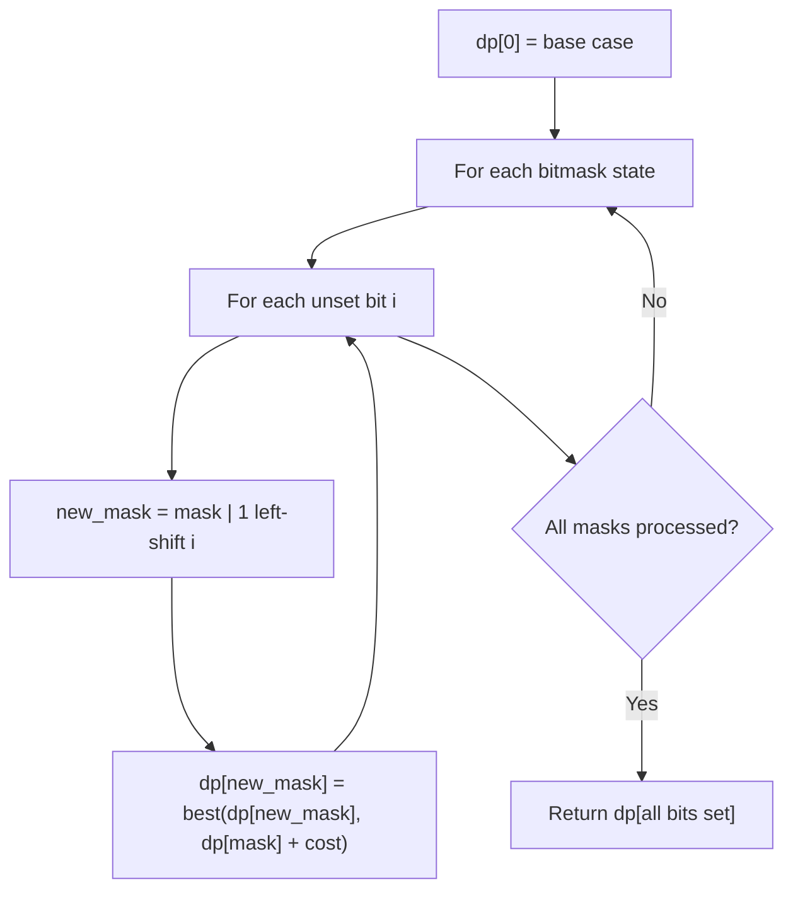

# Problem 464: Can I Win

**Difficulty:** Medium  
**Tags:** Math, Dynamic Programming, Bit Manipulation, Memoization, Game Theory, Bitmask  
**Pattern:** Dynamic Programming (Bitmask)  
**Link:** [leetcode.com/problems/can-i-win](https://leetcode.com/problems/can-i-win/)

## Description

In the "100 game" two players take turns adding, to a running total, any integer from `1` to `10`. The player who first causes the running total to **reach or exceed** 100 wins.

What if we change the game so that players **cannot** re-use integers?

For example, two players might take turns drawing from a common pool of numbers from 1 to 15 without replacement until they reach a total >= 100.

Given two integers `maxChoosableInteger` and `desiredTotal`, return `true` if the first player to move can force a win, otherwise, return `false`. Assume both players play **optimally**.

 

Example 1:

```

**Input:** maxChoosableInteger = 10, desiredTotal = 11
**Output:** false
**Explanation:**
No matter which integer the first player choose, the first player will lose.
The first player can choose an integer from 1 up to 10.
If the first player choose 1, the second player can only choose integers from 2 up to 10.
The second player will win by choosing 10 and get a total = 11, which is >= desiredTotal.
Same with other integers chosen by the first player, the second player will always win.

```

Example 2:

```

**Input:** maxChoosableInteger = 10, desiredTotal = 0
**Output:** true

```

Example 3:

```

**Input:** maxChoosableInteger = 10, desiredTotal = 1
**Output:** true

```

 

**Constraints:**

	- `1 <= maxChoosableInteger <= 20`
	- `0 <= desiredTotal <= 300`

## Approach: Dynamic Programming (Bitmask)

Use bitmask to represent subsets of n elements. dp[mask] = optimal value when the selected subset is represented by mask. Iterate over all masks and transitions.

## Pseudocode

```
1. dp[0] = base case
2. For mask from 0 to 2^n - 1:
   a. For each bit i not set in mask:
      - new_mask = mask | (1 << i)
      - dp[new_mask] = best of dp[new_mask], dp[mask] + cost(i)
3. Return dp[(1 << n) - 1]
```

## Algorithm Flow



## Complexity Analysis

- **Time:** O(2^n * n)
- **Space:** O(2^n)

## Solution (Python3)

```python
class Solution:
    def canIWin(self, maxChoosableInteger: int, desiredTotal: int) -> bool:
        # Bitmask DP - O(2^n * n) time
        n = len(maxChoosableInteger)
        dp = [float('inf')] * (1 << n)
        dp[0] = 0
        for mask in range(1 << n):
            bits = bin(mask).count('1')
            for i in range(n):
                if mask & (1 << i):
                    continue
                new_mask = mask | (1 << i)
                dp[new_mask] = min(dp[new_mask], dp[mask] + 1)
        return dp[(1 << n) - 1]
```

## Solution (C++)

```cpp
#include <algorithm>
#include <climits>
#include <string>
#include <vector>
using namespace std;

class Solution {
public:
    bool canIWin(int maxChoosableInteger, int desiredTotal) {
        // Bitmask DP - O(2^n * n) time
        int n = maxChoosableInteger.size();
        vector<int> dp(1 << n, INT_MAX);
        dp[0] = 0;
        for (int mask = 0; mask < (1 << n); mask++) {
            for (int i = 0; i < n; i++) {
                if (mask & (1 << i)) continue;
                int new_mask = mask | (1 << i);
                dp[new_mask] = min(dp[new_mask], dp[mask] + 1);
            }
        }
        return dp[(1 << n) - 1];
    }
};
```
