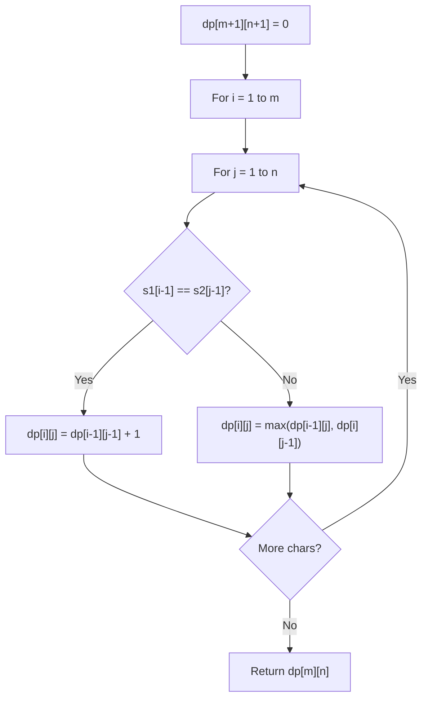

# Problem 466: Count The Repetitions

**Difficulty:** Hard  
**Tags:** String, Dynamic Programming  
**Pattern:** Dynamic Programming (String)  
**Link:** [leetcode.com/problems/count-the-repetitions](https://leetcode.com/problems/count-the-repetitions/)

## Description

We define `str = [s, n]` as the string `str` which consists of the string `s` concatenated `n` times.

	- For example, `str == ["abc", 3] =="abcabcabc"`.

We define that string `s1` can be obtained from string `s2` if we can remove some characters from `s2` such that it becomes `s1`.

	- For example, `s1 = "abc"` can be obtained from `s2 = "ab**dbe**c"` based on our definition by removing the bolded underlined characters.

You are given two strings `s1` and `s2` and two integers `n1` and `n2`. You have the two strings `str1 = [s1, n1]` and `str2 = [s2, n2]`.

Return *the maximum integer *`m`* such that *`str = [str2, m]`* can be obtained from *`str1`.

 

Example 1:

```
**Input:** s1 = "acb", n1 = 4, s2 = "ab", n2 = 2
**Output:** 2

```
Example 2:

```
**Input:** s1 = "acb", n1 = 1, s2 = "acb", n2 = 1
**Output:** 1

```

 

**Constraints:**

	- `1 <= s1.length, s2.length <= 100`
	- `s1` and `s2` consist of lowercase English letters.
	- `1 <= n1, n2 <= 10^6`

## Approach: Dynamic Programming (String)

Compare or match two strings using a 2D DP table. dp[i][j] represents the answer for substrings s1[0..i-1] and s2[0..j-1]. Common patterns: LCS, edit distance, regex matching.

## Pseudocode

```
1. Create dp[m+1][n+1]
2. Initialize base cases
3. For i from 1 to m:
   For j from 1 to n:
     If s1[i-1] == s2[j-1]: dp[i][j] = dp[i-1][j-1] + 1
     Else: dp[i][j] = best of (dp[i-1][j], dp[i][j-1], dp[i-1][j-1])
4. Return dp[m][n]
```

## Algorithm Flow



## Complexity Analysis

- **Time:** O(m * n)
- **Space:** O(m * n)

## Solution (Python3)

```python
class Solution:
    def getMaxRepetitions(self, s1: str, n1: int, s2: str, n2: int) -> int:
        # String DP - O(m*n) time and space
        m, n = len(s1), len(n1)
        dp = [[0] * (n + 1) for _ in range(m + 1)]
        for i in range(1, m + 1):
            for j in range(1, n + 1):
                if s1[i-1] == n1[j-1]:
                    dp[i][j] = dp[i-1][j-1] + 1
                else:
                    dp[i][j] = max(dp[i-1][j], dp[i][j-1])
        return dp[m][n]
```

## Solution (C++)

```cpp
#include <algorithm>
#include <string>
#include <vector>
using namespace std;

class Solution {
public:
    int getMaxRepetitions(string& s1, int n1, string& s2, int n2) {
        // String DP - O(m*n) time and space
        int m = s1.size(), n = n1.size();
        vector<vector<int>> dp(m + 1, vector<int>(n + 1, 0));
        for (int i = 1; i <= m; i++) {
            for (int j = 1; j <= n; j++) {
                if (s1[i-1] == n1[j-1])
                    dp[i][j] = dp[i-1][j-1] + 1;
                else
                    dp[i][j] = max(dp[i-1][j], dp[i][j-1]);
            }
        }
        return dp[m][n];
    }
};
```
