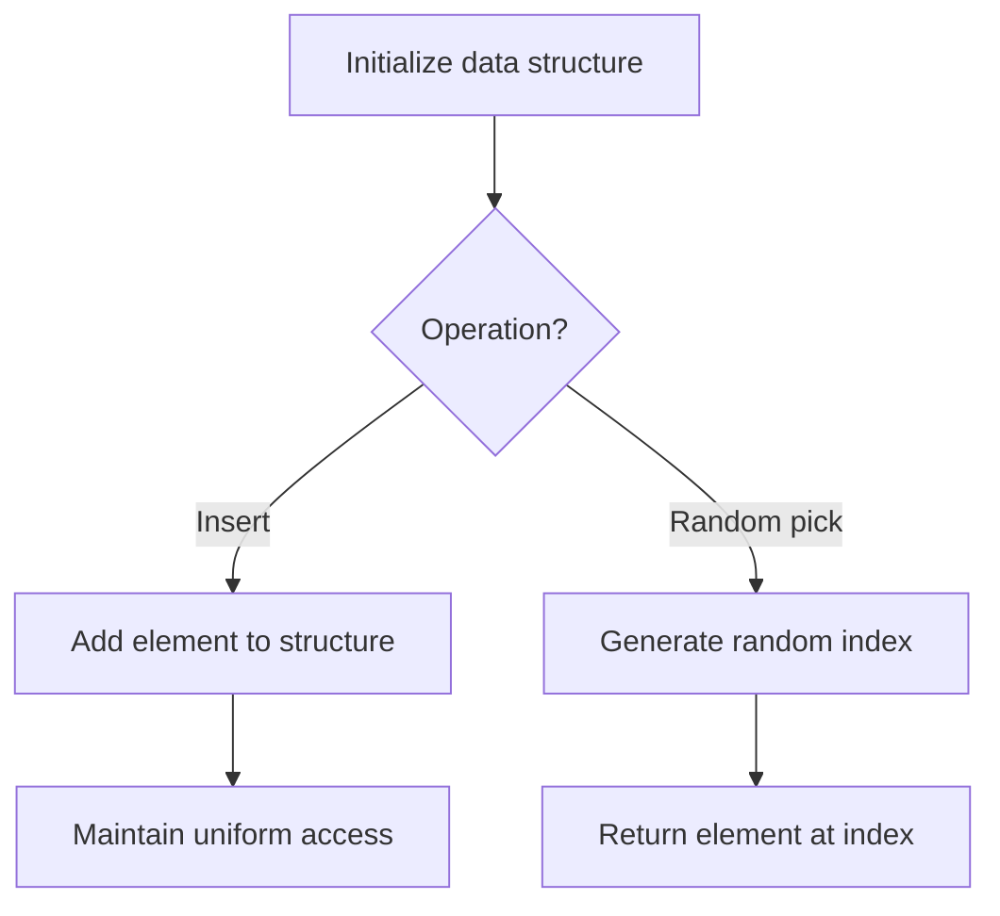

# Problem 470: Implement Rand10() Using Rand7()

**Difficulty:** Medium  
**Tags:** Math, Rejection Sampling, Randomized, Probability and Statistics  
**Pattern:** Randomized Algorithm  
**Link:** [leetcode.com/problems/implement-rand10-using-rand7](https://leetcode.com/problems/implement-rand10-using-rand7/)

## Description

Given the **API** `rand7()` that generates a uniform random integer in the range `[1, 7]`, write a function `rand10()` that generates a uniform random integer in the range `[1, 10]`. You can only call the API `rand7()`, and you shouldn't call any other API. Please **do not** use a language's built-in random API.

Each test case will have one **internal** argument `n`, the number of times that your implemented function `rand10()` will be called while testing. Note that this is **not an argument** passed to `rand10()`.

 

Example 1:

```
**Input:** n = 1
**Output:** [2]

```
Example 2:

```
**Input:** n = 2
**Output:** [2,8]

```
Example 3:

```
**Input:** n = 3
**Output:** [3,8,10]

```

 

**Constraints:**

	- `1 <= n <= 10^5`

 

**Follow up:**

	- What is the expected value for the number of calls to `rand7()` function?
	- Could you minimize the number of calls to `rand7()`?

## Approach: Randomized Algorithm

Use randomization for expected-case efficiency. Random sampling, Fisher-Yates shuffle, or reservoir sampling.

## Pseudocode

```
1. Set up data structure for random access
2. On query:
   - Generate random index/number
   - Return corresponding element
3. Ensure uniform distribution
```

## Algorithm Flow



## Complexity Analysis

- **Time:** O(n) or varies
- **Space:** O(n)

## Solution (Python3)

```python
class Solution:
    def rand10(self) -> None:
        # Randomized approach
        import random
        # Fisher-Yates shuffle or random sampling
        arr = list(nums)
        for i in range(len(arr) - 1, 0, -1):
            j = random.randint(0, i)
            arr[i], arr[j] = arr[j], arr[i]
        return arr
```

## Solution (C++)

```cpp
#include <cstdlib>
#include <ctime>
#include <string>
#include <vector>
using namespace std;

class Solution {
public:
    void rand10() {
        // Randomized approach (Fisher-Yates shuffle)
        vector<int> arr = nums;
        srand(time(0));
        for (int i = arr.size() - 1; i > 0; i--) {
            int j = rand() % (i + 1);
            swap(arr[i], arr[j]);
        }
        return arr;
    }
};
```
