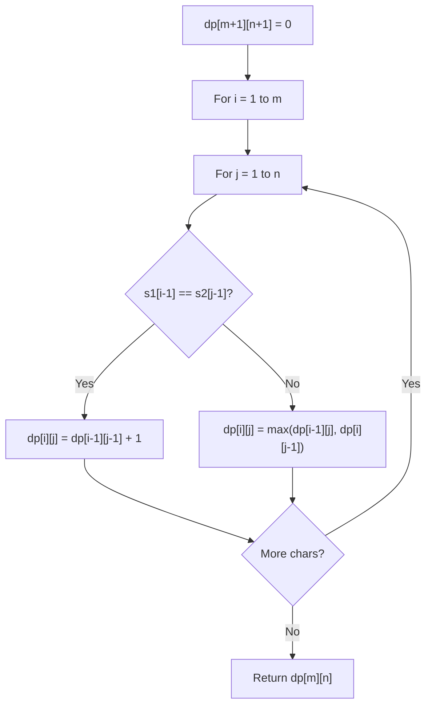

# Problem 474: Ones and Zeroes

**Difficulty:** Medium  
**Tags:** Array, String, Dynamic Programming  
**Pattern:** Dynamic Programming (String)  
**Link:** [leetcode.com/problems/ones-and-zeroes](https://leetcode.com/problems/ones-and-zeroes/)

## Description

You are given an array of binary strings `strs` and two integers `m` and `n`.

Return *the size of the largest subset of `strs` such that there are **at most** *`m`* *`0`*'s and *`n`* *`1`*'s in the subset*.

A set `x` is a **subset** of a set `y` if all elements of `x` are also elements of `y`.

 

Example 1:

```

**Input:** strs = ["10","0001","111001","1","0"], m = 5, n = 3
**Output:** 4
**Explanation:** The largest subset with at most 5 0's and 3 1's is {"10", "0001", "1", "0"}, so the answer is 4.
Other valid but smaller subsets include {"0001", "1"} and {"10", "1", "0"}.
{"111001"} is an invalid subset because it contains 4 1's, greater than the maximum of 3.

```

Example 2:

```

**Input:** strs = ["10","0","1"], m = 1, n = 1
**Output:** 2
**Explanation:** The largest subset is {"0", "1"}, so the answer is 2.

```

 

**Constraints:**

	- `1 <= strs.length <= 600`
	- `1 <= strs[i].length <= 100`
	- `strs[i]` consists only of digits `'0'` and `'1'`.
	- `1 <= m, n <= 100`

## Approach: Dynamic Programming (String)

Compare or match two strings using a 2D DP table. dp[i][j] represents the answer for substrings s1[0..i-1] and s2[0..j-1]. Common patterns: LCS, edit distance, regex matching.

## Pseudocode

```
1. Create dp[m+1][n+1]
2. Initialize base cases
3. For i from 1 to m:
   For j from 1 to n:
     If s1[i-1] == s2[j-1]: dp[i][j] = dp[i-1][j-1] + 1
     Else: dp[i][j] = best of (dp[i-1][j], dp[i][j-1], dp[i-1][j-1])
4. Return dp[m][n]
```

## Algorithm Flow



## Complexity Analysis

- **Time:** O(m * n)
- **Space:** O(m * n)

## Solution (Python3)

```python
class Solution:
    def findMaxForm(self, strs: List[str], m: int, n: int) -> int:
        # String DP - O(m*n) time and space
        m, n = len(strs), len(m)
        dp = [[0] * (n + 1) for _ in range(m + 1)]
        for i in range(1, m + 1):
            for j in range(1, n + 1):
                if strs[i-1] == m[j-1]:
                    dp[i][j] = dp[i-1][j-1] + 1
                else:
                    dp[i][j] = max(dp[i-1][j], dp[i][j-1])
        return dp[m][n]
```

## Solution (C++)

```cpp
#include <algorithm>
#include <string>
#include <vector>
using namespace std;

class Solution {
public:
    int findMaxForm(vector<string>& strs, int m, int n) {
        // String DP - O(m*n) time and space
        int m = strs.size(), n = m.size();
        vector<vector<int>> dp(m + 1, vector<int>(n + 1, 0));
        for (int i = 1; i <= m; i++) {
            for (int j = 1; j <= n; j++) {
                if (strs[i-1] == m[j-1])
                    dp[i][j] = dp[i-1][j-1] + 1;
                else
                    dp[i][j] = max(dp[i-1][j], dp[i][j-1]);
            }
        }
        return dp[m][n];
    }
};
```
