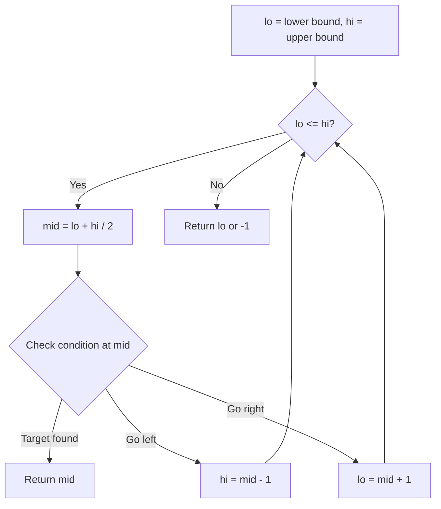
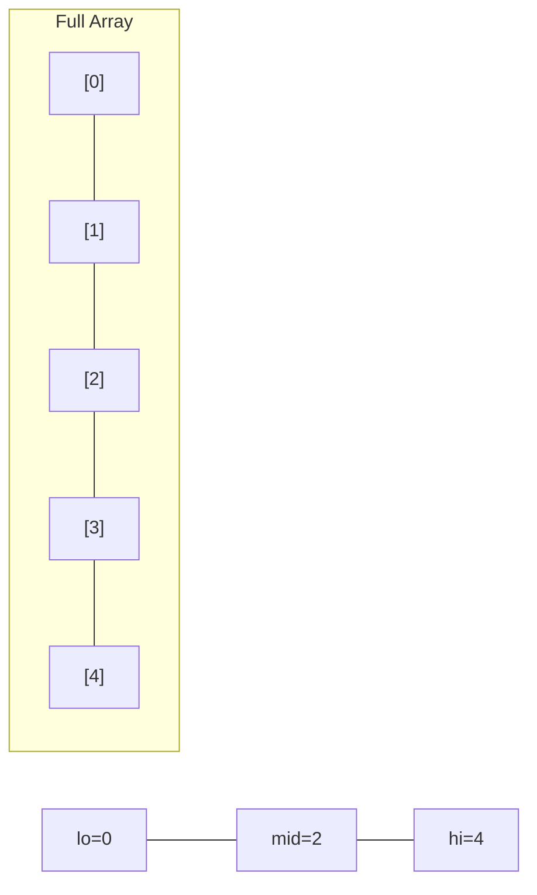
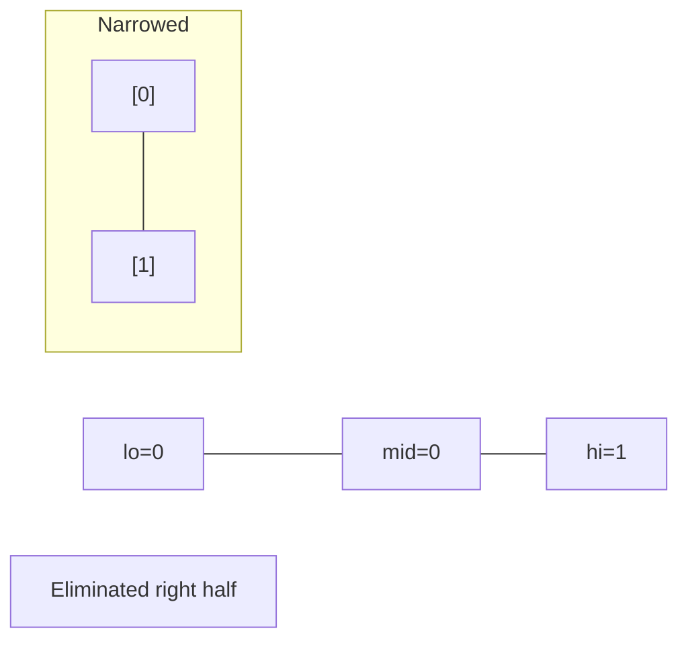
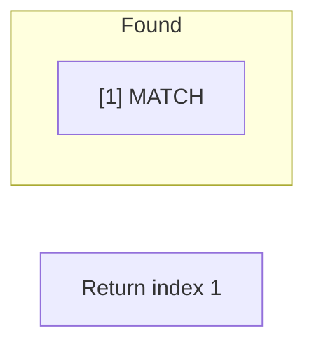

# Problem 475: Heaters

**Difficulty:** Medium  
**Tags:** Array, Two Pointers, Binary Search, Sorting  
**Pattern:** Binary Search  
**Link:** [leetcode.com/problems/heaters](https://leetcode.com/problems/heaters/)

## Description

Winter is coming! During the contest, your first job is to design a standard heater with a fixed warm radius to warm all the houses.

Every house can be warmed, as long as the house is within the heater's warm radius range. 

Given the positions of `houses` and `heaters` on a horizontal line, return *the minimum radius standard of heaters so that those heaters could cover all houses.*

**Notice** that all the `heaters` follow your radius standard, and the warm radius will be the same.

 

Example 1:

```

**Input:** houses = [1,2,3], heaters = [2]
**Output:** 1
**Explanation:** The only heater was placed in the position 2, and if we use the radius 1 standard, then all the houses can be warmed.

```

Example 2:

```

**Input:** houses = [1,2,3,4], heaters = [1,4]
**Output:** 1
**Explanation:** The two heaters were placed at positions 1 and 4. We need to use a radius 1 standard, then all the houses can be warmed.

```

Example 3:

```

**Input:** houses = [1,5], heaters = [2]
**Output:** 3

```

 

**Constraints:**

	- `1 <= houses.length, heaters.length <= 3 * 10^4`
	- `1 <= houses[i], heaters[i] <= 10^9`

## Approach: Binary Search

Use binary search to halve the search space each iteration. Define the search range [lo, hi], compute mid, and decide which half to keep based on the problem's monotonic condition.

## Pseudocode

```
1. lo = lower_bound, hi = upper_bound
2. While lo <= hi (or lo < hi):
   a. mid = (lo + hi) // 2
   b. If condition(mid) is satisfied: record answer, search left half
   c. Else: search right half
3. Return answer
```

## Algorithm Flow



## Visual State Transitions

**Binary Search Step-by-Step:**

**Frame 1: Initial search space**


**Frame 2: Compare mid, narrow search**


**Frame 3: Found target**



## Complexity Analysis

- **Time:** O(log n)
- **Space:** O(1)

## Solution (Python3)

```python
class Solution:
    def findRadius(self, houses: List[int], heaters: List[int]) -> int:
        # Binary search - O(log n) time, O(1) space
        lo, hi = 0, len(houses) - 1
        while lo <= hi:
            mid = lo + (hi - lo) // 2
            if houses[mid] == heaters:
                return mid
            elif houses[mid] < heaters:
                lo = mid + 1
            else:
                hi = mid - 1
        return 0
```

## Solution (C++)

```cpp
#include <string>
#include <vector>
using namespace std;

class Solution {
public:
    int findRadius(vector<int>& houses, vector<int>& heaters) {
        // Binary search - O(log n) time, O(1) space
        int lo = 0, hi = houses.size() - 1;
        while (lo <= hi) {
            int mid = lo + (hi - lo) / 2;
            if (houses[mid] == heaters) {
                return mid;
            } else if (houses[mid] < heaters) {
                lo = mid + 1;
            } else {
                hi = mid - 1;
            }
        }
        return 0;
    }
};
```
