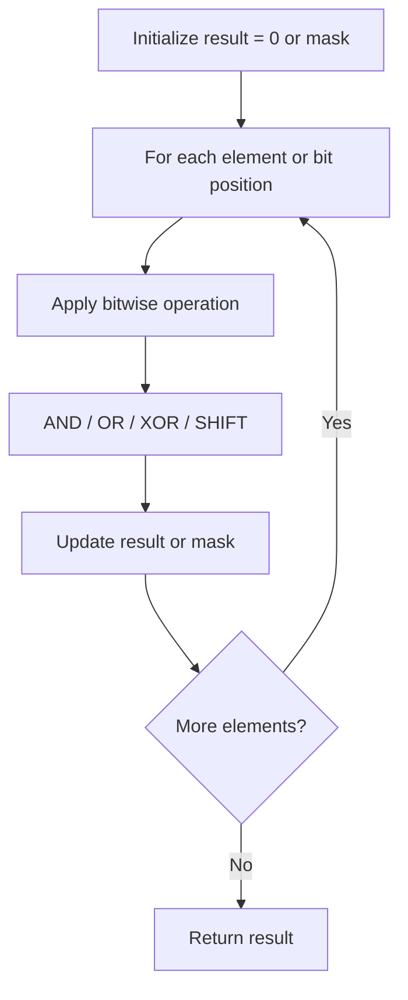

# Problem 476: Number Complement

**Difficulty:** Easy  
**Tags:** Bit Manipulation  
**Pattern:** Bit Manipulation  
**Link:** [leetcode.com/problems/number-complement](https://leetcode.com/problems/number-complement/)

## Description

The **complement** of an integer is the integer you get when you flip all the `0`'s to `1`'s and all the `1`'s to `0`'s in its binary representation.

	- For example, The integer `5` is `"101"` in binary and its **complement** is `"010"` which is the integer `2`.

Given an integer `num`, return *its complement*.

 

Example 1:

```

**Input:** num = 5
**Output:** 2
**Explanation:** The binary representation of 5 is 101 (no leading zero bits), and its complement is 010. So you need to output 2.

```

Example 2:

```

**Input:** num = 1
**Output:** 0
**Explanation:** The binary representation of 1 is 1 (no leading zero bits), and its complement is 0. So you need to output 0.

```

 

**Constraints:**

	- `1 <= num < 2^31`

 

**Note:** This question is the same as 1009: https://leetcode.com/problems/complement-of-base-10-integer/

## Approach: Bit Manipulation

Operate on individual bits using bitwise operators (AND, OR, XOR, shift). Common tricks: x & (x-1) removes lowest set bit, x ^ x = 0, XOR all elements to find unique.

## Pseudocode

```
1. Apply bitwise operations:
   - XOR all elements to cancel paired bits
   - Use bitmask to track state
   - Shift and mask to extract/set individual bits
2. Return result
```

## Algorithm Flow



## Complexity Analysis

- **Time:** O(n) or O(log n)
- **Space:** O(1)

## Solution (Python3)

```python
class Solution:
    def findComplement(self, num: int) -> int:
        # Bit manipulation - O(n) time, O(1) space
        result = 0
        for val in num:
            result ^= val
        return result
```

## Solution (C++)

```cpp
#include <string>
#include <vector>
using namespace std;

class Solution {
public:
    int findComplement(int num) {
        // Bit manipulation - O(n) time, O(1) space
        int result = 0;
        for (int val : num) {
            result ^= val;
        }
        return result;
    }
};
```
