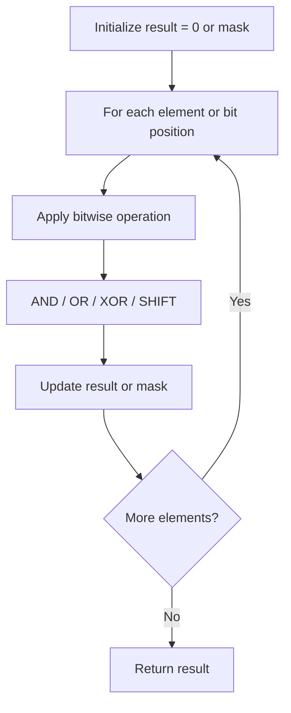

# Problem 477: Total Hamming Distance

**Difficulty:** Medium  
**Tags:** Array, Math, Bit Manipulation  
**Pattern:** Bit Manipulation  
**Link:** [leetcode.com/problems/total-hamming-distance](https://leetcode.com/problems/total-hamming-distance/)

## Description

The Hamming distance between two integers is the number of positions at which the corresponding bits are different.

Given an integer array `nums`, return *the sum of **Hamming distances** between all the pairs of the integers in* `nums`.

 

Example 1:

```

**Input:** nums = [4,14,2]
**Output:** 6
**Explanation:** In binary representation, the 4 is 0100, 14 is 1110, and 2 is 0010 (just
showing the four bits relevant in this case).
The answer will be:
HammingDistance(4, 14) + HammingDistance(4, 2) + HammingDistance(14, 2) = 2 + 2 + 2 = 6.

```

Example 2:

```

**Input:** nums = [4,14,4]
**Output:** 4

```

 

**Constraints:**

	- `1 <= nums.length <= 10^4`
	- `0 <= nums[i] <= 10^9`
	- The answer for the given input will fit in a **32-bit** integer.

## Approach: Bit Manipulation

Operate on individual bits using bitwise operators (AND, OR, XOR, shift). Common tricks: x & (x-1) removes lowest set bit, x ^ x = 0, XOR all elements to find unique.

## Pseudocode

```
1. Apply bitwise operations:
   - XOR all elements to cancel paired bits
   - Use bitmask to track state
   - Shift and mask to extract/set individual bits
2. Return result
```

## Algorithm Flow



## Complexity Analysis

- **Time:** O(n) or O(log n)
- **Space:** O(1)

## Solution (Python3)

```python
class Solution:
    def totalHammingDistance(self, nums: List[int]) -> int:
        # Bit manipulation - O(n) time, O(1) space
        result = 0
        for val in nums:
            result ^= val
        return result
```

## Solution (C++)

```cpp
#include <string>
#include <vector>
using namespace std;

class Solution {
public:
    int totalHammingDistance(vector<int>& nums) {
        // Bit manipulation - O(n) time, O(1) space
        int result = 0;
        for (int val : nums) {
            result ^= val;
        }
        return result;
    }
};
```
